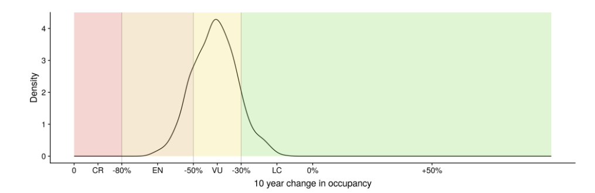

# Bayesian Occupancy Model documentation
The Bayesian Occupancy Model is the subject of much debate, including its usage for the creation of Red List assessments. Considerable time has been spent in this assessment pruning the various assumptions that the model utilises, discarding any where it is possible to do so and the taxon specialists deem the assumption to be incorrect.

## Model Scale
The model was run at 2 km and 10 km resolutions to examine the differences. It was decided that the difference in result between 10 km and 2 km was insufficient to justify the vastly decreased statistical power that the 2 km model was left with.

## Confidence vs Credible
The `CI` metrics reported from the Bayesian Occupancy Model are *Credible* Intervals, **not** *Confidence* Intervals. Both metrics examine the *spread* of a distribution, but have distinct differences in their interpretation.

For a robust guide on the differences between the two, I recommend further reading. The Centre for Evidence-Based Medicine has [a useful primer](https://www.cebm.ox.ac.uk/news/views/should-e-be-using-credible-intervals-more-routinely), but be aware that it is targeted at non-lay readers. A *short* extraction of that primer is included below.

### Confidence interval
This metric is used in *frequentist* statistics. A 95% confidence interval means that 95% of all intervals calculated from a distribution will contain the 'true' value. Remember that 'true' here does not mean 'real', but 'true' *as far as the data's parameters and restrictions allow*.

### Credible interval
This metric is used in *Bayesian* statistics. a 95% credible interval means that there is a 95% chance that the 'true' value lies within range. Again, 'true' does not mean 'real', but 'true' *as far as the data's parameters and restrictions allow*.

## Trend Calculation
There exist two different ways of calculating the trends from the occupancy models. These are the *Arithmetic* and *Bayesian* methods. The difference revolves around where the mean average reading occurs.

Remember that the Occupancy model consists of many (999 in this case) repetitions of the same model, which are then condensed down to a singular 'run', using the mean average in this project.

### Arithmetic
This method takes the mean average of all start points of the [time slice](./glossary.md#slice), the mean average of all end points of the time slice, then calculates the difference between them.

### Bayesian
This method takes the start and end point per cycle of the model and calculates the trend. This is repeated for every repetition, then the resulting trends are condensed to a mean average trend. This is the method which this Red List project has chosen to base assessment upon

### Differences
There are frequently substantial differences between the means calculated by each of these methods, though whether these differences are significant is unknown. Making this harder is that these trends are expressed as percentage points (percentage chance between two percentages), during a period in which the subject matter has, overall, experienced significant growth. The nature of a percentage change means that high increases, especially with smaller starting points, result in larger percentage changes and therefore larger discrepencies between the Arithmetic and Bayesian means.

## Examination of Bayesian Trend Calculation
To better explain how the Bayesian Trend Calculation is utilised, consider this graph:

Simplified, this graph is formed by running the Bayesian Occupancy Model *N* times - in our case 999 times. Each run then has the short term trend calculated, resulting in a number. The *density* of each short term trend is then plotted, resulting in the graph above.

From this point the 95% CI interval, representing 2 standard deviations, is calulated.

## Other Bayesian Occupancy Models
A significant source of confusion is that the Bayesian Occupancy Model used in this experiment is one of a number of similar models, all derived from the same base algorithm. However, these models are *not* the same, and caution should be taken when comparing across them. Unfortunately there has been no consistent naming or versioning method applied to these different versions, which has led to them all being referred to as '*the* Bayesian Occupancy Model'.

Different models are also interpreted in different ways by different users. Because these models are so new and undergoing significant development, the branching in their creation has also led to branching in their analysis. The simplest way to regard this is that the underlying model can be specialised towards a particular subject or analysis method, depending on the opinion of the subject experts.

## 90% vs 95% Credible Interval

For the model used in *this* study, we have chosen to follow the Red List guidance documentation as strictly as possible. In the **Guidance** documentation (G 3.2.4), `a 90% credible interval may be used to set a plausible range of values`. Due to the order of works performed, the Bayesian Occupancy Model was run before this decision was taken. This left the project with a 95% credible interval rather than 90%. The 95% CI figure was deemed usable as, though being 0.355 standard deviations different from the mentioned 1.645 standard deviations (90% CI), the direction of change is in opposition to the mentioned `worse case scenario`, satisfying the **Guidance** directive to avoid using worst case scenarios.

### Lichens and crossing the 0 line
*I am waiting to hear back from the Lichen Red List team. The only information I have regarding this project comes from a third party source and I want to be sure that I have my information correct before contributing to the confusion that currently exists*