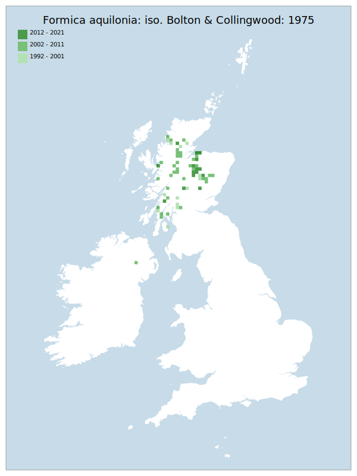

# Formica aquilonia: iso. Bolton & Collingwood: 1975

## Provisional Red List status: LC
- B1 a,b, 
- B2 a,b, 
- D2

## Red List Justification
*N/A*
### Narrative

The most threatening accepted population decline was inferred at 0% using expert inference (A2). This does not exceed the 30% decline required for qualification as VU. The EoO (33,800 km^2) exceeds the 20,000 km^2 VU threshold for criterion B1 and does not satisfy sufficient subcriteria to reach a threat status, and the AoO (512 km^2) is below the 2,000 km^2 VU threshold for criterion B2 but does not satisfy sufficient subcriteria to reach a threat status. For Criterion D2, the number of locations was greater than 5 and there is no plausible threat that could drive the taxon to CR or RE in a very short time. No information was available on population size to inform assessments against Criteria C and D1; nor were any life-history models available to inform an assessment against Criterion E.
### Quantified Attributes
|Attribute|Result|
|---|---|
|Synanthropy|No|
|Vagrancy|No|
|Colonisation|No|
|Nomenclature|No|

## National Rarity
Nationally Scarce (*NS*)

## National Presence
|Country|Presence
|---|:-:|
|England|N|
|Scotland|Y|
|Wales|N|

## Distribution map

## Red List QA Metrics
### Decade
| Slice | # Records | AoO (sq km) | dEoO (sq km) |BU%A |
|---|---|---|---|---|
|1992 - 2001|94|228|59789|93%|
|2002 - 2011|189|348|60733|95%|
|2012 - 2021|128|108|40771|63%|
### 5-year
| Slice | # Records | AoO (sq km) | dEoO (sq km) |BU%A |
|---|---|---|---|---|
|2002 - 2006|74|100|28936|45%|
|2007 - 2011|115|260|58991|92%|
|2012 - 2016|125|100|40169|62%|
|2017 - 2021|3|12|13809|21%|
### Criterion A2 (Statistical)
|Attribute|Assessment|Value|Accepted|Justification
|---|---|---|---|---|
|Raw record count|CE|-98%|No|Insufficient data|
|AoO|CE|-88%|No|Insufficient data|
|dEoO|EN|-66%|No|Insufficient data|
|Bayesian|LC|5%|No|Insufficient data|
|Bayesian (Expert interpretation)|DD|*N/A*|Yes||
### Criterion A2 (Expert Inference)
|Attribute|Assessment|Value|Accepted|Justification
|---|---|---|---|---|
|Internal review|DD||Yes||
### Criterion A3 (Expert Inference)
|Attribute|Assessment|Value|Accepted|Justification
|---|---|---|---|---|
|Internal review|DD||Yes||
### Criterion B
|Criterion| Value|
|---|---|
|Locations|>10|
|Subcriteria||
|Support||
#### B1
|Attribute|Assessment|Value|Accepted|Justification
|---|---|---|---|---|
|MCP|LC|33800|Yes||
#### B2
|Attribute|Assessment|Value|Accepted|Justification
|---|---|---|---|---|
|Tetrad|LC|512|Yes||
### Criterion D2
|Attribute|Assessment|Value|Accepted|Justification
|---|---|---|---|---|
|D2|LC|*N/A*|Yes||
### Wider Review
|  |  |
|---|---|
|**Action**|Maintained|
|**Reviewed Status**|LC|
|**Justification**||

## National Rarity QA Metrics
|Attribute|Value|
|---|---|
|Hectads|68|
|Calculated|NS|
|Final|NS|
|Moderation support||

