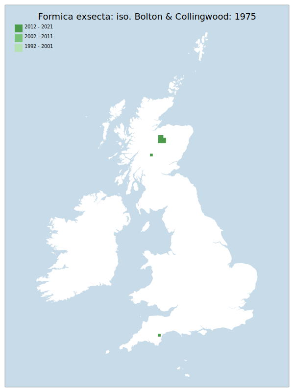

# Formica exsecta: iso. Bolton & Collingwood: 1975

## Provisional Red List status: VU
- B2 a,b, iii

## Red List Justification
Requires a maintained amount of successional front in woodland. Has a potential management conflict with Capercallie, with which it shares a goegraphic region. The Capercallie requires denser continuous forest cover than this taxon.
### Narrative
This “wood ant” builds smaller nests than the other mound nesting species of the genus and nests have been found in open heath or moor, as well as woodland rides and clearings, and roadside verges. The distribution has always been disjunct and limited to the south coast of England and the Scottish Highlands but is much declined in England and to a lesser extent in Scotland. For the main (Scottish) population it requires a maintained amount of successional edge habitat in woodland. As such it has a potential management conflict with Capercaillie, with which it shares a geographic region. The Capercaillie requires denser continuous forest cover than this taxon.

No assessment was possible under Criterion A due insufficient data. The EoO (27,000 km2</sup.) is above the 20,000 km2</sup. VU threshold for criterion B1 and the AoO (124 km2</sup.) is below the 500 km2</sup. EN threshold for criterion B2. There are fewer or equal to 10 locations, and continuing decline observed/projected in area, extent & quality of habitat. For Criterion D2, the number of locations was greater than 5, and there is no plausible threat of rapid habitat loss that could drive the taxon to CR or RE in a very short time. No information was available on population size to inform assessments against Criteria C and D1; nor were any life-history models available to inform an assessment against Criterion E.
### Quantified Attributes
|Attribute|Result|
|---|---|
|Synanthropy|No|
|Vagrancy|No|
|Colonisation|No|
|Nomenclature|No|

## National Rarity
Nationally Rare (*NR*)

## National Presence
|Country|Presence
|---|:-:|
|England|Y|
|Scotland|Y|
|Wales|N|

## Distribution map

## Red List QA Metrics
### Decade
| Slice | # Records | AoO (sq km) | dEoO (sq km) |BU%A |
|---|---|---|---|---|
|1992 - 2001|21|32|14999|67%|
|2002 - 2011|25|52|21107|95%|
|2012 - 2021|110|92|22094|100%|
### 5-year
| Slice | # Records | AoO (sq km) | dEoO (sq km) |BU%A |
|---|---|---|---|---|
|2002 - 2006|8|12|14710|66%|
|2007 - 2011|17|48|14412|65%|
|2012 - 2016|104|88|22094|100%|
|2017 - 2021|6|8|6694|30%|
### Criterion A2 (Statistical)
|Attribute|Assessment|Value|Accepted|Justification
|---|---|---|---|---|
|Raw record count|CE|-94%|No|Insufficient data|
|AoO|CE|-91%|No|Insufficient data|
|dEoO|EN|-70%|No|Insufficient data|
|Bayesian|VU|2%|No|Insufficient data|
|Bayesian (Expert interpretation)|DD|*N/A*|Yes||
### Criterion A2 (Expert Inference)
|Attribute|Assessment|Value|Accepted|Justification
|---|---|---|---|---|
|Internal review|DD||Yes||
### Criterion A3 (Expert Inference)
|Attribute|Assessment|Value|Accepted|Justification
|---|---|---|---|---|
|Internal review|DD||Yes||
### Criterion B
|Criterion| Value|
|---|---|
|Locations|<=10|
|Subcriteria|iii|
|Support|Requires a maintained amount of successional front in woodland. Has a potential management conflict with Capercallie, which requires denser continuous forest cover.|
#### B1
|Attribute|Assessment|Value|Accepted|Justification
|---|---|---|---|---|
|MCP|LC|27000|Yes||
#### B2
|Attribute|Assessment|Value|Accepted|Justification
|---|---|---|---|---|
|Tetrad|VU|124|Yes||
### Criterion D2
|Attribute|Assessment|Value|Accepted|Justification
|---|---|---|---|---|
|D2|LC|*N/A*|Yes||
### Wider Review
|  |  |
|---|---|
|**Action**|Maintained|
|**Reviewed Status**|VU|
|**Justification**||

## National Rarity QA Metrics
|Attribute|Value|
|---|---|
|Hectads|11|
|Calculated|NR|
|Final|NR|
|Moderation support||

