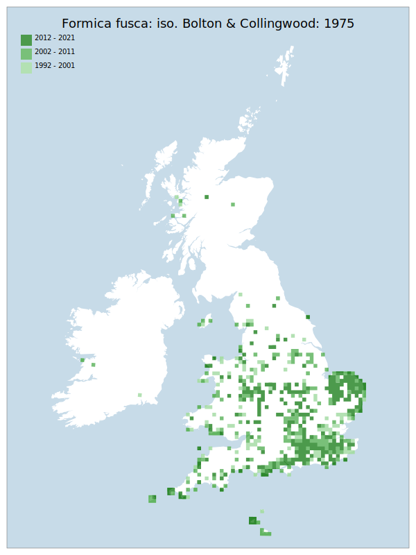

# Formica fusca: iso. Bolton & Collingwood: 1975

## Provisional Red List status: LC
- A2 b,c
- B1 a,b, 
- B2 a,b, 
- D2

## Red List Justification
*N/A*
### Narrative

The most threatening accepted population change estimate is -10.0% (discrete Extent of Occurrence), which does not exceed the 30% decline required for qualification as VU under Criterion A. The EoO (325,800 km²) exceeds the 20,000 km² VU threshold for criterion B1 and does not satisfy sufficient subcriteria to reach a threat status, and the AoO (5,564 km²) exceeds the 2,000 km² VU threshold for criterion B2 and does not satisfy sufficient subcriteria to reach a threat status. For Criterion D2, the number of locations was greater than 5 and there is no plausible threat that could drive the taxon to CR or RE in a very short time. No information was available on population size to inform assessments against Criteria C and D1; nor were any life-history models available to inform an assessment against Criterion E.
### Quantified Attributes
|Attribute|Result|
|---|---|
|Synanthropy|No|
|Vagrancy|No|
|Colonisation|No|
|Nomenclature|No|

## National Rarity
Nationally Frequent (*NF*)

## National Presence
|Country|Presence
|---|:-:|
|England|Y|
|Scotland|Y|
|Wales|Y|

## Distribution map

## Red List QA Metrics
### Decade
| Slice | # Records | AoO (sq km) | dEoO (sq km) |BU%A |
|---|---|---|---|---|
|1992 - 2001|1095|2140|239074|83%|
|2002 - 2011|1853|2816|259762|91%|
|2012 - 2021|881|1756|227569|79%|
### 5-year
| Slice | # Records | AoO (sq km) | dEoO (sq km) |BU%A |
|---|---|---|---|---|
|2002 - 2006|619|1560|236699|82%|
|2007 - 2011|1234|1552|223457|78%|
|2012 - 2016|638|1156|202286|70%|
|2017 - 2021|243|684|182207|63%|
### Criterion A2 (Statistical)
|Attribute|Assessment|Value|Accepted|Justification
|---|---|---|---|---|
|Raw record count|EN|-62%|No|Insufficient data|
|AoO|VU|-41%|No|Insufficient data|
|dEoO|LC|-10%|Yes||
|Bayesian|LC|21%|No|Insufficient data|
|Bayesian (Expert interpretation)|DD|*N/A*|Yes||
### Criterion A2 (Expert Inference)
|Attribute|Assessment|Value|Accepted|Justification
|---|---|---|---|---|
|Internal review|LC||Yes||
### Criterion A3 (Expert Inference)
|Attribute|Assessment|Value|Accepted|Justification
|---|---|---|---|---|
|Internal review|DD||Yes||
### Criterion B
|Criterion| Value|
|---|---|
|Locations|>10|
|Subcriteria||
|Support||
#### B1
|Attribute|Assessment|Value|Accepted|Justification
|---|---|---|---|---|
|MCP|LC|325800|Yes||
#### B2
|Attribute|Assessment|Value|Accepted|Justification
|---|---|---|---|---|
|Tetrad|LC|5564|Yes||
### Criterion D2
|Attribute|Assessment|Value|Accepted|Justification
|---|---|---|---|---|
|D2|LC|*N/A*|Yes||
### Wider Review
|  |  |
|---|---|
|**Action**|Maintained|
|**Reviewed Status**|LC|
|**Justification**||

## National Rarity QA Metrics
|Attribute|Value|
|---|---|
|Hectads|588|
|Calculated|NF|
|Final|NF|
|Moderation support||

