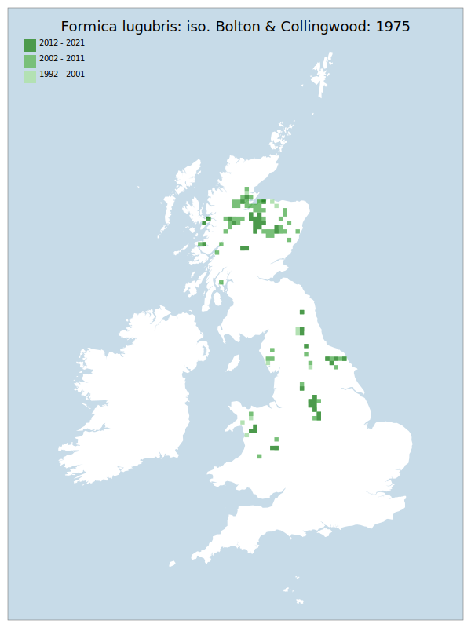

# Formica lugubris: iso. Bolton & Collingwood: 1975

## Provisional Red List status: LC
- B1ab
- B2ab
- D2

## Red List Justification
*N/A*

### Narrative

The most threatening accepted population decline was inferred at 0% using expert inference (A2). This does not exceed the 30% decline required for qualification as VU. The EoO (140,900 km²) exceeds the 20,000 km² VU threshold for criterion B1 and does not satisfy sufficient subcriteria to reach a threat status, and the AoO (944 km²) is below the 2,000 km² VU threshold for criterion B2 but does not satisfy sufficient subcriteria to reach a threat status. For Criterion D2, the number of locations was greater than 5 and there is no plausible threat that could drive the taxon to CR or RE in a very short time. No information was available on population size to inform assessments against Criteria C and D1; nor were any life-history models available to inform an assessment against Criterion E.

### Quantified Attributes
|Attribute|Result|
|---|---|
|Synanthropy|No|
|Vagrancy|No|
|Colonisation|No|
|Nomenclature|No|

## National Rarity
Nationally Frequent (*NF*)

## National Presence
|Country|Presence
|---|:-:|
|England|Y|
|Scotland|Y|
|Wales|Y|

## Distribution map

## Red List QA Metrics
### Decade
| Slice | # Records | AoO (sq km) | dEoO (sq km) |BU%A |
|---|---|---|---|---|
|1992 - 2001|107|284|91383|70%|
|2002 - 2011|454|676|125844|96%|
|2012 - 2021|286|300|86064|66%|

### 5-year
| Slice | # Records | AoO (sq km) | dEoO (sq km) |BU%A |
|---|---|---|---|---|
|2002 - 2006|202|308|89897|69%|
|2007 - 2011|252|488|107372|82%|
|2012 - 2016|268|260|70413|54%|
|2017 - 2021|18|56|52562|40%|

### Criterion A2 (Statistical)
|Attribute|Assessment|Value|Accepted|Justification
|---|---|---|---|---|
|Raw record count|CE|-93%|No|Insufficient data|
|AoO|EN|-78%|No|Insufficient data|
|dEoO|LC|-25%|No|Insufficient data|
|Bayesian|EN|6%|No|Insufficient data|
|Bayesian (Expert interpretation)|DD|*N/A*|Yes||

### Criterion A2 (Expert Inference)
|Attribute|Assessment|Value|Accepted|Justification
|---|---|---|---|---|
|Internal review|DD||Yes||

### Criterion A3 (Expert Inference)
|Attribute|Assessment|Value|Accepted|Justification
|---|---|---|---|---|
|Internal review|DD||Yes||

### Criterion B
|Criterion| Value|
|---|---|
|Locations|>10|
|Subcriteria||
|Support||

#### B1
|Attribute|Assessment|Value|Accepted|Justification
|---|---|---|---|---|
|MCP|LC|140900|Yes||

#### B2
|Attribute|Assessment|Value|Accepted|Justification
|---|---|---|---|---|
|Tetrad|LC|944|Yes||

### Criterion D2
|Attribute|Assessment|Value|Accepted|Justification
|---|---|---|---|---|
|D2|LC|*N/A*|Yes||

### Wider Review
|  |  |
|---|---|
|**Action**|Maintained|
|**Reviewed Status**|LC|
|**Justification**||

## National Rarity QA Metrics
|Attribute|Value|
|---|---|
|Hectads|116|
|Calculated|NF|
|Final|NF|
|Moderation support||
