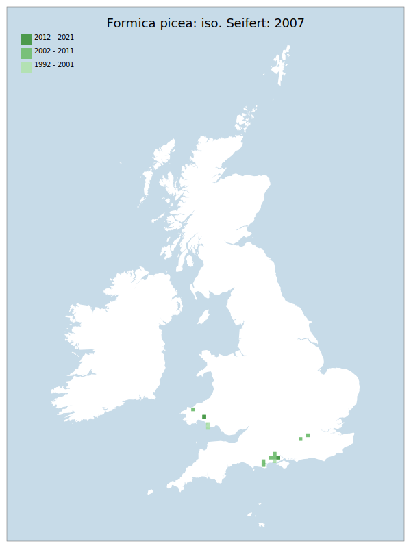

# Formica picea: iso. Seifert: 2007

## Provisional Red List status: VU
- B2 a,b, iii

## Red List Justification
Vulnerable to changes in hydrology of known sites, as well as vegetation succession.
### Narrative
This ant – a specialist of wet lowland heath – has always been restricted to South Wales and southern counties of England (Dorset, Hampshire and Surrey). It has disappeared from several of its former sites and is vulnerable to changes in hydrology, as well as vegetation succession. It may be under-recorded in known locations due to confusion with other species in the Serviformica sub genus but there is no evidence it occurs anywhere else in GB.

No assessment was possible under Criterion A due insufficient data. The EoO (66,000 km2</sup.) is above the 20,000 km2</sup. EN threshold for criterion B1 and the AoO (92 km2</sup.) is below the 500 km2</sup. EN threshold for criterion B2. There are fewer or equal to 10 locations, and continuing decline observed/projected in area, extent & quality of habitat. was greater than 5 and there is no plausible threat that could drive the taxon to CR or RE in a very short time. No information was available on population size to inform assessments against Criteria C and D1; nor were any life-history models available to inform an assessment against Criterion E.
### Quantified Attributes
|Attribute|Result|
|---|---|
|Synanthropy|No|
|Vagrancy|No|
|Colonisation|No|
|Nomenclature|No|

## National Rarity
Nationally Rare (*NR*)

## National Presence
|Country|Presence
|---|:-:|
|England|Y|
|Scotland|N|
|Wales|Y|

## Distribution map

## Red List QA Metrics
### Decade
| Slice | # Records | AoO (sq km) | dEoO (sq km) |BU%A |
|---|---|---|---|---|
|1992 - 2001|47|60|27631|69%|
|2002 - 2011|27|52|30052|75%|
|2012 - 2021|2|8|13388|33%|
### 5-year
| Slice | # Records | AoO (sq km) | dEoO (sq km) |BU%A |
|---|---|---|---|---|
|2002 - 2006|16|24|25698|64%|
|2007 - 2011|11|28|17952|44%|
|2012 - 2016|1|4|6694|16%|
|2017 - 2021|1|4|6694|16%|
### Criterion A2 (Statistical)
|Attribute|Assessment|Value|Accepted|Justification
|---|---|---|---|---|
|Raw record count|LC|0%|No|Insufficient data|
|AoO|LC|0%|No|Insufficient data|
|dEoO|LC|0%|No|Insufficient data|
|Bayesian|LC|0%|No|Insufficient data|
|Bayesian (Expert interpretation)|DD|*N/A*|Yes||
### Criterion A2 (Expert Inference)
|Attribute|Assessment|Value|Accepted|Justification
|---|---|---|---|---|
|Internal review|DD||Yes||
### Criterion A3 (Expert Inference)
|Attribute|Assessment|Value|Accepted|Justification
|---|---|---|---|---|
|Internal review|DD||Yes||
### Criterion B
|Criterion| Value|
|---|---|
|Locations|<=10|
|Subcriteria|iii|
|Support|Vulnerable to changes in hydrology of known sites, as well as vegetation succession, |
#### B1
|Attribute|Assessment|Value|Accepted|Justification
|---|---|---|---|---|
|MCP|LC|66000|Yes||
#### B2
|Attribute|Assessment|Value|Accepted|Justification
|---|---|---|---|---|
|Tetrad|VU|92|Yes||
### Criterion D2
|Attribute|Assessment|Value|Accepted|Justification
|---|---|---|---|---|
|D2|LC|*N/A*|Yes||
### Wider Review
|  |  |
|---|---|
|**Action**|Maintained|
|**Reviewed Status**|VU|
|**Justification**||

## National Rarity QA Metrics
|Attribute|Value|
|---|---|
|Hectads|14|
|Calculated|NR|
|Final|NR|
|Moderation support||

