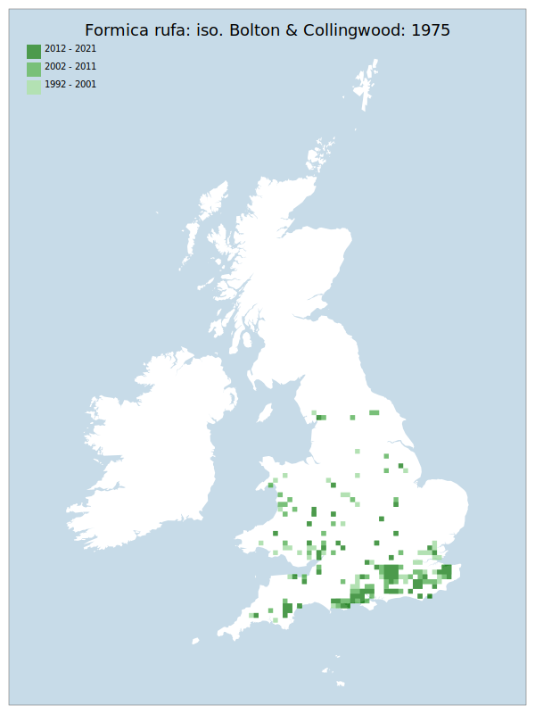

---
    parent: ant
    ---

    # Formica rufa: iso. Bolton & Collingwood: 1975

## Provisional Red List status: VU
- A2 b,c

## Red List Justification
Changes to woodland management practices have led to a decline. Current management practices do not lead to suitable conditions for spread. Effects noted across entire survey area by multiple experts, including directed survey efforts and academic projects.
### Narrative
This mound nesting “wood ant” has undergone contraction of the range of especially in northern, central and eastern England and parts of Wales. Changes to woodland management practices have contributed to decline and current woodland management practices do not lead to suitable conditions for spread. These effects have been noted throughout GB by multiple experts - including directed survey efforts by regional recorders - and a large number of academic research projects.

The most threatening accepted population change estimate is 10.0% (tetrad area), which does not exceed the 30% decline required for qualification as VU under Criterion A. Expert inference assessed the taxon as VU (30% decline over 10 years), predominantly based on survey experience and research work performed on this species. The assessment of VU was supported by all peer reviewers who provided a response. The EoO (134,050 km²) exceeds the 20,000 km² VU threshold for criterion B1 and does not satisfy sufficient subcriteria to reach a threat status, and the AoO (2,116 km²) exceeds the 2,000 km² VU threshold for criterion B2. There are assessed to be greater or equal to 10 locations (VU) and there is no continuing decline observed & projected to the area, extent/quality of habitat. For Criterion D2, the number of locations was greater than 5 and there is no plausible threat that could drive the taxon to CR or RE in a very short time. No information was available on population size to inform assessments against Criteria C and D1; nor were any life-history models available to inform an assessment against Criterion E.
### Quantified Attributes
|Attribute|Result|
|---|---|
|Synanthropy|No|
|Vagrancy|No|
|Colonisation|No|
|Nomenclature|No|

## National Rarity
Nationally Frequent (*NF*)

## National Presence
|Country|Presence
|---|:-:|
|England|Y|
|Scotland|N|
|Wales|Y|

## Distribution map

## Red List QA Metrics
### Decade
| Slice | # Records | AoO (sq km) | dEoO (sq km) |BU%A |
|---|---|---|---|---|
|1992 - 2001|742|1416|151332|90%|
|2002 - 2011|470|956|142151|84%|
|2012 - 2021|276|584|124085|73%|
### 5-year
| Slice | # Records | AoO (sq km) | dEoO (sq km) |BU%A |
|---|---|---|---|---|
|2002 - 2006|293|688|131848|78%|
|2007 - 2011|177|424|112233|66%|
|2012 - 2016|114|304|92359|55%|
|2017 - 2021|162|336|107953|64%|
### Criterion A2 (Statistical)
|Attribute|Assessment|Value|Accepted|Justification
|---|---|---|---|---|
|Raw record count|LC|42%|Yes||
|AoO|LC|11%|Yes||
|dEoO|LC|17%|Yes||
|Bayesian|LC|5%|Yes||
|Bayesian (Expert interpretation)|LC|*N/A*|Yes||
### Criterion A2 (Expert Inference)
|Attribute|Assessment|Value|Accepted|Justification
|---|---|---|---|---|
|Internal review|VU|Changes to woodland management practices have led to a decline in this taxon. Current management practices do not lead to suitable conditions for spread, with forestry tending towards narrow, shaded rides that are unsuitable for this species. Larger felling blocks, driven by larger harvesting machinery, are also detrimental to the taxon as glades/rides become less frequent. The effects have been noted across the entire survey area by multiple experts, including directed survey efforts and academic projects.|Yes||
### Criterion A3 (Expert Inference)
|Attribute|Assessment|Value|Accepted|Justification
|---|---|---|---|---|
|Internal review|DD||Yes||
### Criterion B
|Criterion| Value|
|---|---|
|Locations|>10|
|Subcriteria||
|Support||
#### B1
|Attribute|Assessment|Value|Accepted|Justification
|---|---|---|---|---|
|MCP|LC|134050|Yes||
#### B2
|Attribute|Assessment|Value|Accepted|Justification
|---|---|---|---|---|
|Tetrad|LC|2116|Yes||
### Criterion D2
|Attribute|Assessment|Value|Accepted|Justification
|---|---|---|---|---|
|D2|LC|*N/A*|Yes||
### Wider Review
|  |  |
|---|---|
|**Action**|Maintained|
|**Reviewed Status**|VU|
|**Justification**|This taxon was reviewed considerably by the core team, with the final decision being taken to maintain the status of VU based on A2 Expert Inference. Mike Edwards specifically reiterated that active, reproducing nests have declined by at least 30% over the past decade, to the best of his knowledge. It was also pointed out that large nest mounds are the sign of a struggling nest, not of success.|

## National Rarity QA Metrics
|Attribute|Value|
|---|---|
|Hectads|198|
|Calculated|NF|
|Final|NF|
|Moderation support||

