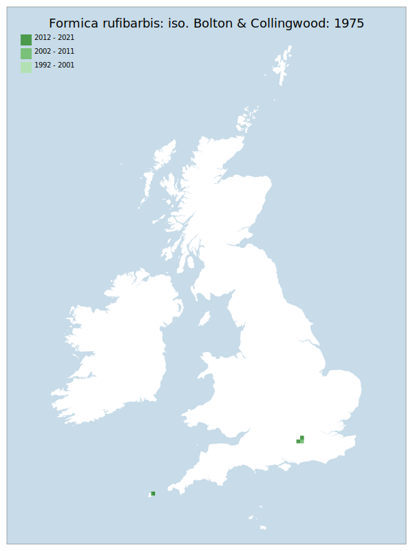

# Formica rufibarbis: iso. Bolton & Collingwood: 1975

## Provisional Red List status: EN
- B2 a,b, iii
iv
ii
i

## Red List Justification
The mainland population is threatened by development, while the Scilly population has a threat of increased vegetational growth reducing nesting viability. There is close to zero possibility of re-colonisation from within GB should one of these sites be lost. The mainland population is currently being maintained by a group with low support.

One of the few known mainland colonies was lost due to the replacement of a manhole cover.
### Narrative
This mound nesting ant has always been very rare in the British Isles: all well-substantiated records are from Surrey and the Isles of Scilly. The mainland population is threatened by development (1 colony was lost when a manhole cover was replaced), while the Scilly population has a threat of increased vegetational growth reducing nesting viability. There is close to zero possibility of re-colonisation from within GB should one of these sites be lost. The mainland population is currently being conserved / maintained by a volunteer group with low support.

No statistical assessment was possible under Criterion A due insufficient data. Expert inference assessed this taxon as NT under future threat on the basis of continued intensification of the very localised known occupied areas, lack of support for current conservation efforts, and low possibility of recolonisation. The EoO (7,600 km²) is below the 20,000 km² VU threshold for criterion B1 and the AoO (28 km²) is below the 500 km² EN threshold for criterion B2. There are fewer or equal to 5 locations, and continuing/projected decline in extent of occurrence, area of occupancy, and area, extent & quality of habitat. For Criterion D2, the number of locations was fewer or equal to 5, and there is a plausible threat of rapid habitat loss that could drive the taxon to CR or RE in a very short time. No information was available on population size to inform assessments against Criteria C and D1; nor were any life-history models available to inform an assessment against Criterion E.
### Quantified Attributes
|Attribute|Result|
|---|---|
|Synanthropy|No|
|Vagrancy|No|
|Colonisation|No|
|Nomenclature|No|

## National Rarity
Nationally Rare (*NR*)

## National Presence
|Country|Presence
|---|:-:|
|England|Y|
|Scotland|N|
|Wales|N|

## Distribution map

## Red List QA Metrics
### Decade
| Slice | # Records | AoO (sq km) | dEoO (sq km) |BU%A |
|---|---|---|---|---|
|1992 - 2001|29|20|14288|95%|
|2002 - 2011|63|24|14288|95%|
|2012 - 2021|17|12|14710|98%|
### 5-year
| Slice | # Records | AoO (sq km) | dEoO (sq km) |BU%A |
|---|---|---|---|---|
|2002 - 2006|27|24|14288|95%|
|2007 - 2011|36|16|13388|89%|
|2012 - 2016|15|8|8015|53%|
|2017 - 2021|2|4|6694|44%|
### Criterion A2 (Statistical)
|Attribute|Assessment|Value|Accepted|Justification
|---|---|---|---|---|
|Raw record count|CE|-87%|No|Insufficient data|
|AoO|EN|-50%|No|Insufficient data|
|dEoO|LC|-16%|No|Insufficient data|
|Bayesian|LC|0%|No|Insufficient data|
|Bayesian (Expert interpretation)|DD|*N/A*|Yes||
### Criterion A2 (Expert Inference)
|Attribute|Assessment|Value|Accepted|Justification
|---|---|---|---|---|
|Internal review|NT|One of the few known colonies was lost due to the replacement of a manhole cover.|Yes||
### Criterion A3 (Expert Inference)
|Attribute|Assessment|Value|Accepted|Justification
|---|---|---|---|---|
|Internal review|DD||Yes||
### Criterion B
|Criterion| Value|
|---|---|
|Locations|<=5|
|Subcriteria|iii, iv, ii, i|
|Support|Mainland population threatened by development. Scilly population has a threat of increased vegetational change. Close to zero possibility of re-colonisation from within GB. Mainland population currently being maintained by a group with low support.|
#### B1
|Attribute|Assessment|Value|Accepted|Justification
|---|---|---|---|---|
|MCP|VU|7600|Yes||
#### B2
|Attribute|Assessment|Value|Accepted|Justification
|---|---|---|---|---|
|Tetrad|EN|28|Yes||
### Criterion D2
|Attribute|Assessment|Value|Accepted|Justification
|---|---|---|---|---|
|D2|VU|*N/A*|Yes||
### Wider Review
|  |  |
|---|---|
|**Action**|Maintained|
|**Reviewed Status**|EN|
|**Justification**||

## National Rarity QA Metrics
|Attribute|Value|
|---|---|
|Hectads|4|
|Calculated|NR|
|Final|NR|
|Moderation support||

