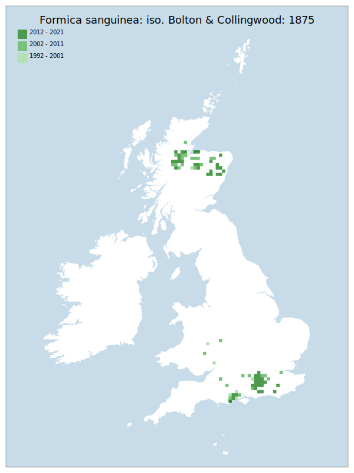

# Formica sanguinea: iso. Bolton & Collingwood: 1875

## Provisional Red List status: LC
- A2 b,c
- B1 a,b, 
- B2 a,b, 
- D2

## Red List Justification
*N/A*
### Quantified Attributes
|Attribute|Result|
|---|---|
|Synanthropy|No|
|Vagrancy|No|
|Colonisation|No|
|Nomenclature|No|

## National Rarity
Nationally Scarce (*NS*)

## National Presence
|Country|Presence
|---|:-:|
|England|Y|
|Scotland|Y|
|Wales|Y|

## Distribution map

## Red List QA Metrics
### Decade
| Slice | # Records | AoO (sq km) | dEoO (sq km) |BU%A |
|---|---|---|---|---|
|1992 - 2001|224|448|72349|76%|
|2002 - 2011|352|580|83036|87%|
|2012 - 2021|167|304|58959|62%|
### 5-year
| Slice | # Records | AoO (sq km) | dEoO (sq km) |BU%A |
|---|---|---|---|---|
|2002 - 2006|120|292|63597|67%|
|2007 - 2011|232|392|72902|77%|
|2012 - 2016|131|228|56354|59%|
|2017 - 2021|36|96|34518|36%|
### Criterion A2 (Statistical)
|Attribute|Assessment|Value|Accepted|Justification
|---|---|---|---|---|
|Raw record count|EN|-73%|No|Insufficient data|
|AoO|EN|-58%|No|Insufficient data|
|dEoO|VU|-39%|No|Insufficient data|
|Bayesian|LC|10%|Yes||
|Bayesian (Expert interpretation)|LC|*N/A*|Yes||
### Criterion A2 (Expert Inference)
|Attribute|Assessment|Value|Accepted|Justification
|---|---|---|---|---|
|Internal review|LC||Yes||
### Criterion A3 (Expert Inference)
|Attribute|Assessment|Value|Accepted|Justification
|---|---|---|---|---|
|Internal review|DD||Yes||
### Criterion B
|Criterion| Value|
|---|---|
|Locations|>10|
|Subcriteria||
|Support||
#### B1
|Attribute|Assessment|Value|Accepted|Justification
|---|---|---|---|---|
|MCP|LC|159600|Yes||
#### B2
|Attribute|Assessment|Value|Accepted|Justification
|---|---|---|---|---|
|Tetrad|LC|980|Yes||
### Criterion D2
|Attribute|Assessment|Value|Accepted|Justification
|---|---|---|---|---|
|D2|LC|*N/A*|Yes||
### Wider Review
|  |  |
|---|---|
|**Action**|Maintained|
|**Reviewed Status**|LC|
|**Justification**||

## National Rarity QA Metrics
|Attribute|Value|
|---|---|
|Hectads|100|
|Calculated|NS|
|Final|NS|
|Moderation support||

