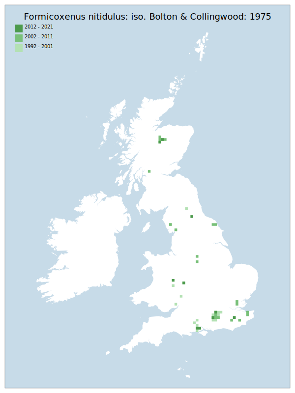

# Formicoxenus nitidulus: iso. Bolton & Collingwood: 1975

## Provisional Red List status: VU
- A2 b,c

## Red List Justification
One host, Formica rufa: iso. Bolton & Collingwood: 1975, is assessed as VU. This is the only host in the south of this taxon's range, and as such constitutes a significant portion of the known taxon's population.
### Narrative
This is a “guest ant” which lives as a harmless commensal within the nest mounds of *Formica* species. Although the species has been found to associate with three *Formica* species, 1 of these - *F. rufa* - is assessed as VU. *F. rufa* is the only host in the south of this taxon's range, and with most modern records from the south of England constitutes a significant portion of the known taxon's population. Targeted surveying has been undertaken for this species in the assessment period.

No statistical assessment was possible under Criterion A due insufficient data. Expert inference assessed this taxon as VU on the basis of the extent of occupancy of one of two hosts (*Formica rufa*: iso. Bolton & Collingwood: 1975). This taxon is the only host found in the south of England, the loss or contraction of which alone has a very high probability to cause >30% decline in the extent of occupancy of  *F. nitidulus*. The EoO (143,100 km2</sup.) is above the 20,000 km2</sup. VU threshold for criterion B1 and the AoO (344 km2</sup.) is below the 500 km2</sup. EN threshold for criterion B2. However, the taxon does not satisfy sufficient subcriteria to reach a threat status. For Criterion D2, the number of locations was greater than 5, and there is no plausible threat of rapid habitat loss that could drive the taxon to CR or RE in a very short time. No information was available on population size to inform assessments against Criteria C and D1; nor were any life-history models available to inform an assessment against Criterion E.
### Quantified Attributes
|Attribute|Result|
|---|---|
|Synanthropy|No|
|Vagrancy|No|
|Colonisation|No|
|Nomenclature|No|

## National Rarity
Nationally Scarce (*NS*)

## National Presence
|Country|Presence
|---|:-:|
|England|Y|
|Scotland|Y|
|Wales|Y|

## Distribution map

## Red List QA Metrics
### Decade
| Slice | # Records | AoO (sq km) | dEoO (sq km) |BU%A |
|---|---|---|---|---|
|1992 - 2001|92|192|59835|57%|
|2002 - 2011|84|184|80410|76%|
|2012 - 2021|19|44|46025|43%|
### 5-year
| Slice | # Records | AoO (sq km) | dEoO (sq km) |BU%A |
|---|---|---|---|---|
|2002 - 2006|54|136|66332|63%|
|2007 - 2011|30|56|42070|40%|
|2012 - 2016|17|36|39330|37%|
|2017 - 2021|2|8|13388|12%|
### Criterion A2 (Statistical)
|Attribute|Assessment|Value|Accepted|Justification
|---|---|---|---|---|
|Raw record count|CE|-88%|No|Insufficient data|
|AoO|EN|-78%|No|Insufficient data|
|dEoO|EN|-66%|No|Insufficient data|
|Bayesian|LC|2%|No|Insufficient data|
|Bayesian (Expert interpretation)|DD|*N/A*|Yes||
### Criterion A2 (Expert Inference)
|Attribute|Assessment|Value|Accepted|Justification
|---|---|---|---|---|
|Internal review|VU|One host, Formica rufa: iso. Bolton & Collingwood: 1975, is assessed as VU. This is the only host in the south of this taxon's range.|Yes||
### Criterion A3 (Expert Inference)
|Attribute|Assessment|Value|Accepted|Justification
|---|---|---|---|---|
|Internal review|DD||Yes||
### Criterion B
|Criterion| Value|
|---|---|
|Locations|>10|
|Subcriteria||
|Support||
#### B1
|Attribute|Assessment|Value|Accepted|Justification
|---|---|---|---|---|
|MCP|LC|143100|Yes||
#### B2
|Attribute|Assessment|Value|Accepted|Justification
|---|---|---|---|---|
|Tetrad|LC|344|Yes||
### Criterion D2
|Attribute|Assessment|Value|Accepted|Justification
|---|---|---|---|---|
|D2|LC|*N/A*|Yes||
### Wider Review
|  |  |
|---|---|
|**Action**|Moderated|
|**Reviewed Status**|NT|
|**Justification**|Moderated based on feedback|

## National Rarity QA Metrics
|Attribute|Value|
|---|---|
|Hectads|48|
|Calculated|NS|
|Final|NS|
|Moderation support||

