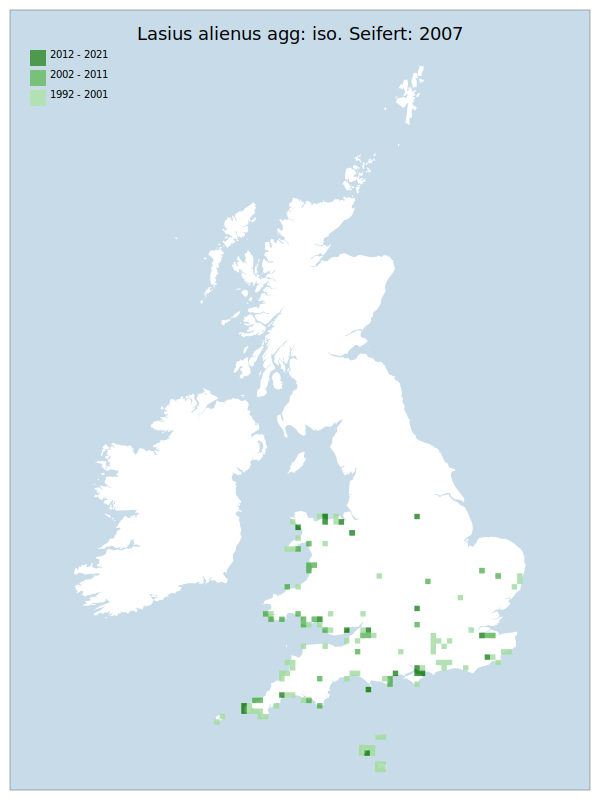

# Lasius alienus agg: iso. Seifert: 2007

## Provisional Red List status: NE

## Red List Justification
*N/A*

### Narrative

### Quantified Attributes
|Attribute|Result|
|---|---|
|Synanthropy|No|
|Vagrancy|No|
|Colonisation|No|
|Nomenclature|No|

## National Rarity
Nationally Frequent (*NF*)

## National Presence
|Country|Presence
|---|:-:|
|England|Y|
|Scotland|N|
|Wales|Y|

## Distribution map

## Red List QA Metrics
### Decade
| Slice | # Records | AoO (sq km) | dEoO (sq km) |BU%A |
|---|---|---|---|---|
|1992 - 2001|247|612|161127|89%|
|2002 - 2011|78|184|107317|59%|
|2012 - 2021|32|100|85834|47%|

### 5-year
| Slice | # Records | AoO (sq km) | dEoO (sq km) |BU%A |
|---|---|---|---|---|
|2002 - 2006|59|116|72936|40%|
|2007 - 2011|19|68|53945|29%|
|2012 - 2016|11|40|47443|26%|
|2017 - 2021|21|60|53284|29%|

### Criterion A2 (Statistical)
|Attribute|Assessment|Value|Accepted|Justification
|---|---|---|---|---|
|Raw record count|LC|91%|||
|AoO|LC|50%|||
|dEoO|LC|12%|||
|Bayesian|VU|4%|||
|Bayesian (Expert interpretation)||*N/A*|||

### Criterion A2 (Expert Inference)
|Attribute|Assessment|Value|Accepted|Justification
|---|---|---|---|---|
|Internal review|||||

### Criterion A3 (Expert Inference)
|Attribute|Assessment|Value|Accepted|Justification
|---|---|---|---|---|
|Internal review|DD||||

### Criterion B
|Criterion| Value|
|---|---|
|Locations||
|Subcriteria||
|Support||

#### B1
|Attribute|Assessment|Value|Accepted|Justification
|---|---|---|---|---|
|MCP|LC|153050|||

#### B2
|Attribute|Assessment|Value|Accepted|Justification
|---|---|---|---|---|
|Tetrad|LC|824|||

### Criterion D2
|Attribute|Assessment|Value|Accepted|Justification
|---|---|---|---|---|
|D2|LC|*N/A*|Yes||

### Wider Review
|  |  |
|---|---|
|**Action**|Maintained|
|**Reviewed Status**|NE|
|**Justification**||

## National Rarity QA Metrics
|Attribute|Value|
|---|---|
|Hectads|126|
|Calculated|NF|
|Final|NF|
|Moderation support||
