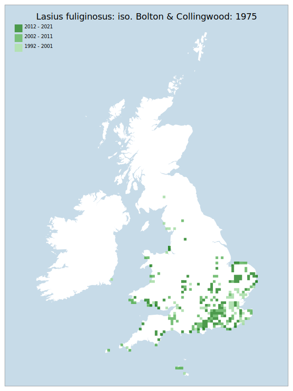

# Lasius fuliginosus: iso. Bolton & Collingwood: 1975

## Provisional Red List status: LC
- A2bc
- B1ab
- B2ab
- D2

## Red List Justification
*N/A*

### Narrative

The most threatening accepted population change estimate is -6.0% (discrete Extent of Occurrence), which does not exceed the 30% decline required for qualification as VU under Criterion A. The EoO (198,650 km²) exceeds the 20,000 km² VU threshold for criterion B1 and does not satisfy sufficient subcriteria to reach a threat status, and the AoO (2,004 km²) exceeds the 2,000 km² VU threshold for criterion B2 and does not satisfy sufficient subcriteria to reach a threat status. For Criterion D2, the number of locations was greater than 5 and there is no plausible threat that could drive the taxon to CR or RE in a very short time. No information was available on population size to inform assessments against Criteria C and D1; nor were any life-history models available to inform an assessment against Criterion E.

### Quantified Attributes
|Attribute|Result|
|---|---|
|Synanthropy|No|
|Vagrancy|No|
|Colonisation|No|
|Nomenclature|No|

## National Rarity
Nationally Frequent (*NF*)

## National Presence
|Country|Presence
|---|:-:|
|England|Y|
|Scotland|Y|
|Wales|Y|

## Distribution map

## Red List QA Metrics
### Decade
| Slice | # Records | AoO (sq km) | dEoO (sq km) |BU%A |
|---|---|---|---|---|
|1992 - 2001|310|752|159497|76%|
|2002 - 2011|442|968|168397|80%|
|2012 - 2021|222|624|145625|69%|

### 5-year
| Slice | # Records | AoO (sq km) | dEoO (sq km) |BU%A |
|---|---|---|---|---|
|2002 - 2006|187|508|142894|68%|
|2007 - 2011|255|544|132387|63%|
|2012 - 2016|145|380|124002|59%|
|2017 - 2021|77|264|116596|55%|

### Criterion A2 (Statistical)
|Attribute|Assessment|Value|Accepted|Justification
|---|---|---|---|---|
|Raw record count|VU|-47%|No|Insufficient data|
|AoO|VU|-31%|No|Insufficient data|
|dEoO|LC|-6%|Yes||
|Bayesian|LC|10%|No|Insufficient data|
|Bayesian (Expert interpretation)|DD|*N/A*|Yes||

### Criterion A2 (Expert Inference)
|Attribute|Assessment|Value|Accepted|Justification
|---|---|---|---|---|
|Internal review|LC|Hyper-parasite. Parasite of the Lasius umbratus group, which in turn parasitise other Lasius sp.|Yes||

### Criterion A3 (Expert Inference)
|Attribute|Assessment|Value|Accepted|Justification
|---|---|---|---|---|
|Internal review|DD||Yes||

### Criterion B
|Criterion| Value|
|---|---|
|Locations|>10|
|Subcriteria||
|Support||

#### B1
|Attribute|Assessment|Value|Accepted|Justification
|---|---|---|---|---|
|MCP|LC|198650|Yes||

#### B2
|Attribute|Assessment|Value|Accepted|Justification
|---|---|---|---|---|
|Tetrad|LC|2004|Yes||

### Criterion D2
|Attribute|Assessment|Value|Accepted|Justification
|---|---|---|---|---|
|D2|LC|*N/A*|Yes||

### Wider Review
|  |  |
|---|---|
|**Action**|Maintained|
|**Reviewed Status**|LC|
|**Justification**||

## National Rarity QA Metrics
|Attribute|Value|
|---|---|
|Hectads|268|
|Calculated|NF|
|Final|NF|
|Moderation support||
