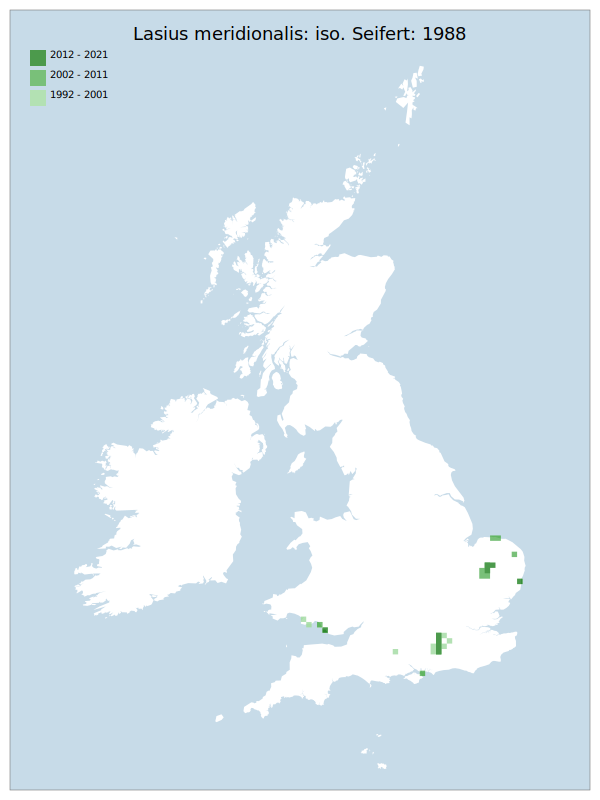

---
    parent: ant
    ---

    # Lasius meridionalis: iso. Seifert: 1988

## Provisional Red List status: LC
- B1 a,b, 
- B2 a,b, 
- D2

## Red List Justification
*N/A*
### Narrative
This parasitic ant is seldom seen as it spends the vast majority of it's time in the host nest (of another species of Lasius - principally L. psammophilus). As such it is not possible to place confidence in the recorded distribution.

Insufficient data were available to reach a supportable conclusion on the threat status for this taxon.
### Quantified Attributes
|Attribute|Result|
|---|---|
|Synanthropy|No|
|Vagrancy|No|
|Colonisation|No|
|Nomenclature|No|

## National Rarity
Insufficient Data (*ID*)

## National Presence
|Country|Presence
|---|:-:|
|England|Y|
|Scotland|N|
|Wales|Y|

## Distribution map

## Red List QA Metrics
### Decade
| Slice | # Records | AoO (sq km) | dEoO (sq km) |BU%A |
|---|---|---|---|---|
|1992 - 2001|53|140|35077|57%|
|2002 - 2011|55|104|48304|79%|
|2012 - 2021|17|52|29307|48%|
### 5-year
| Slice | # Records | AoO (sq km) | dEoO (sq km) |BU%A |
|---|---|---|---|---|
|2002 - 2006|12|28|30825|50%|
|2007 - 2011|43|76|31767|52%|
|2012 - 2016|16|48|22612|37%|
|2017 - 2021|1|4|6694|11%|
### Criterion A2 (Statistical)
|Attribute|Assessment|Value|Accepted|Justification
|---|---|---|---|---|
|Raw record count|CE|-94%|No|Insufficient data|
|AoO|CE|-92%|No|Insufficient data|
|dEoO|EN|-70%|No|Insufficient data|
|Bayesian|LC|3%|No|Insufficient data|
|Bayesian (Expert interpretation)|DD|*N/A*|Yes||
### Criterion A2 (Expert Inference)
|Attribute|Assessment|Value|Accepted|Justification
|---|---|---|---|---|
|Internal review|DD||Yes||
### Criterion A3 (Expert Inference)
|Attribute|Assessment|Value|Accepted|Justification
|---|---|---|---|---|
|Internal review|DD||Yes||
### Criterion B
|Criterion| Value|
|---|---|
|Locations|>10|
|Subcriteria||
|Support||
#### B1
|Attribute|Assessment|Value|Accepted|Justification
|---|---|---|---|---|
|MCP|LC|61150|Yes||
#### B2
|Attribute|Assessment|Value|Accepted|Justification
|---|---|---|---|---|
|Tetrad|LC|256|Yes||
### Criterion D2
|Attribute|Assessment|Value|Accepted|Justification
|---|---|---|---|---|
|D2|LC|*N/A*|Yes||
### Wider Review
|  |  |
|---|---|
|**Action**|Re-assessed|
|**Reviewed Status**|DD|
|**Justification**|Moved back to DD based on reviewer feedback|

## National Rarity QA Metrics
|Attribute|Value|
|---|---|
|Hectads|29|
|Calculated|NS|
|Final|ID|
|Moderation support||

