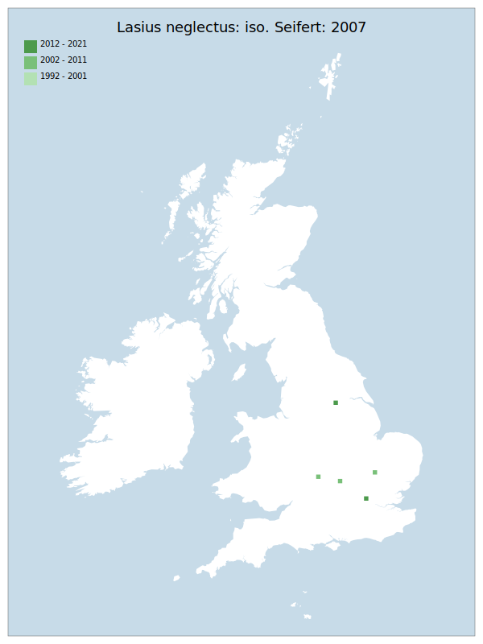

# Lasius neglectus: iso. Seifert: 2007

## Provisional Red List status: NE

## Red List Justification
A synanthropic colonist.

### Narrative
An ant that probably originated from Asia Minor or Turkey (Seifert, 2000) and is thought to have been introduced into Europe with horticultural materials (Espadaler et al., 2007). As a synanthropic colonist it has not been evaluated.

### Quantified Attributes
|Attribute|Result|
|---|---|
|Synanthropy|Synanthropic Colonist|
|Vagrancy|No|
|Colonisation|No|
|Nomenclature|Early-assessment change|

## National Rarity
Insufficient Data (*ID*)

## National Presence
|Country|Presence
|---|:-:|
|England|Y|
|Scotland|N|
|Wales|N|

## Distribution map

## Red List QA Metrics
### Decade
| Slice | # Records | AoO (sq km) | dEoO (sq km) |BU%A |
|---|---|---|---|---|
|1992 - 2001|0|0|0|0%|
|2002 - 2011|5|12|17571|60%|
|2012 - 2021|4|12|13388|46%|

### 5-year
| Slice | # Records | AoO (sq km) | dEoO (sq km) |BU%A |
|---|---|---|---|---|
|2002 - 2006|0|0|0|0%|
|2007 - 2011|5|12|17571|60%|
|2012 - 2016|3|8|13388|46%|
|2017 - 2021|1|4|6694|23%|

### Criterion A2 (Statistical)
|Attribute|Assessment|Value|Accepted|Justification
|---|---|---|---|---|
|Raw record count|EN|-67%|No|Insufficient data|
|AoO|EN|-50%|No|Insufficient data|
|dEoO|EN|-50%|No|Insufficient data|
|Bayesian|DD|*NaN*%|Yes||
|Bayesian (Expert interpretation)|DD|*N/A*|Yes||

### Criterion A2 (Expert Inference)
|Attribute|Assessment|Value|Accepted|Justification
|---|---|---|---|---|
|Internal review|DD|Highly difficult to identify and find.|Yes||

### Criterion A3 (Expert Inference)
|Attribute|Assessment|Value|Accepted|Justification
|---|---|---|---|---|
|Internal review|DD||||

### Criterion B
|Criterion| Value|
|---|---|
|Locations||
|Subcriteria||
|Support||

#### B1
|Attribute|Assessment|Value|Accepted|Justification
|---|---|---|---|---|
|MCP|LC|18250|No|Insufficient data|

#### B2
|Attribute|Assessment|Value|Accepted|Justification
|---|---|---|---|---|
|Tetrad|LC|24|No|Insufficient data|

### Criterion D2
|Attribute|Assessment|Value|Accepted|Justification
|---|---|---|---|---|
|D2|DD|*N/A*|Yes||

### Wider Review
|  |  |
|---|---|
|**Action**|Maintained|
|**Reviewed Status**|NE|
|**Justification**||

## National Rarity QA Metrics
|Attribute|Value|
|---|---|
|Hectads|5|
|Calculated|NR|
|Final|ID|
|Moderation support||
