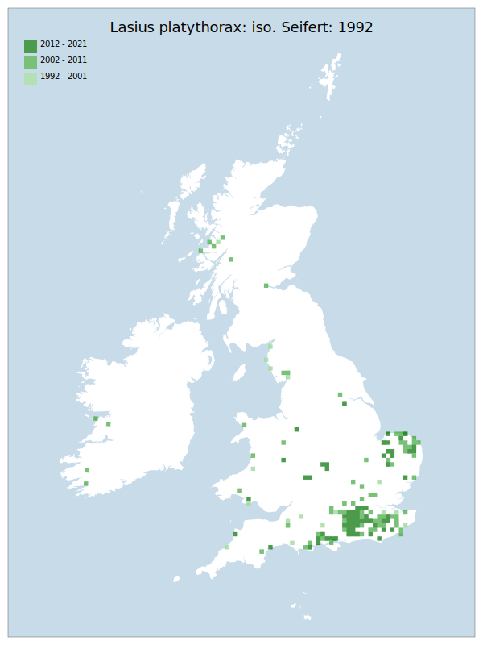

# Lasius platythorax: iso. Seifert: 1992

## Provisional Red List status: LC
- A2bc
- B1ab
- B2ab
- D2

## Red List Justification
*N/A*

### Narrative

The most threatening accepted population decline was inferred at 0% using expert inference (A2). This does not exceed the 30% decline required for qualification as VU. The EoO (234,200 km²) exceeds the 20,000 km² VU threshold for criterion B1 and does not satisfy sufficient subcriteria to reach a threat status, and the AoO (1,360 km²) is below the 2,000 km² VU threshold for criterion B2 but does not satisfy sufficient subcriteria to reach a threat status. For Criterion D2, the number of locations was greater than 5 and there is no plausible threat that could drive the taxon to CR or RE in a very short time. No information was available on population size to inform assessments against Criteria C and D1; nor were any life-history models available to inform an assessment against Criterion E.

### Quantified Attributes
|Attribute|Result|
|---|---|
|Synanthropy|No|
|Vagrancy|No|
|Colonisation|No|
|Nomenclature|Early-assessment change|

## National Rarity
Nationally Frequent (*NF*)

## National Presence
|Country|Presence
|---|:-:|
|England|Y|
|Scotland|Y|
|Wales|Y|

## Distribution map

## Red List QA Metrics
### Decade
| Slice | # Records | AoO (sq km) | dEoO (sq km) |BU%A |
|---|---|---|---|---|
|1992 - 2001|98|308|103197|52%|
|2002 - 2011|376|840|153304|77%|
|2012 - 2021|200|440|111116|56%|

### 5-year
| Slice | # Records | AoO (sq km) | dEoO (sq km) |BU%A |
|---|---|---|---|---|
|2002 - 2006|144|432|103457|52%|
|2007 - 2011|232|484|124335|62%|
|2012 - 2016|140|300|88571|44%|
|2017 - 2021|60|152|72062|36%|

### Criterion A2 (Statistical)
|Attribute|Assessment|Value|Accepted|Justification
|---|---|---|---|---|
|Raw record count|EN|-57%|No|Insufficient data|
|AoO|VU|-49%|No|Insufficient data|
|dEoO|LC|-19%|No|Insufficient data|
|Bayesian|LC|9%|No|Insufficient data|
|Bayesian (Expert interpretation)|DD|*N/A*|Yes||

### Criterion A2 (Expert Inference)
|Attribute|Assessment|Value|Accepted|Justification
|---|---|---|---|---|
|Internal review|LC|Still confusion with Lasius niger: iso. Seifert: 1992, though data has been extensively checked.|Yes||

### Criterion A3 (Expert Inference)
|Attribute|Assessment|Value|Accepted|Justification
|---|---|---|---|---|
|Internal review|DD||Yes||

### Criterion B
|Criterion| Value|
|---|---|
|Locations|>10|
|Subcriteria||
|Support||

#### B1
|Attribute|Assessment|Value|Accepted|Justification
|---|---|---|---|---|
|MCP|LC|234200|Yes||

#### B2
|Attribute|Assessment|Value|Accepted|Justification
|---|---|---|---|---|
|Tetrad|LC|1360|Yes||

### Criterion D2
|Attribute|Assessment|Value|Accepted|Justification
|---|---|---|---|---|
|D2|LC|*N/A*|Yes||

### Wider Review
|  |  |
|---|---|
|**Action**|Maintained|
|**Reviewed Status**|LC|
|**Justification**||

## National Rarity QA Metrics
|Attribute|Value|
|---|---|
|Hectads|180|
|Calculated|NF|
|Final|NF|
|Moderation support||
