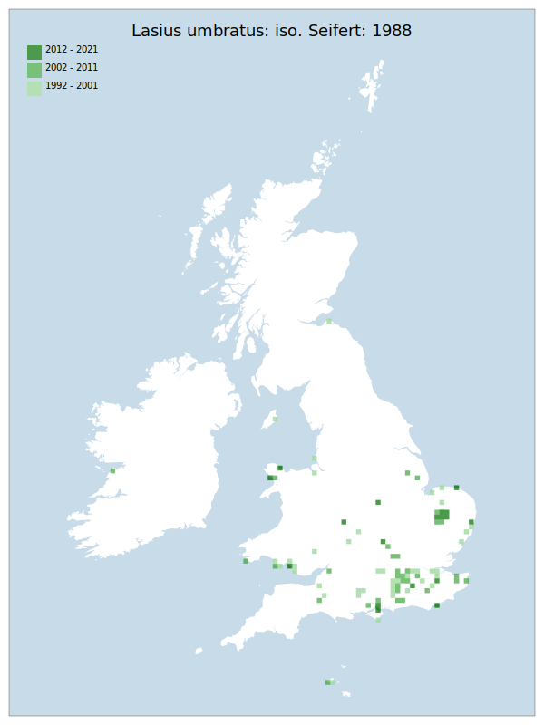

# Lasius umbratus: iso. Seifert: 1988

## Provisional Red List status: LC
- A2bc
- B1ab
- B2ab
- D2

## Red List Justification
*N/A*

### Narrative
This parasitic ant is seldom seen as it spends the vast majority of it's time in the host nest (of another species of Lasius - there are three known hosts and others are possible). As such it is not possible to place confidence in the recorded distribution.

Insufficient data were available to reach a supportable conclusion on the threat status for this taxon.

### Quantified Attributes
|Attribute|Result|
|---|---|
|Synanthropy|No|
|Vagrancy|No|
|Colonisation|No|
|Nomenclature|No|

## National Rarity
Insufficient Data (*ID*)

## National Presence
|Country|Presence
|---|:-:|
|England|Y|
|Scotland|Y|
|Wales|Y|

## Distribution map

## Red List QA Metrics
### Decade
| Slice | # Records | AoO (sq km) | dEoO (sq km) |BU%A |
|---|---|---|---|---|
|1992 - 2001|91|292|108080|71%|
|2002 - 2011|124|272|89800|59%|
|2012 - 2021|49|140|81013|53%|

### 5-year
| Slice | # Records | AoO (sq km) | dEoO (sq km) |BU%A |
|---|---|---|---|---|
|2002 - 2006|25|72|61120|40%|
|2007 - 2011|99|200|57870|38%|
|2012 - 2016|46|132|78617|51%|
|2017 - 2021|3|12|14288|9%|

### Criterion A2 (Statistical)
|Attribute|Assessment|Value|Accepted|Justification
|---|---|---|---|---|
|Raw record count|CE|-93%|No|Insufficient data|
|AoO|CE|-91%|No|Insufficient data|
|dEoO|CE|-82%|No|Insufficient data|
|Bayesian|LC|6%|No|Insufficient data|
|Bayesian (Expert interpretation)|DD|*N/A*|Yes||

### Criterion A2 (Expert Inference)
|Attribute|Assessment|Value|Accepted|Justification
|---|---|---|---|---|
|Internal review|LC|Typically recorded by finding wandering queens, or destroying other ant nests.|Yes||

### Criterion A3 (Expert Inference)
|Attribute|Assessment|Value|Accepted|Justification
|---|---|---|---|---|
|Internal review|DD||Yes||

### Criterion B
|Criterion| Value|
|---|---|
|Locations|>10|
|Subcriteria||
|Support||

#### B1
|Attribute|Assessment|Value|Accepted|Justification
|---|---|---|---|---|
|MCP|LC|183400|Yes||

#### B2
|Attribute|Assessment|Value|Accepted|Justification
|---|---|---|---|---|
|Tetrad|LC|680|Yes||

### Criterion D2
|Attribute|Assessment|Value|Accepted|Justification
|---|---|---|---|---|
|D2|LC|*N/A*|Yes||

### Wider Review
|  |  |
|---|---|
|**Action**|Re-assessed|
|**Reviewed Status**|DD|
|**Justification**|Moved back to DD based on reviewer feedback|

## National Rarity QA Metrics
|Attribute|Value|
|---|---|
|Hectads|99|
|Calculated|NS|
|Final|ID|
|Moderation support||
