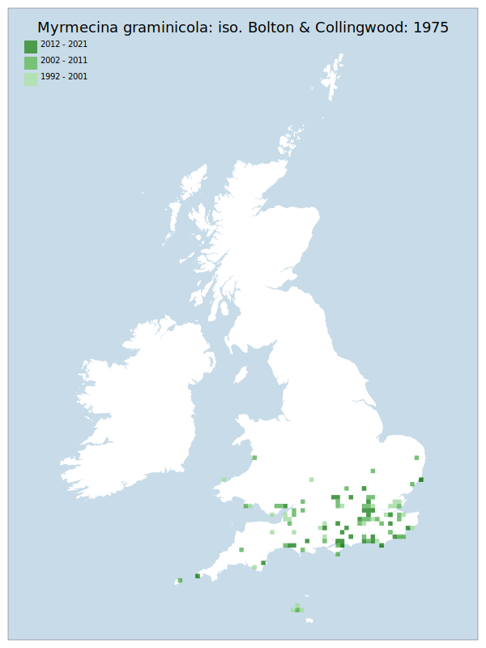

# Myrmecina graminicola: iso. Bolton & Collingwood: 1975

## Provisional Red List status: LC
- A2 b,c
- B1 a,b, 
- B2 a,b, 
- D2

## Red List Justification
*N/A*
### Narrative

The most threatening accepted population change estimate is 127.0% (Bayesian upper 95% CI), which does not exceed the 30% decline required for qualification as VU under Criterion A. The EoO (115,900 km2) exceeds the 20,000 km2 VU threshold for criterion B1 and does not satisfy sufficient subcriteria to reach a threat status, and the AoO (720 km2) is below the 2,000 km2 VU threshold for criterion B2 but does not satisfy sufficient subcriteria to reach a threat status. For Criterion D2, the number of locations was greater than 5 and there is no plausible threat that could drive the taxon to CR or RE in a very short time. No information was available on population size to inform assessments against Criteria C and D1; nor were any life-history models available to inform an assessment against Criterion E.
### Quantified Attributes
|Attribute|Result|
|---|---|
|Synanthropy|No|
|Vagrancy|No|
|Colonisation|No|
|Nomenclature|No|

## National Rarity
Nationally Frequent (*NF*)

## National Presence
|Country|Presence
|---|:-:|
|England|Y|
|Scotland|N|
|Wales|Y|

## Distribution map

## Red List QA Metrics
### Decade
| Slice | # Records | AoO (sq km) | dEoO (sq km) |BU%A |
|---|---|---|---|---|
|1992 - 2001|220|280|102152|77%|
|2002 - 2011|113|284|110901|83%|
|2012 - 2021|78|216|78613|59%|
### 5-year
| Slice | # Records | AoO (sq km) | dEoO (sq km) |BU%A |
|---|---|---|---|---|
|2002 - 2006|76|168|94499|71%|
|2007 - 2011|37|128|80016|60%|
|2012 - 2016|48|128|56943|43%|
|2017 - 2021|30|96|54724|41%|
### Criterion A2 (Statistical)
|Attribute|Assessment|Value|Accepted|Justification
|---|---|---|---|---|
|Raw record count|VU|-38%|No|Insufficient data|
|AoO|LC|-25%|No|Insufficient data|
|dEoO|LC|-4%|No|Insufficient data|
|Bayesian|LC|5%|Yes||
|Bayesian (Expert interpretation)|LC|*N/A*|Yes||
### Criterion A2 (Expert Inference)
|Attribute|Assessment|Value|Accepted|Justification
|---|---|---|---|---|
|Internal review|LC||Yes||
### Criterion A3 (Expert Inference)
|Attribute|Assessment|Value|Accepted|Justification
|---|---|---|---|---|
|Internal review|DD||Yes||
### Criterion B
|Criterion| Value|
|---|---|
|Locations|>10|
|Subcriteria||
|Support||
#### B1
|Attribute|Assessment|Value|Accepted|Justification
|---|---|---|---|---|
|MCP|LC|115900|Yes||
#### B2
|Attribute|Assessment|Value|Accepted|Justification
|---|---|---|---|---|
|Tetrad|LC|720|Yes||
### Criterion D2
|Attribute|Assessment|Value|Accepted|Justification
|---|---|---|---|---|
|D2|LC|*N/A*|Yes||
### Wider Review
|  |  |
|---|---|
|**Action**|Maintained|
|**Reviewed Status**|LC|
|**Justification**||

## National Rarity QA Metrics
|Attribute|Value|
|---|---|
|Hectads|111|
|Calculated|NF|
|Final|NF|
|Moderation support||

