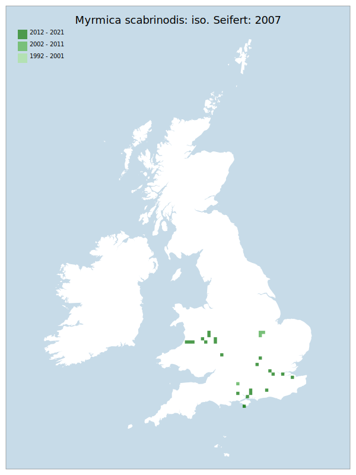

# Myrmica scabrinodis: iso. Seifert: 2007

## Provisional Red List status: NE

## Red List Justification
Modern interpretation (Skinner & Jarmin, in press) suggests that data of Myrmica scabrinodis agg: iso. Seifert: 2007 is entirely Myrmica scabrinodis. Accordingly, Myrmica scabrinodis agg: iso. Seifert: 2007 has been assessed for this Red List as though it is Myrmica scabrinodis.
### Narrative
Modern interpretation (Skinner & Jarmin, in press) suggests that data of Myrmica scabrinodis agg: iso. Seifert: 2007 is entirely Myrmica scabrinodis. Accordingly, Myrmica scabrinodis agg: iso. Seifert: 2007 has been assessed for this Red List as though it is Myrmica scabrinodis.

### Quantified Attributes
|Attribute|Result|
|---|---|
|Synanthropy|No|
|Vagrancy|No|
|Colonisation|No|
|Nomenclature|Peri-assessment change|

## National Rarity
Insufficient Data (*ID*)

## National Presence
|Country|Presence
|---|:-:|
|England|Y|
|Scotland|N|
|Wales|Y|

## Distribution map

## Red List QA Metrics
### Decade
| Slice | # Records | AoO (sq km) | dEoO (sq km) |BU%A |
|---|---|---|---|---|
|1992 - 2001|0|0|0|0%|
|2002 - 2011|4|16|14999|22%|
|2012 - 2021|24|96|56029|85%|
### 5-year
| Slice | # Records | AoO (sq km) | dEoO (sq km) |BU%A |
|---|---|---|---|---|
|2002 - 2006|4|16|14999|22%|
|2007 - 2011|0|0|0|0%|
|2012 - 2016|1|4|6694|10%|
|2017 - 2021|23|92|54917|84%|
### Criterion A2 (Statistical)
|Attribute|Assessment|Value|Accepted|Justification
|---|---|---|---|---|
|Raw record count|LC|2200%|No|Insufficient data|
|AoO|LC|2200%|No|Insufficient data|
|dEoO|LC|720%|No|Insufficient data|
|Bayesian|DD|*NaN*%|Yes||
|Bayesian (Expert interpretation)|DD|*N/A*|Yes||
### Criterion A2 (Expert Inference)
|Attribute|Assessment|Value|Accepted|Justification
|---|---|---|---|---|
|Internal review|DD|Modern interpretation (Skinner & Jarmin, in press) suggests that data of Myrmica scabrinodis agg: iso. Seifert: 2007 is entirely Myrmica scabrinodis. Accordingly, Myrmica scabrinodis agg: iso. Seifert: 2007 has been assessed for this Red List as though it is Myrmica scabrinodis.|Yes||
### Criterion A3 (Expert Inference)
|Attribute|Assessment|Value|Accepted|Justification
|---|---|---|---|---|
|Internal review|DD||Yes||
### Criterion B
|Criterion| Value|
|---|---|
|Locations||
|Subcriteria||
|Support||
#### B1
|Attribute|Assessment|Value|Accepted|Justification
|---|---|---|---|---|
|MCP|LC|49500|No|Insufficient data|
#### B2
|Attribute|Assessment|Value|Accepted|Justification
|---|---|---|---|---|
|Tetrad|LC|112|No|Insufficient data|
### Criterion D2
|Attribute|Assessment|Value|Accepted|Justification
|---|---|---|---|---|
|D2|DD|*N/A*|Yes||
### Wider Review
|  |  |
|---|---|
|**Action**|Maintained|
|**Reviewed Status**|NE|
|**Justification**|See Skinner & Jarman 2025, and see M. scabrinodis agg: iso. Seifert: 2007 for current assessment|

## National Rarity QA Metrics
|Attribute|Value|
|---|---|
|Hectads|25|
|Calculated|NS|
|Final|ID|
|Moderation support|Modern interpretation change is obscuring data|

