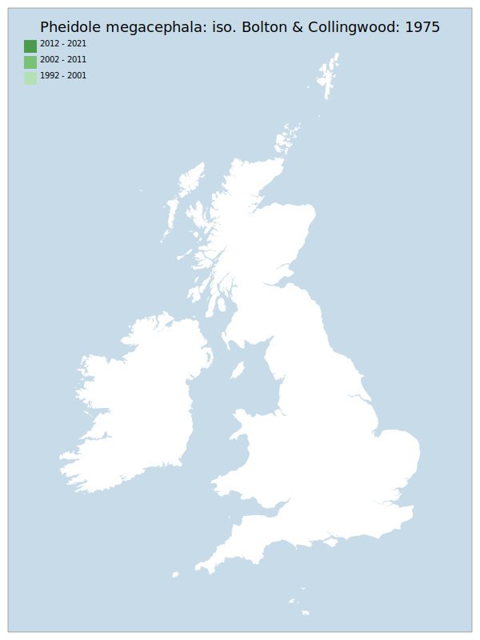

# Pheidole megacephala: iso. Bolton & Collingwood: 1975

## Provisional Red List status: NE

## Red List Justification
Only record is from 1850. One specimen was tentatively determined as this in 2015, but this determination was incorrect.

### Narrative
This ant – originally from Africa – has been introduced into many areas globally. There is an 1850 record, though a 2015 determination of a specimen was incorrect. A non-established synanthropic colonist that is not evaluated.

### Quantified Attributes
|Attribute|Result|
|---|---|
|Synanthropy|No|
|Vagrancy|No|
|Colonisation|No|
|Nomenclature|No|

## Distribution map

## Red List QA Metrics
### Decade
| Slice | # Records | AoO (sq km) | dEoO (sq km) |BU%A |
|---|---|---|---|---|
|1992 - 2001||||%|
|2002 - 2011||||%|
|2012 - 2021||||%|

### 5-year
| Slice | # Records | AoO (sq km) | dEoO (sq km) |BU%A |
|---|---|---|---|---|
|2002 - 2006||||%|
|2007 - 2011||||%|
|2012 - 2016||||%|
|2017 - 2021||||%|

### Criterion A2 (Statistical)
|Attribute|Assessment|Value|Accepted|Justification
|---|---|---|---|---|
|Raw record count|DD|%|||
|AoO|DD|%|||
|dEoO|DD|%|||
|Bayesian|DD|*NaN*%|||
|Bayesian (Expert interpretation)||*N/A*|||

### Criterion A2 (Expert Inference)
|Attribute|Assessment|Value|Accepted|Justification
|---|---|---|---|---|
|Internal review|||||

### Criterion A3 (Expert Inference)
|Attribute|Assessment|Value|Accepted|Justification
|---|---|---|---|---|
|Internal review|DD||||

### Criterion B
|Criterion| Value|
|---|---|
|Locations||
|Subcriteria||
|Support||

#### B1
|Attribute|Assessment|Value|Accepted|Justification
|---|---|---|---|---|
|MCP|DD||||

#### B2
|Attribute|Assessment|Value|Accepted|Justification
|---|---|---|---|---|
|Tetrad|DD||||

### Criterion D2
|Attribute|Assessment|Value|Accepted|Justification
|---|---|---|---|---|
|D2||*N/A*|||

### Wider Review
|  |  |
|---|---|
|**Action**|Maintained|
|**Reviewed Status**|NE|
|**Justification**||

