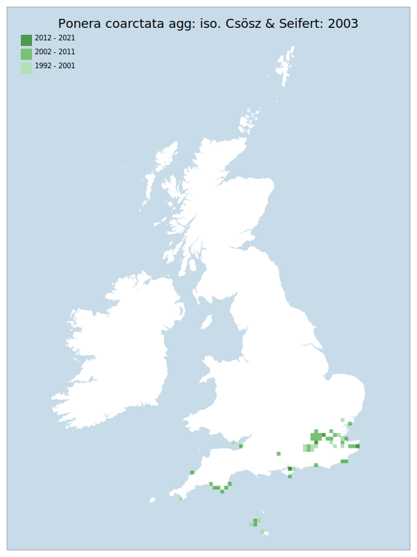

# Ponera coarctata agg: iso. Csösz & Seifert: 2003

## Provisional Red List status: NE

## Red List Justification
*N/A*

### Narrative

### Quantified Attributes
|Attribute|Result|
|---|---|
|Synanthropy|No|
|Vagrancy|No|
|Colonisation|No|
|Nomenclature|No|

## National Presence
|Country|Presence
|---|:-:|
|England|Y|
|Scotland|N|
|Wales|Y|

## Distribution map

## Red List QA Metrics
### Decade
| Slice | # Records | AoO (sq km) | dEoO (sq km) |BU%A |
|---|---|---|---|---|
|1992 - 2001|40|104|53359|68%|
|2002 - 2011|55|172|68131|86%|
|2012 - 2021|4|16|22689|28%|

### 5-year
| Slice | # Records | AoO (sq km) | dEoO (sq km) |BU%A |
|---|---|---|---|---|
|2002 - 2006|37|128|66700|85%|
|2007 - 2011|18|52|32537|41%|
|2012 - 2016|3|12|20082|25%|
|2017 - 2021|1|4|6694|8%|

### Criterion A2 (Statistical)
|Attribute|Assessment|Value|Accepted|Justification
|---|---|---|---|---|
|Raw record count|EN|-67%|||
|AoO|EN|-67%|||
|dEoO|EN|-67%|||
|Bayesian|LC|1%|||
|Bayesian (Expert interpretation)||*N/A*|||

### Criterion A2 (Expert Inference)
|Attribute|Assessment|Value|Accepted|Justification
|---|---|---|---|---|
|Internal review|||||

### Criterion A3 (Expert Inference)
|Attribute|Assessment|Value|Accepted|Justification
|---|---|---|---|---|
|Internal review|DD||||

### Criterion B
|Criterion| Value|
|---|---|
|Locations||
|Subcriteria||
|Support||

#### B1
|Attribute|Assessment|Value|Accepted|Justification
|---|---|---|---|---|
|MCP|LC|55850|||

#### B2
|Attribute|Assessment|Value|Accepted|Justification
|---|---|---|---|---|
|Tetrad|LC|284|||

### Criterion D2
|Attribute|Assessment|Value|Accepted|Justification
|---|---|---|---|---|
|D2||*N/A*|||

### Wider Review
|  |  |
|---|---|
|**Action**|Maintained|
|**Reviewed Status**|NE|
|**Justification**||

## National Rarity QA Metrics
|Attribute|Value|
|---|---|
|Hectads|54|
|Calculated|NS|
|Final||
|Moderation support||
