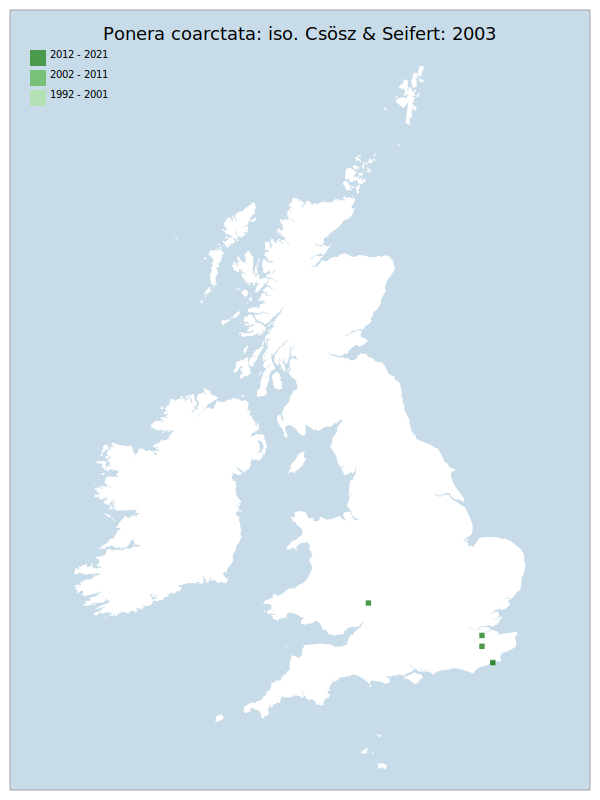

---
    parent: ant
    ---

    # Ponera coarctata: iso. Csösz & Seifert: 2003

## Provisional Red List status: LC
- A2 b,c

## Red List Justification
*N/A*
### Narrative

The most threatening accepted population decline was inferred at 0% using expert inference (A2). This does not exceed the 30% decline required for qualification as VU. The EoO was not accepted, the AoO was not accepted. For Criterion D2, the number of locations was greater than 5 and there is no plausible threat that could drive the taxon to CR or RE in a very short time. No information was available on population size to inform assessments against Criteria C and D1; nor were any life-history models available to inform an assessment against Criterion E.
### Quantified Attributes
|Attribute|Result|
|---|---|
|Synanthropy|No|
|Vagrancy|No|
|Colonisation|No|
|Nomenclature|Early-assessment change|

## National Rarity
Insufficient Data (*ID*)

## National Presence
|Country|Presence
|---|:-:|
|England|Y|
|Scotland|N|
|Wales|N|

## Distribution map

## Red List QA Metrics
### Decade
| Slice | # Records | AoO (sq km) | dEoO (sq km) |BU%A |
|---|---|---|---|---|
|1992 - 2001|0|0|0|0%|
|2002 - 2011|8|32|10849|54%|
|2012 - 2021|9|28|19517|97%|
### 5-year
| Slice | # Records | AoO (sq km) | dEoO (sq km) |BU%A |
|---|---|---|---|---|
|2002 - 2006|6|24|10849|54%|
|2007 - 2011|2|8|8753|43%|
|2012 - 2016|4|12|14113|70%|
|2017 - 2021|5|16|12402|62%|
### Criterion A2 (Statistical)
|Attribute|Assessment|Value|Accepted|Justification
|---|---|---|---|---|
|Raw record count|LC|25%|No|Insufficient data and nomencatural change|
|AoO|LC|33%|No|Insufficient data and nomencatural change|
|dEoO|LC|-12%|No|Insufficient data and nomencatural change|
|Bayesian|DD|*NaN*%|Yes||
|Bayesian (Expert interpretation)|DD|*N/A*|Yes||
### Criterion A2 (Expert Inference)
|Attribute|Assessment|Value|Accepted|Justification
|---|---|---|---|---|
|Internal review|LC|Based on expert inference from Andy Jarman|Yes||
### Criterion A3 (Expert Inference)
|Attribute|Assessment|Value|Accepted|Justification
|---|---|---|---|---|
|Internal review|DD||Yes||
### Criterion B
|Criterion| Value|
|---|---|
|Locations|>10|
|Subcriteria||
|Support||
#### B1
|Attribute|Assessment|Value|Accepted|Justification
|---|---|---|---|---|
|MCP|LC|4550|No|Insufficient data and nomencatural change|
#### B2
|Attribute|Assessment|Value|Accepted|Justification
|---|---|---|---|---|
|Tetrad|LC|60|No|Insufficient data and nomencatural change|
### Criterion D2
|Attribute|Assessment|Value|Accepted|Justification
|---|---|---|---|---|
|D2|DD|*N/A*|Yes||
### Wider Review
|  |  |
|---|---|
|**Action**|Re-assessed|
|**Reviewed Status**|LC|
|**Justification**||

## National Rarity QA Metrics
|Attribute|Value|
|---|---|
|Hectads|10|
|Calculated|NR|
|Final|ID|
|Moderation support||

