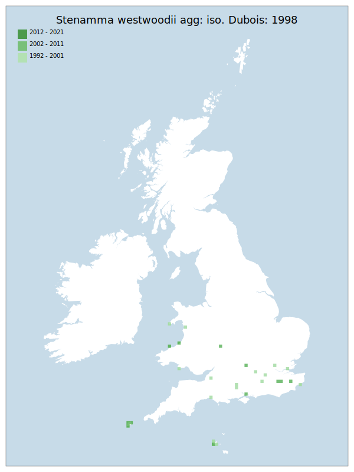

---
    parent: ant
    ---

    # Stenamma westwoodii agg: iso. Dubois: 1998

## Provisional Red List status: 

## Red List Justification
*N/A*
### Narrative

### Quantified Attributes
|Attribute|Result|
|---|---|
|Synanthropy|No|
|Vagrancy|No|
|Colonisation|No|
|Nomenclature|No|

## National Presence
|Country|Presence
|---|:-:|
|England|Y|
|Scotland|N|
|Wales|Y|

## Distribution map

## Red List QA Metrics
### Decade
| Slice | # Records | AoO (sq km) | dEoO (sq km) |BU%A |
|---|---|---|---|---|
|1992 - 2001|19|60|60162|68%|
|2002 - 2011|19|64|48210|55%|
|2012 - 2021|0|0|0|0%|
### 5-year
| Slice | # Records | AoO (sq km) | dEoO (sq km) |BU%A |
|---|---|---|---|---|
|2002 - 2006|11|40|37937|43%|
|2007 - 2011|8|28|21882|25%|
|2012 - 2016|0|0|0|0%|
|2017 - 2021|0|0|0|0%|
### Criterion A2 (Statistical)
|Attribute|Assessment|Value|Accepted|Justification
|---|---|---|---|---|
|Raw record count|LC|?%|||
|AoO|LC|?%|||
|dEoO|LC|?%|||
|Bayesian|LC|1%|||
|Bayesian (Expert interpretation)||*N/A*|||
### Criterion A2 (Expert Inference)
|Attribute|Assessment|Value|Accepted|Justification
|---|---|---|---|---|
|Internal review|||||
### Criterion A3 (Expert Inference)
|Attribute|Assessment|Value|Accepted|Justification
|---|---|---|---|---|
|Internal review|DD||||
### Criterion B
|Criterion| Value|
|---|---|
|Locations||
|Subcriteria||
|Support||
#### B1
|Attribute|Assessment|Value|Accepted|Justification
|---|---|---|---|---|
|MCP|LC|95400|||
#### B2
|Attribute|Assessment|Value|Accepted|Justification
|---|---|---|---|---|
|Tetrad|LC|124|||
### Criterion D2
|Attribute|Assessment|Value|Accepted|Justification
|---|---|---|---|---|
|D2||*N/A*|||
### Wider Review
|  |  |
|---|---|
|**Action**||
|**Reviewed Status**||
|**Justification**||

## National Rarity QA Metrics
|Attribute|Value|
|---|---|
|Hectads|25|
|Calculated|NS|
|Final||
|Moderation support||

