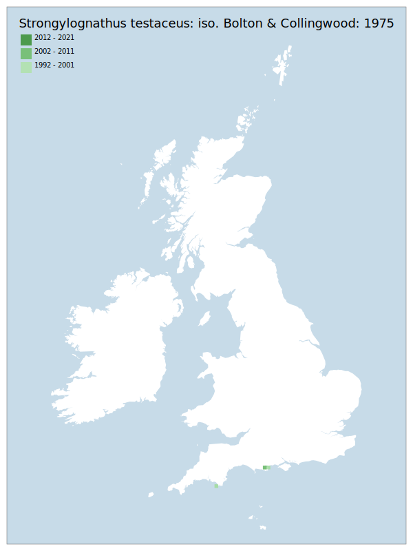

---
    parent: ant
    ---

    # Strongylognathus testaceus: iso. Bolton & Collingwood: 1975

## Provisional Red List status: DD
- A2 b,c
- A3 b
- D2

## Red List Justification
*N/A*
### Narrative
Strongylognathus testaceus is a very rare ant parasitic on Tetramorium caespitum (Linnaeus) with a very localised distribution (Devon, Dorset, South Hampshire). It is suspected that the species is a "degenerate slave maker", but due to the paucity of records the species biology and ecology are imperfectly known.

Insufficient data were available to reach a supportable conclusion on the threat status for this taxon.
### Quantified Attributes
|Attribute|Result|
|---|---|
|Synanthropy|No|
|Vagrancy|No|
|Colonisation|No|
|Nomenclature|No|

## National Rarity
Insufficient Data (*ID*)

## National Presence
|Country|Presence
|---|:-:|
|England|Y|
|Scotland|N|
|Wales|N|

## Distribution map

## Red List QA Metrics
### Decade
| Slice | # Records | AoO (sq km) | dEoO (sq km) |BU%A |
|---|---|---|---|---|
|1992 - 2001|5|12|14288|100%|
|2002 - 2011|1|4|6694|46%|
|2012 - 2021|0|0|0|0%|
### 5-year
| Slice | # Records | AoO (sq km) | dEoO (sq km) |BU%A |
|---|---|---|---|---|
|2002 - 2006|0|0|0|0%|
|2007 - 2011|1|4|6694|46%|
|2012 - 2016|0|0|0|0%|
|2017 - 2021|0|0|0|0%|
### Criterion A2 (Statistical)
|Attribute|Assessment|Value|Accepted|Justification
|---|---|---|---|---|
|Raw record count|LC|?%|No|Insufficient data|
|AoO|LC|?%|No|Insufficient data|
|dEoO|LC|?%|No|Insufficient data|
|Bayesian|DD|*NaN*%|Yes||
|Bayesian (Expert interpretation)|DD|*N/A*|Yes||
### Criterion A2 (Expert Inference)
|Attribute|Assessment|Value|Accepted|Justification
|---|---|---|---|---|
|Internal review|DD|Any attempt at targeted survey effort tends to rely on destruction of the habitat, therefore is not performed.|Yes||
### Criterion A3 (Expert Inference)
|Attribute|Assessment|Value|Accepted|Justification
|---|---|---|---|---|
|Internal review|DD||Yes||
### Criterion B
|Criterion| Value|
|---|---|
|Locations|>10|
|Subcriteria||
|Support||
#### B1
|Attribute|Assessment|Value|Accepted|Justification
|---|---|---|---|---|
|MCP|LC|2250|No|Insufficient data|
#### B2
|Attribute|Assessment|Value|Accepted|Justification
|---|---|---|---|---|
|Tetrad|LC|16|No|Insufficient data|
### Criterion D2
|Attribute|Assessment|Value|Accepted|Justification
|---|---|---|---|---|
|D2|DD|*N/A*|Yes||
### Wider Review
|  |  |
|---|---|
|**Action**|Maintained|
|**Reviewed Status**|DD|
|**Justification**|Maintained as DD due to Skinner & Jarman 2025 alteration of understanding of host taxon|

## National Rarity QA Metrics
|Attribute|Value|
|---|---|
|Hectads|3|
|Calculated|NR|
|Final|ID|
|Moderation support||

