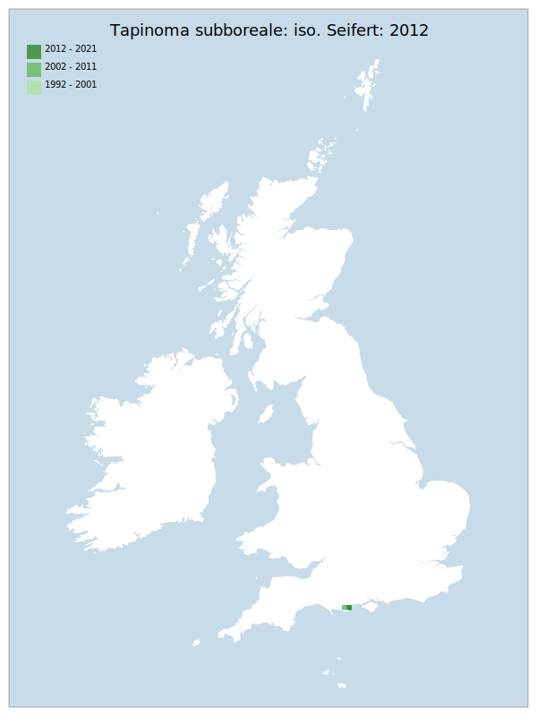

---
    parent: ant
    ---

    # Tapinoma subboreale: iso. Seifert: 2012

## Provisional Red List status: DD
- A2 b,c
- A3 b
- D2

## Red List Justification
*N/A*
### Narrative
Due to a peri-assessment nomenclatural change (2012), elucidation of the biology and ecology of the species is not of a standard to inform targeted surveying in order to determine distribution.

Insufficient data were available to reach a supportable conclusion on the threat status for this taxon.
### Quantified Attributes
|Attribute|Result|
|---|---|
|Synanthropy|No|
|Vagrancy|No|
|Colonisation|No|
|Nomenclature|Peri-assessment change|

## National Rarity
Insufficient Data (*ID*)

## National Presence
|Country|Presence
|---|:-:|
|England|Y|
|Scotland|N|
|Wales|N|

## Distribution map

## Red List QA Metrics
### Decade
| Slice | # Records | AoO (sq km) | dEoO (sq km) |BU%A |
|---|---|---|---|---|
|1992 - 2001|0|0|0|0%|
|2002 - 2011|35|24|11786|100%|
|2012 - 2021|1|4|6694|56%|
### 5-year
| Slice | # Records | AoO (sq km) | dEoO (sq km) |BU%A |
|---|---|---|---|---|
|2002 - 2006|0|0|0|0%|
|2007 - 2011|35|24|11786|100%|
|2012 - 2016|1|4|6694|56%|
|2017 - 2021|0|0|0|0%|
### Criterion A2 (Statistical)
|Attribute|Assessment|Value|Accepted|Justification
|---|---|---|---|---|
|Raw record count|CE|-100%|No|Nomenclatural split|
|AoO|CE|-100%|No|Nomenclatural split|
|dEoO|CE|-100%|No|Nomenclatural split|
|Bayesian|DD|*NaN*%|Yes||
|Bayesian (Expert interpretation)|DD|*N/A*|Yes||
### Criterion A2 (Expert Inference)
|Attribute|Assessment|Value|Accepted|Justification
|---|---|---|---|---|
|Internal review|DD||Yes||
### Criterion A3 (Expert Inference)
|Attribute|Assessment|Value|Accepted|Justification
|---|---|---|---|---|
|Internal review|DD||Yes||
### Criterion B
|Criterion| Value|
|---|---|
|Locations|>10|
|Subcriteria||
|Support||
#### B1
|Attribute|Assessment|Value|Accepted|Justification
|---|---|---|---|---|
|MCP|LC|950|No|Nomenclatural split|
#### B2
|Attribute|Assessment|Value|Accepted|Justification
|---|---|---|---|---|
|Tetrad|LC|24|No|Nomenclatural split|
### Criterion D2
|Attribute|Assessment|Value|Accepted|Justification
|---|---|---|---|---|
|D2|DD|*N/A*|Yes||
### Wider Review
|  |  |
|---|---|
|**Action**|Maintained|
|**Reviewed Status**|DD|
|**Justification**||

## National Rarity QA Metrics
|Attribute|Value|
|---|---|
|Hectads|2|
|Calculated|NR|
|Final|ID|
|Moderation support||

