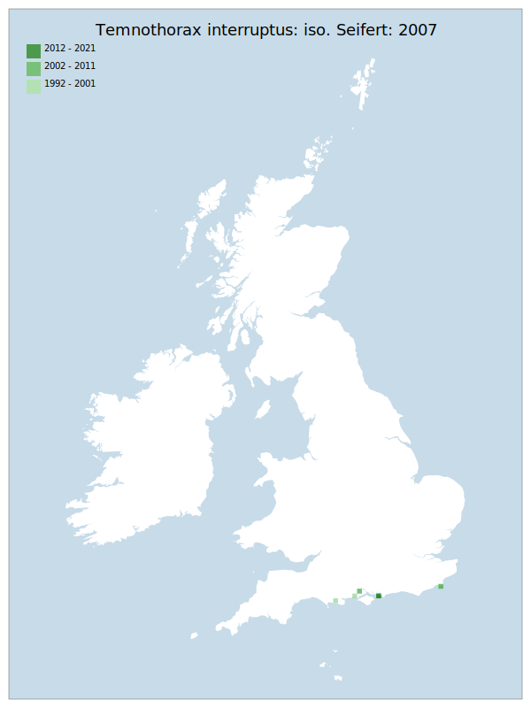

# Temnothorax interruptus: iso. Seifert: 2007

## Provisional Red List status: EN
- B2 a,b, iii
ii
i
iv

## Red List Justification
Subject of targeted survey effort without the discovery of new sites. Highly susceptible to localised events such as storm surges and vegetation succession. Stokeford site is now a gravel pit. Associated with lichen heath.
### Narrative
This small ant, with a correspondingly small nest, is associated with heathland and particularly lichen heath. It is currently known from only three counties – in Dorset, Hampshire (New Forest) and Kent (Dungeness). It has been the subject of targeted survey effort without the discovery of new sites and is highly susceptible to localised events such as storm surges and vegetation succession. One site in Dorset has been destroyed by conversion into a gravel pit.

No statistical assessment was possible under Criterion A due insufficient data. Expert inference assessed this taxon as LC, noting that it is on the northernmost edge of its range. The EoO (6,000 km2) is below the 20,000 km2 VU threshold for criterion B1 and the AoO (48 km2) is below the 500 km2 EN threshold for criterion B2. There are fewer or equal to 5 locations, and continuing/projected decline in extent of occurrence, area of occupancy, number of individuals, and area, extent & quality of habitat. For Criterion D2, the number of locations was fewer or equal to 5, and there is a plausible threat of rapid habitat loss that could drive the taxon to CR or RE in a very short time. No information was available on population size to inform assessments against Criteria C and D1; nor were any life-history models available to inform an assessment against Criterion E.
### Quantified Attributes
|Attribute|Result|
|---|---|
|Synanthropy|No|
|Vagrancy|No|
|Colonisation|No|
|Nomenclature|Early-assessment change|

## National Rarity
Nationally Rare (*NR*)

## National Presence
|Country|Presence
|---|:-:|
|England|Y|
|Scotland|N|
|Wales|N|

## Distribution map

## Red List QA Metrics
### Decade
| Slice | # Records | AoO (sq km) | dEoO (sq km) |BU%A |
|---|---|---|---|---|
|1992 - 2001|11|36|22336|92%|
|2002 - 2011|10|24|17042|70%|
|2012 - 2021|1|4|6694|27%|
### 5-year
| Slice | # Records | AoO (sq km) | dEoO (sq km) |BU%A |
|---|---|---|---|---|
|2002 - 2006|5|12|17042|70%|
|2007 - 2011|5|16|13388|55%|
|2012 - 2016|1|4|6694|27%|
|2017 - 2021|0|0|0|0%|
### Criterion A2 (Statistical)
|Attribute|Assessment|Value|Accepted|Justification
|---|---|---|---|---|
|Raw record count|CE|-100%|No|Insufficient data|
|AoO|CE|-100%|No|Insufficient data|
|dEoO|CE|-100%|No|Insufficient data|
|Bayesian|DD|*NaN*%|Yes||
|Bayesian (Expert interpretation)|DD|*N/A*|Yes||
### Criterion A2 (Expert Inference)
|Attribute|Assessment|Value|Accepted|Justification
|---|---|---|---|---|
|Internal review|LC|Northern edge of range|Yes||
### Criterion A3 (Expert Inference)
|Attribute|Assessment|Value|Accepted|Justification
|---|---|---|---|---|
|Internal review|DD||Yes||
### Criterion B
|Criterion| Value|
|---|---|
|Locations|<=5|
|Subcriteria|iii, ii, i, iv|
|Support|Subject of targeted survey effort without discovery of new sites. Highly susceptible to localised events such as storm surges and vegetation succession. Stokeford site is now a gravel pit. Associated with lichen heath.|
#### B1
|Attribute|Assessment|Value|Accepted|Justification
|---|---|---|---|---|
|MCP|VU|6000|Yes||
#### B2
|Attribute|Assessment|Value|Accepted|Justification
|---|---|---|---|---|
|Tetrad|EN|48|Yes||
### Criterion D2
|Attribute|Assessment|Value|Accepted|Justification
|---|---|---|---|---|
|D2|VU|*N/A*|Yes||
### Wider Review
|  |  |
|---|---|
|**Action**|Maintained|
|**Reviewed Status**|EN|
|**Justification**||

## National Rarity QA Metrics
|Attribute|Value|
|---|---|
|Hectads|6|
|Calculated|NR|
|Final|NR|
|Moderation support||

