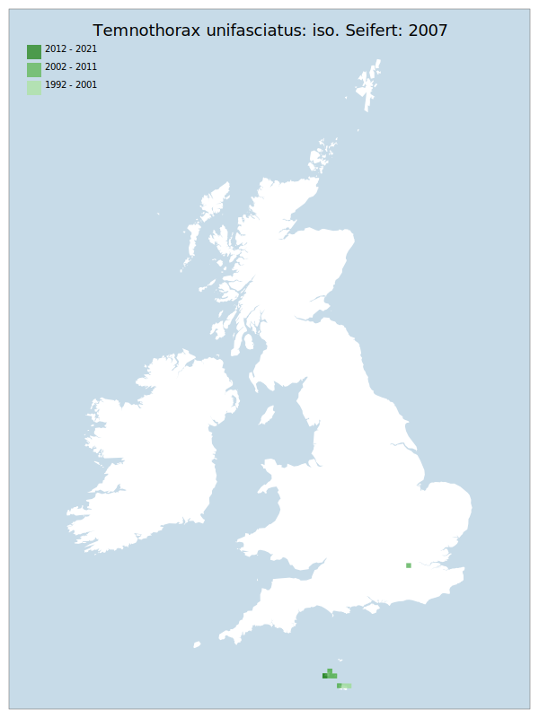

---
    parent: ant
    ---

    # Temnothorax unifasciatus: iso. Seifert: 2007

## Provisional Red List status: NE

## Red List Justification
A synanthropic colonist
### Narrative
Although present on the Channel Islands (which are beyond the scope of this review) there is only 1 record of this species for West London, and this is regarded as an accidental import of a species predominantly distributed in Central and Southern Europe. As such it is not evaluated.

### Quantified Attributes
|Attribute|Result|
|---|---|
|Synanthropy|Synanthropic Colonist|
|Vagrancy|No|
|Colonisation|No|
|Nomenclature|No|

## National Presence
|Country|Presence
|---|:-:|
|England|Y|
|Scotland|N|
|Wales|N|

## Distribution map

## Red List QA Metrics
### Decade
| Slice | # Records | AoO (sq km) | dEoO (sq km) |BU%A |
|---|---|---|---|---|
|1992 - 2001|0|0|0|0%|
|2002 - 2011|1|4|6694|100%|
|2012 - 2021|0|0|0|0%|
### 5-year
| Slice | # Records | AoO (sq km) | dEoO (sq km) |BU%A |
|---|---|---|---|---|
|2002 - 2006|0|0|0|0%|
|2007 - 2011|1|4|6694|100%|
|2012 - 2016|0|0|0|0%|
|2017 - 2021|0|0|0|0%|
### Criterion A2 (Statistical)
|Attribute|Assessment|Value|Accepted|Justification
|---|---|---|---|---|
|Raw record count|LC|?%|||
|AoO|LC|?%|||
|dEoO|LC|?%|||
|Bayesian|DD|*NaN*%|||
|Bayesian (Expert interpretation)||*N/A*|||
### Criterion A2 (Expert Inference)
|Attribute|Assessment|Value|Accepted|Justification
|---|---|---|---|---|
|Internal review|||||
### Criterion A3 (Expert Inference)
|Attribute|Assessment|Value|Accepted|Justification
|---|---|---|---|---|
|Internal review|DD||No||
### Criterion B
|Criterion| Value|
|---|---|
|Locations||
|Subcriteria||
|Support||
#### B1
|Attribute|Assessment|Value|Accepted|Justification
|---|---|---|---|---|
|MCP|LC|100|||
#### B2
|Attribute|Assessment|Value|Accepted|Justification
|---|---|---|---|---|
|Tetrad|LC|4|||
### Criterion D2
|Attribute|Assessment|Value|Accepted|Justification
|---|---|---|---|---|
|D2|VU|*N/A*|No||
### Wider Review
|  |  |
|---|---|
|**Action**|Maintained|
|**Reviewed Status**|NE|
|**Justification**||

## National Rarity QA Metrics
|Attribute|Value|
|---|---|
|Hectads|1|
|Calculated|NR|
|Final||
|Moderation support||

