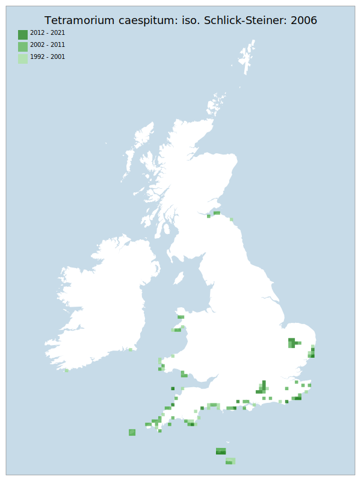

# Tetramorium caespitum: iso. Schlick-Steiner: 2006

## Provisional Red List status: NE

## Red List Justification
Skinner & Jarman note potential confusion. Richard Becker confirmed the presence of significant widespread confusion in data of this taxon during the wider review process.

### Narrative
With both early and peri-assessment taxonomic changes to this species there is too much doubt and confusion regarding records to be able to assess the species and it is thus not evaluated.

### Quantified Attributes
|Attribute|Result|
|---|---|
|Synanthropy|No|
|Vagrancy|No|
|Colonisation|No|
|Nomenclature|Early-assessment change, Peri-assessment change|

## National Rarity
Nationally Frequent (*NF*)

## National Presence
|Country|Presence
|---|:-:|
|England|Y|
|Scotland|Y|
|Wales|Y|

## Distribution map

## Red List QA Metrics
### Decade
| Slice | # Records | AoO (sq km) | dEoO (sq km) |BU%A |
|---|---|---|---|---|
|1992 - 2001|205|464|133653|92%|
|2002 - 2011|281|572|129875|89%|
|2012 - 2021|58|136|69800|48%|

### 5-year
| Slice | # Records | AoO (sq km) | dEoO (sq km) |BU%A |
|---|---|---|---|---|
|2002 - 2006|132|316|105988|73%|
|2007 - 2011|149|300|97619|67%|
|2012 - 2016|53|120|56007|38%|
|2017 - 2021|5|20|30431|21%|

### Criterion A2 (Statistical)
|Attribute|Assessment|Value|Accepted|Justification
|---|---|---|---|---|
|Raw record count|CE|-91%|No|Nomenclatural issues|
|AoO|CE|-83%|No|Nomenclatural issues|
|dEoO|VU|-46%|No|Nomenclatural issues|
|Bayesian|VU|5%|No|Nomenclatural issues|
|Bayesian (Expert interpretation)|DD|*N/A*|Yes||

### Criterion A2 (Expert Inference)
|Attribute|Assessment|Value|Accepted|Justification
|---|---|---|---|---|
|Internal review|LC||Yes||

### Criterion A3 (Expert Inference)
|Attribute|Assessment|Value|Accepted|Justification
|---|---|---|---|---|
|Internal review|DD||Yes||

### Criterion B
|Criterion| Value|
|---|---|
|Locations|>10|
|Subcriteria||
|Support||

#### B1
|Attribute|Assessment|Value|Accepted|Justification
|---|---|---|---|---|
|MCP|LC|226700|Yes||

#### B2
|Attribute|Assessment|Value|Accepted|Justification
|---|---|---|---|---|
|Tetrad|LC|940|Yes||

### Criterion D2
|Attribute|Assessment|Value|Accepted|Justification
|---|---|---|---|---|
|D2|LC|*N/A*|Yes||

### Wider Review
|  |  |
|---|---|
|**Action**|Maintained|
|**Reviewed Status**|NE|
|**Justification**||

## National Rarity QA Metrics
|Attribute|Value|
|---|---|
|Hectads|108|
|Calculated|NF|
|Final|NF|
|Moderation support||
