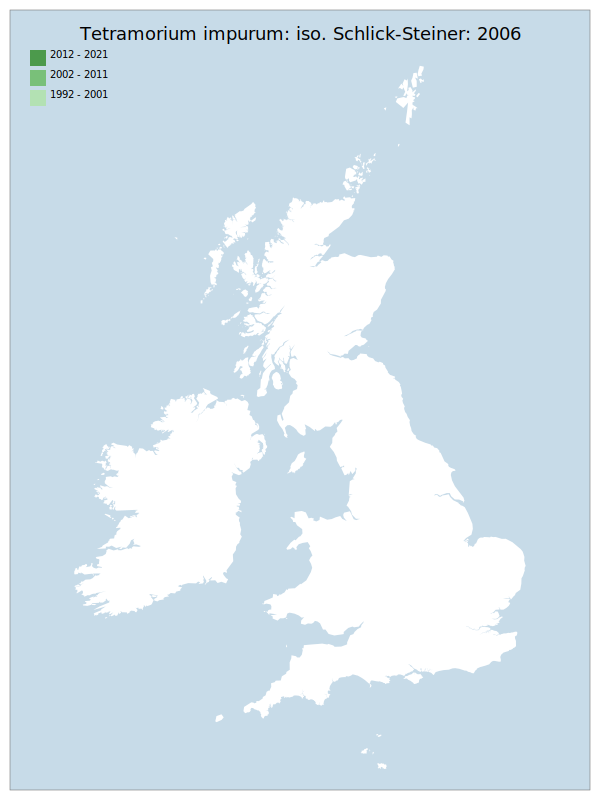

# Tetramorium impurum: iso. Schlick-Steiner: 2006

## Provisional Red List status: DD
- A2
- A3b
- B1ab
- B2ab
- D2

## Red List Justification
*N/A*

### Narrative
Following the confirmed peri-assessment nomenclatural change to this species (2018) the biology and ecology of the species may be elucidated at a later date (though the separation of this species from T. caespitum relies on analysis of pheromones at present, which will hamper efforts in the short term).

Insufficient data were available to reach a supportable conclusion on the threat status for this taxon.

### Quantified Attributes
|Attribute|Result|
|---|---|
|Synanthropy|No|
|Vagrancy|No|
|Colonisation|No|
|Nomenclature|Early-assessment change|

## National Rarity
Insufficient Data (*ID*)

## Distribution map

## Red List QA Metrics
### Decade
| Slice | # Records | AoO (sq km) | dEoO (sq km) |BU%A |
|---|---|---|---|---|
|1992 - 2001||||%|
|2002 - 2011||||%|
|2012 - 2021||||%|

### 5-year
| Slice | # Records | AoO (sq km) | dEoO (sq km) |BU%A |
|---|---|---|---|---|
|2002 - 2006||||%|
|2007 - 2011||||%|
|2012 - 2016||||%|
|2017 - 2021||||%|

### Criterion A2 (Statistical)
|Attribute|Assessment|Value|Accepted|Justification
|---|---|---|---|---|
|Raw record count|DD|%|Yes||
|AoO|DD|%|Yes||
|dEoO|DD|%|Yes||
|Bayesian|DD|*NaN*%|Yes||
|Bayesian (Expert interpretation)|DD|*N/A*|Yes||

### Criterion A2 (Expert Inference)
|Attribute|Assessment|Value|Accepted|Justification
|---|---|---|---|---|
|Internal review|DD||Yes||

### Criterion A3 (Expert Inference)
|Attribute|Assessment|Value|Accepted|Justification
|---|---|---|---|---|
|Internal review|DD||Yes||

### Criterion B
|Criterion| Value|
|---|---|
|Locations||
|Subcriteria||
|Support||

#### B1
|Attribute|Assessment|Value|Accepted|Justification
|---|---|---|---|---|
|MCP|DD||Yes||

#### B2
|Attribute|Assessment|Value|Accepted|Justification
|---|---|---|---|---|
|Tetrad|DD||Yes||

### Criterion D2
|Attribute|Assessment|Value|Accepted|Justification
|---|---|---|---|---|
|D2|DD|*N/A*|Yes||

### Wider Review
|  |  |
|---|---|
|**Action**|Maintained|
|**Reviewed Status**|DD|
|**Justification**||

## National Rarity QA Metrics
|Attribute|Value|
|---|---|
|Hectads||
|Calculated||
|Final|ID|
|Moderation support||
