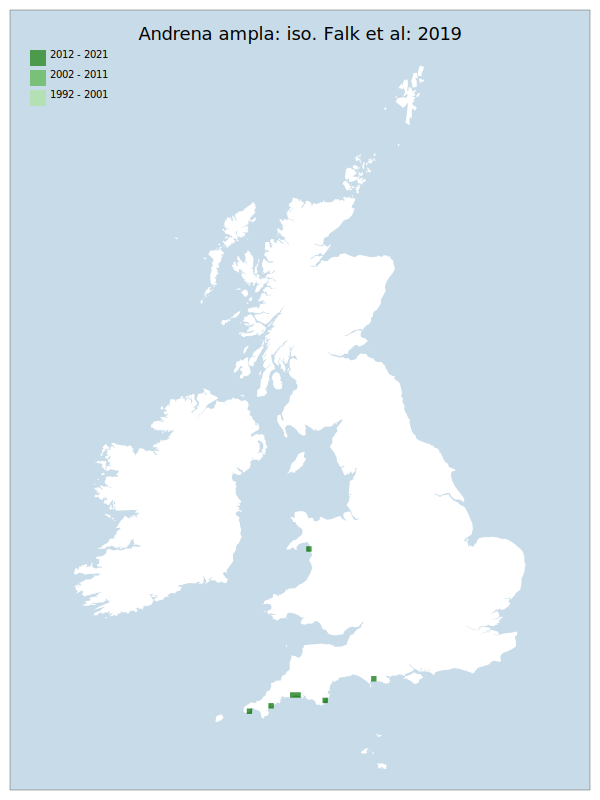

---
    parent: bee
    ---

    # Andrena ampla: iso. Falk et al: 2019

## Provisional Red List status: DD
- A2 b,c
- A3 b
- D2

## Red List Justification
*N/A*
### Narrative

Insufficient data were available to reach a supportable conclusion on the threat status for this taxon.
### Quantified Attributes
|Attribute|Result|
|---|---|
|Synanthropy|No|
|Vagrancy|No|
|Colonisation|No|
|Nomenclature|Peri-assessment change|

## National Rarity
Insufficient Data (*ID*)

## National Presence
|Country|Presence
|---|:-:|
|England|Y|
|Scotland|N|
|Wales|Y|

## Distribution map

## Red List QA Metrics
### Decade
| Slice | # Records | AoO (sq km) | dEoO (sq km) |BU%A |
|---|---|---|---|---|
|1992 - 2001|0|0|0|0%|
|2002 - 2011|0|0|0|0%|
|2012 - 2021|12|32|33043|100%|
### 5-year
| Slice | # Records | AoO (sq km) | dEoO (sq km) |BU%A |
|---|---|---|---|---|
|2002 - 2006|0|0|0|0%|
|2007 - 2011|0|0|0|0%|
|2012 - 2016|0|0|0|0%|
|2017 - 2021|12|32|33043|100%|
### Criterion A2 (Statistical)
|Attribute|Assessment|Value|Accepted|Justification
|---|---|---|---|---|
|Raw record count|LC|?%|No|Nomenclature change|
|AoO|LC|?%|No|Nomenclature change|
|dEoO|LC|?%|No|Nomenclature change|
|Bayesian|DD|*NaN*%|Yes||
|Bayesian (Expert interpretation)|DD|*N/A*|Yes||
### Criterion A2 (Expert Inference)
|Attribute|Assessment|Value|Accepted|Justification
|---|---|---|---|---|
|Internal review|DD|Taxon results from a recent nomenclatural change. There is insufficient data and knowledge to arrive at a supportable conclusion.|Yes||
### Criterion A3 (Expert Inference)
|Attribute|Assessment|Value|Accepted|Justification
|---|---|---|---|---|
|Internal review|DD||Yes||
### Criterion B
|Criterion| Value|
|---|---|
|Locations|>10|
|Subcriteria||
|Support||
#### B1
|Attribute|Assessment|Value|Accepted|Justification
|---|---|---|---|---|
|MCP|LC|38500|No|Nomenclature change|
#### B2
|Attribute|Assessment|Value|Accepted|Justification
|---|---|---|---|---|
|Tetrad|LC|32|No|Nomenclature change|
### Criterion D2
|Attribute|Assessment|Value|Accepted|Justification
|---|---|---|---|---|
|D2|DD|*N/A*|Yes||
### Wider Review
|  |  |
|---|---|
|**Action**|Maintained|
|**Reviewed Status**|DD|
|**Justification**|The hypothesis of the wider reviewers that there is a defined east-west split between A. ampla and proxima has been considered. However, the core review team feels that there are insufficient data which can be relied upon to reach any further status. There are multiple records within central southern England that remain to be checked and assigned to either side of this split.|

## National Rarity QA Metrics
|Attribute|Value|
|---|---|
|Hectads|7|
|Calculated|NR|
|Final|ID|
|Moderation support||

