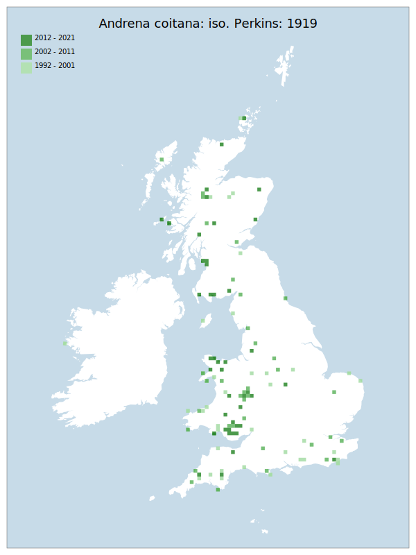

---
    parent: bee
    ---

    # Andrena coitana: iso. Perkins: 1919

## Provisional Red List status: NT
- A2 b,c
- A3 b

## Red List Justification
Retreating northwards. Fewer records in the south of England, despite higher sampling present in this area. Low data volume makes anything more precise impossible.

Potential decline from warming climate expected in the future.
### Narrative
This is a small solitary bee.  Though always local in GB it has become very localised and rare south of the Severn to the Wash line (except for Cornwall) despite higher sampling in this area.

The most threatening accepted population change estimate is -10.0% (raw record count), which does not exceed the 30% decline required for qualification as VU under Criterion A. However, expert inference noted that the taxon appears to be retreating northwards, even with the overall bias towards southern sampling present in the aculeates. The very low data volume makes any attempt at precise estimation impossible, though this inference was unanimously supported by wider peer review. The suspected mechanic for this shift is the warming climate, though again the details of how are unknown. Given the lack of data to support a 30% decline, coupled with the overall concern at a longer-term downward trend, this taxon has been placed in NT to encapsulate the inferred risk of continued decline as temperatures increase.

The EoO (367,650 km²) exceeds the 20,000 km² VU threshold for criterion B1 and does not satisfy sufficient subcriteria to reach a threat status, and the AoO (496 km²) is below the 2,000 km² VU threshold for criterion B2 but does not satisfy sufficient subcriteria to reach a threat status. For Criterion D2, the number of locations was greater than 5 and there is no plausible threat that could drive the taxon to CR or RE in a very short time. No information was available on population size to inform assessments against Criteria C and D1; nor were any life-history models available to inform an assessment against Criterion E.
### Quantified Attributes
|Attribute|Result|
|---|---|
|Synanthropy|No|
|Vagrancy|No|
|Colonisation|No|
|Nomenclature|No|

## National Rarity
Nationally Frequent (*NF*)

## National Presence
|Country|Presence
|---|:-:|
|England|Y|
|Scotland|Y|
|Wales|Y|

## Distribution map

## Red List QA Metrics
### Decade
| Slice | # Records | AoO (sq km) | dEoO (sq km) |BU%A |
|---|---|---|---|---|
|1992 - 2001|62|172|165670|61%|
|2002 - 2011|60|164|172941|64%|
|2012 - 2021|74|192|140933|52%|
### 5-year
| Slice | # Records | AoO (sq km) | dEoO (sq km) |BU%A |
|---|---|---|---|---|
|2002 - 2006|38|112|129244|47%|
|2007 - 2011|22|64|86095|31%|
|2012 - 2016|39|96|96907|35%|
|2017 - 2021|35|100|93244|34%|
### Criterion A2 (Statistical)
|Attribute|Assessment|Value|Accepted|Justification
|---|---|---|---|---|
|Raw record count|LC|-10%|Yes||
|AoO|LC|4%|Yes||
|dEoO|LC|-4%|Yes||
|Bayesian|LC|11%|Yes||
|Bayesian (Expert interpretation)|LC|*N/A*|Yes||
### Criterion A2 (Expert Inference)
|Attribute|Assessment|Value|Accepted|Justification
|---|---|---|---|---|
|Internal review|NT|Retreating northwards. Fewer records in the south of England, despite higher sampling present in this area. Low data volume makes anything more precise impossible.|Yes||
### Criterion A3 (Expert Inference)
|Attribute|Assessment|Value|Accepted|Justification
|---|---|---|---|---|
|Internal review|NT|Potential decline from warming climate.|Yes||
### Criterion B
|Criterion| Value|
|---|---|
|Locations|>10|
|Subcriteria||
|Support||
#### B1
|Attribute|Assessment|Value|Accepted|Justification
|---|---|---|---|---|
|MCP|LC|367650|Yes||
#### B2
|Attribute|Assessment|Value|Accepted|Justification
|---|---|---|---|---|
|Tetrad|LC|496|Yes||
### Criterion D2
|Attribute|Assessment|Value|Accepted|Justification
|---|---|---|---|---|
|D2|LC|*N/A*|Yes||
### Wider Review
|  |  |
|---|---|
|**Action**|Maintained|
|**Reviewed Status**|NT|
|**Justification**||

## National Rarity QA Metrics
|Attribute|Value|
|---|---|
|Hectads|116|
|Calculated|NF|
|Final|NF|
|Moderation support||

