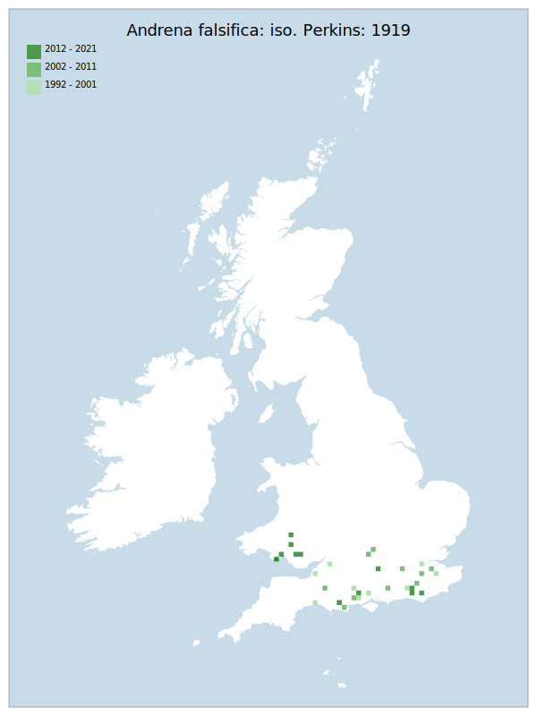

# Andrena falsifica: iso. Perkins: 1919

## Provisional Red List status: LC
- A2 b,c
- B1 a,b, 
- B2 a,b, 
- D2

## Red List Justification
*N/A*
### Narrative

The most threatening accepted population decline was inferred at 0% using expert inference (A2). This does not exceed the 30% decline required for qualification as VU. The EoO (36,850 km2</sup.) exceeds the 20,000 km2</sup. VU threshold for criterion B1 and does not satisfy sufficient subcriteria to reach a threat status, and the AoO (156 km2</sup.) is below the 500 km2</sup. EN threshold for criterion B2 but does not satisfy sufficient subcriteria to reach a threat status. For Criterion D2, the number of locations was greater than 5 and there is no plausible threat that could drive the taxon to CR or RE in a very short time. No information was available on population size to inform assessments against Criteria C and D1; nor were any life-history models available to inform an assessment against Criterion E.
### Quantified Attributes
|Attribute|Result|
|---|---|
|Synanthropy|No|
|Vagrancy|No|
|Colonisation|No|
|Nomenclature|No|

## National Rarity
Nationally Scarce (*NS*)

## National Presence
|Country|Presence
|---|:-:|
|England|Y|
|Scotland|N|
|Wales|Y|

## Distribution map

## Red List QA Metrics
### Decade
| Slice | # Records | AoO (sq km) | dEoO (sq km) |BU%A |
|---|---|---|---|---|
|1992 - 2001|13|40|39014|61%|
|2002 - 2011|16|60|40960|64%|
|2012 - 2021|14|56|32814|51%|
### 5-year
| Slice | # Records | AoO (sq km) | dEoO (sq km) |BU%A |
|---|---|---|---|---|
|2002 - 2006|11|44|34259|53%|
|2007 - 2011|5|16|19079|29%|
|2012 - 2016|10|40|19165|30%|
|2017 - 2021|4|16|19155|30%|
### Criterion A2 (Statistical)
|Attribute|Assessment|Value|Accepted|Justification
|---|---|---|---|---|
|Raw record count|EN|-60%|No|Insufficient data|
|AoO|EN|-60%|No|Insufficient data|
|dEoO|LC|0%|No|Insufficient data|
|Bayesian|DD|*NaN*%|Yes||
|Bayesian (Expert interpretation)|DD|*N/A*|Yes||
### Criterion A2 (Expert Inference)
|Attribute|Assessment|Value|Accepted|Justification
|---|---|---|---|---|
|Internal review|LC|Always scarce, no changes to taxon noticed.|Yes||
### Criterion A3 (Expert Inference)
|Attribute|Assessment|Value|Accepted|Justification
|---|---|---|---|---|
|Internal review|DD||Yes||
### Criterion B
|Criterion| Value|
|---|---|
|Locations|>10|
|Subcriteria||
|Support||
#### B1
|Attribute|Assessment|Value|Accepted|Justification
|---|---|---|---|---|
|MCP|LC|36850|Yes||
#### B2
|Attribute|Assessment|Value|Accepted|Justification
|---|---|---|---|---|
|Tetrad|LC|156|Yes||
### Criterion D2
|Attribute|Assessment|Value|Accepted|Justification
|---|---|---|---|---|
|D2|LC|*N/A*|Yes||
### Wider Review
|  |  |
|---|---|
|**Action**|Maintained|
|**Reviewed Status**|LC|
|**Justification**|Map represents significant under-recording, not decline. 'Buffer-Union % All' figures support a pattern of substantial under-recording with no figure reaching > 80%. Data shows the activity of recording rather than the taxon. Comments are noted on the reliance on brownfield sites in Wales and their threats, however the limited currently known scope of this impact is considered insufficient to elevate the taxon to NT. Multiple records of this taxon have emerged from the north-west of England, within the time period, demonstrating the wider 'true' range of this taxon.|

## National Rarity QA Metrics
|Attribute|Value|
|---|---|
|Hectads|32|
|Calculated|NS|
|Final|NS|
|Moderation support||

