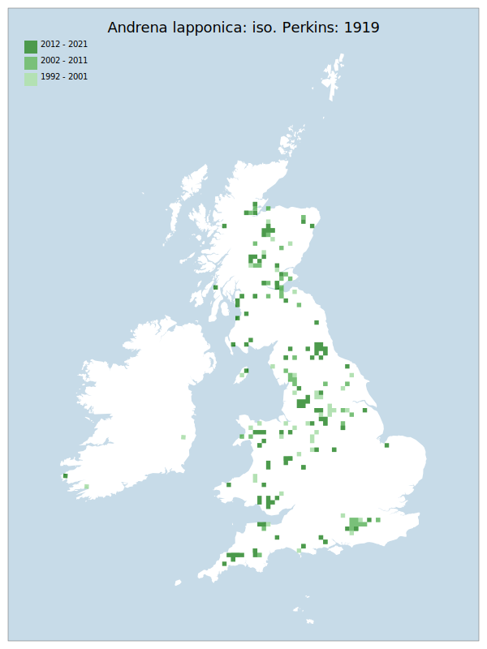

# Andrena lapponica: iso. Perkins: 1919

## Provisional Red List status: NT
- A3 b

## Red List Justification
Host plant distribution is expected to shrink under climate change predictions.
### Narrative
This medium sized solitary bee species has always been uncommon and localised south of the Severn to the Wash line. Even in areas with suitable habitat and favoured genus of forage plants (Vaccinium – usually V. myrtillis) there have been localised losses even in the core population areas and there is a risk of climate change reducing viable habitat areas and host plants.

The most threatening accepted population change estimate is 10.0% (tetrad area), which does not exceed the 30% decline required for qualification as VU under Criterion A. Expert inference has been used to assess this taxon as NT under the basis of expected decline of *Vaccinium* over the southern range. This decline is expected to be produced by the warming climate reducing areas of suitability for *Vaccinium*, which is known to be highly responsive to such changes [(Hirabayashi et al, 2022)](https://doi.org/10.1016/j.scitotenv.2022.157341). There is potential for *Vaccinium* to reach such low densities in the southern range of *A. lapponcia* that the region ceases to be able to support a viable population. Whilst reviewers noted that this taxon, and its food plant, remain common in northern areas of this assessment, the Red List criteria include *extent of habitat*. As such, the assessment of NT was maintained specifically under projected increased severity of this threat factor.

The EoO (249,350 km²) exceeds the 20,000 km² VU threshold for criterion B1 and does not satisfy sufficient subcriteria to reach a threat status, and the AoO (1,204 km²) is below the 2,000 km² VU threshold for criterion B2 and does not satisfy sufficient subcriteria to reach a threat status. For Criterion D2, the number of locations was greater than 5 and there is no plausible threat that could drive the taxon to CR or RE in a very short time. No information was available on population size to inform assessments against Criteria C and D1; nor were any life-history models available to inform an assessment against Criterion E.
### Quantified Attributes
|Attribute|Result|
|---|---|
|Synanthropy|No|
|Vagrancy|No|
|Colonisation|No|
|Nomenclature|No|

## National Rarity
Nationally Frequent (*NF*)

## National Presence
|Country|Presence
|---|:-:|
|England|Y|
|Scotland|Y|
|Wales|Y|

## Distribution map

## Red List QA Metrics
### Decade
| Slice | # Records | AoO (sq km) | dEoO (sq km) |BU%A |
|---|---|---|---|---|
|1992 - 2001|148|404|146743|58%|
|2002 - 2011|136|404|160448|64%|
|2012 - 2021|174|520|217007|87%|
### 5-year
| Slice | # Records | AoO (sq km) | dEoO (sq km) |BU%A |
|---|---|---|---|---|
|2002 - 2006|59|180|113994|45%|
|2007 - 2011|77|260|131522|52%|
|2012 - 2016|73|252|148509|59%|
|2017 - 2021|101|300|185379|74%|
### Criterion A2 (Statistical)
|Attribute|Assessment|Value|Accepted|Justification
|---|---|---|---|---|
|Raw record count|LC|38%|Yes||
|AoO|LC|19%|Yes||
|dEoO|LC|25%|Yes||
|Bayesian|LC|21%|Yes||
|Bayesian (Expert interpretation)|LC|*N/A*|Yes||
### Criterion A2 (Expert Inference)
|Attribute|Assessment|Value|Accepted|Justification
|---|---|---|---|---|
|Internal review|LC||Yes||
### Criterion A3 (Expert Inference)
|Attribute|Assessment|Value|Accepted|Justification
|---|---|---|---|---|
|Internal review|NT|Climate change at risk of reducing viable habitat area of host plants|Yes||
### Criterion B
|Criterion| Value|
|---|---|
|Locations|>10|
|Subcriteria||
|Support||
#### B1
|Attribute|Assessment|Value|Accepted|Justification
|---|---|---|---|---|
|MCP|LC|249350|Yes||
#### B2
|Attribute|Assessment|Value|Accepted|Justification
|---|---|---|---|---|
|Tetrad|LC|1204|Yes||
### Criterion D2
|Attribute|Assessment|Value|Accepted|Justification
|---|---|---|---|---|
|D2|LC|*N/A*|Yes||
### Wider Review
|  |  |
|---|---|
|**Action**|Maintained|
|**Reviewed Status**|NT|
|**Justification**|Evidence suggests that the host plant is decreasing, even as far north as Cumbria. Whilst the taxon is currently common where it is found, this is projected to change within the projected 100 year time period used under A3.|

## National Rarity QA Metrics
|Attribute|Value|
|---|---|
|Hectads|201|
|Calculated|NF|
|Final|NF|
|Moderation support||

