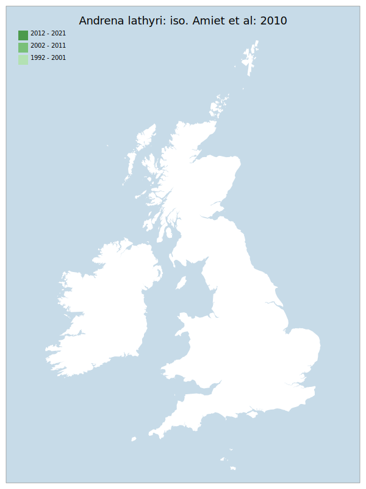

# Andrena lathyri: iso. Amiet et al: 2010

## Provisional Red List status: RE
- A2 

## Red List Justification
*N/A*
### Narrative
Always a very rare bee (the largest of 4 species in the Taeniandrena sub genus recorded for the UK) with 20th Century Records from 1950 – 1990 from only 2 locations. The 1950 record was from Somerset (Moorlinch – exact site unknown) – all other records from 1970 – 1990 were from the grassy bank of an old, abandoned railway line in Wiltshire (Burbage). The record from 1990 showed that the species might cling on in this very restricted area but despite repeated visits to this site and Moorlinch it has never been found since and it has been evaluated as RE.

### Quantified Attributes
|Attribute|Result|
|---|---|
|Synanthropy|No|
|Vagrancy|No|
|Colonisation|No|
|Nomenclature|No|

## National Rarity
Nationally Extinct (*EX*)

## Distribution map

## Red List QA Metrics
### Decade
| Slice | # Records | AoO (sq km) | dEoO (sq km) |BU%A |
|---|---|---|---|---|
|1992 - 2001||||%|
|2002 - 2011||||%|
|2012 - 2021||||%|
### 5-year
| Slice | # Records | AoO (sq km) | dEoO (sq km) |BU%A |
|---|---|---|---|---|
|2002 - 2006||||%|
|2007 - 2011||||%|
|2012 - 2016||||%|
|2017 - 2021||||%|
### Criterion A2 (Statistical)
|Attribute|Assessment|Value|Accepted|Justification
|---|---|---|---|---|
|Raw record count|DD|%|Yes||
|AoO|DD|%|Yes||
|dEoO|DD|%|Yes||
|Bayesian|DD|*NaN*%|Yes||
|Bayesian (Expert interpretation)|DD|*N/A*|Yes||
### Criterion A2 (Expert Inference)
|Attribute|Assessment|Value|Accepted|Justification
|---|---|---|---|---|
|Internal review|RE|Last seen 1990-05-10. Has been subject to repeated target survey effort ~ 1990 - 2010|Yes||
### Criterion A3 (Expert Inference)
|Attribute|Assessment|Value|Accepted|Justification
|---|---|---|---|---|
|Internal review|DD||Yes||
### Criterion B
|Criterion| Value|
|---|---|
|Locations||
|Subcriteria||
|Support||
#### B1
|Attribute|Assessment|Value|Accepted|Justification
|---|---|---|---|---|
|MCP|DD||Yes||
#### B2
|Attribute|Assessment|Value|Accepted|Justification
|---|---|---|---|---|
|Tetrad|DD||Yes||
### Criterion D2
|Attribute|Assessment|Value|Accepted|Justification
|---|---|---|---|---|
|D2|DD|*N/A*|Yes||
### Wider Review
|  |  |
|---|---|
|**Action**|Maintained|
|**Reviewed Status**|RE|
|**Justification**||

## National Rarity QA Metrics
|Attribute|Value|
|---|---|
|Hectads||
|Calculated||
|Final|EX|
|Moderation support||

