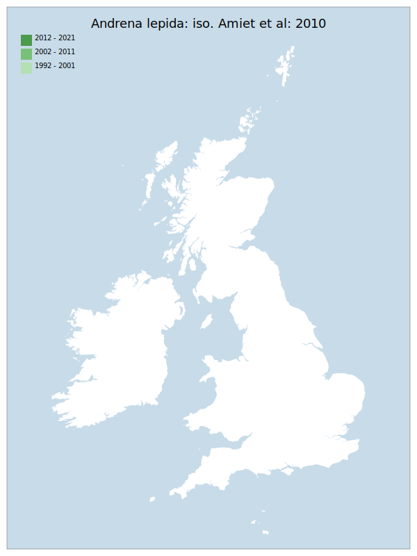

# Andrena lepida: iso. Amiet et al: 2010

## Provisional Red List status: RE
- A2

## Red List Justification
*N/A*

### Narrative
Although widespread in Central and Southern Europe this bee – very similar to the common and widespread A. dorsata - has been recorded in GB only 3 times in a twenty-year period (1931-1951) - Berkshire (Aldworth) and Dorset (Witchampton and Badbury Rings). Despite targeted survey effort since, the last record is 1951 (Dorset, Badbury Rings) and thus the species is considered RE.

### Quantified Attributes
|Attribute|Result|
|---|---|
|Synanthropy|No|
|Vagrancy|No|
|Colonisation|No|
|Nomenclature|No|

## National Rarity
Nationally Extinct (*EX*)

## Distribution map

## Red List QA Metrics
### Decade
| Slice | # Records | AoO (sq km) | dEoO (sq km) |BU%A |
|---|---|---|---|---|
|1992 - 2001||||%|
|2002 - 2011||||%|
|2012 - 2021||||%|

### 5-year
| Slice | # Records | AoO (sq km) | dEoO (sq km) |BU%A |
|---|---|---|---|---|
|2002 - 2006||||%|
|2007 - 2011||||%|
|2012 - 2016||||%|
|2017 - 2021||||%|

### Criterion A2 (Statistical)
|Attribute|Assessment|Value|Accepted|Justification
|---|---|---|---|---|
|Raw record count|DD|%|Yes||
|AoO|DD|%|Yes||
|dEoO|DD|%|Yes||
|Bayesian|DD|*NaN*%|Yes||
|Bayesian (Expert interpretation)|DD|*N/A*|Yes||

### Criterion A2 (Expert Inference)
|Attribute|Assessment|Value|Accepted|Justification
|---|---|---|---|---|
|Internal review|RE|Last seen 1952-08-02. Has been subject to targeted searches.|Yes||

### Criterion A3 (Expert Inference)
|Attribute|Assessment|Value|Accepted|Justification
|---|---|---|---|---|
|Internal review|DD||No||

### Criterion B
|Criterion| Value|
|---|---|
|Locations||
|Subcriteria||
|Support||

#### B1
|Attribute|Assessment|Value|Accepted|Justification
|---|---|---|---|---|
|MCP|DD||Yes||

#### B2
|Attribute|Assessment|Value|Accepted|Justification
|---|---|---|---|---|
|Tetrad|DD||Yes||

### Criterion D2
|Attribute|Assessment|Value|Accepted|Justification
|---|---|---|---|---|
|D2|DD|*N/A*|Yes||

### Wider Review
|  |  |
|---|---|
|**Action**|Maintained|
|**Reviewed Status**|RE|
|**Justification**||

## National Rarity QA Metrics
|Attribute|Value|
|---|---|
|Hectads||
|Calculated||
|Final|EX|
|Moderation support||
