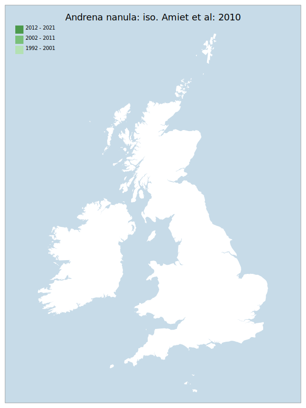

# Andrena nanula: iso. Amiet et al: 2010

## Provisional Red List status: NE

## Red List Justification
Presence of this taxon is based on a single specimen, with an unclear label, and a cloud of uncertainty around the validity of this specimen.

### Narrative
The inclusion of this bee on the British list rests on a female in the F. Smith Collection in the University Museum, Oxford. The only documentation carried on the pin is “16.8.”. According to R.C.L. Perkins (1914) the specimen was probably sent to Smith by J.B. Bridgman of Norwich as the pin, mode of setting and label is similar to that of other Andrena species known to have been sent by him to Smith in the period 1875-77. As the presence of this taxon is based on a single specimen, with an unclear label, there is a cloud of uncertainty around the validity of this specimen.

### Quantified Attributes
|Attribute|Result|
|---|---|
|Synanthropy|No|
|Vagrancy|No|
|Colonisation|No|
|Nomenclature|No|

## Distribution map

## Red List QA Metrics
### Decade
| Slice | # Records | AoO (sq km) | dEoO (sq km) |BU%A |
|---|---|---|---|---|
|1992 - 2001||||%|
|2002 - 2011||||%|
|2012 - 2021||||%|

### 5-year
| Slice | # Records | AoO (sq km) | dEoO (sq km) |BU%A |
|---|---|---|---|---|
|2002 - 2006||||%|
|2007 - 2011||||%|
|2012 - 2016||||%|
|2017 - 2021||||%|

### Criterion A2 (Statistical)
|Attribute|Assessment|Value|Accepted|Justification
|---|---|---|---|---|
|Raw record count|DD|%|||
|AoO|DD|%|||
|dEoO|DD|%|||
|Bayesian|DD|*NaN*%|||
|Bayesian (Expert interpretation)||*N/A*|||

### Criterion A2 (Expert Inference)
|Attribute|Assessment|Value|Accepted|Justification
|---|---|---|---|---|
|Internal review|||||

### Criterion A3 (Expert Inference)
|Attribute|Assessment|Value|Accepted|Justification
|---|---|---|---|---|
|Internal review|DD||||

### Criterion B
|Criterion| Value|
|---|---|
|Locations||
|Subcriteria||
|Support||

#### B1
|Attribute|Assessment|Value|Accepted|Justification
|---|---|---|---|---|
|MCP|DD||||

#### B2
|Attribute|Assessment|Value|Accepted|Justification
|---|---|---|---|---|
|Tetrad|DD||||

### Criterion D2
|Attribute|Assessment|Value|Accepted|Justification
|---|---|---|---|---|
|D2||*N/A*|||

### Wider Review
|  |  |
|---|---|
|**Action**|Maintained|
|**Reviewed Status**|NE|
|**Justification**||

