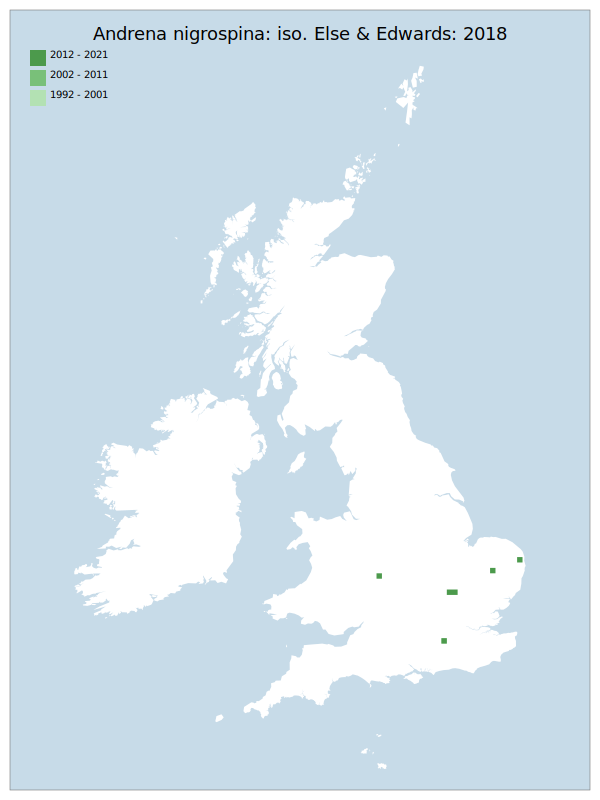

# Andrena nigrospina: iso. Else & Edwards: 2018

## Provisional Red List status: DD
- A2b
- A3b
- D2

## Red List Justification
*N/A*

### Narrative
This is a nearly all-black solitary bee which forages pollen fro Brassicascea. The species has been subject to a recent nomenclatural change.

Insufficient data were available to reach a supportable conclusion on the threat status for this taxon.

### Quantified Attributes
|Attribute|Result|
|---|---|
|Synanthropy|No|
|Vagrancy|No|
|Colonisation|No|
|Nomenclature|Peri-assessment change|

## National Rarity
Insufficient Data (*ID*)

## National Presence
|Country|Presence
|---|:-:|
|England|Y|
|Scotland|N|
|Wales|N|

## Distribution map

## Red List QA Metrics
### Decade
| Slice | # Records | AoO (sq km) | dEoO (sq km) |BU%A |
|---|---|---|---|---|
|1992 - 2001|1|4|6694|20%|
|2002 - 2011|0|0|0|0%|
|2012 - 2021|7|24|31974|100%|

### 5-year
| Slice | # Records | AoO (sq km) | dEoO (sq km) |BU%A |
|---|---|---|---|---|
|2002 - 2006|0|0|0|0%|
|2007 - 2011|0|0|0|0%|
|2012 - 2016|1|4|6694|20%|
|2017 - 2021|6|20|27305|85%|

### Criterion A2 (Statistical)
|Attribute|Assessment|Value|Accepted|Justification
|---|---|---|---|---|
|Raw record count|LC|500%|No|Nomenclature change|
|AoO|LC|400%|No|Nomenclature change|
|dEoO|LC|308%||Nomenclature change|
|Bayesian|DD|*NaN*%|Yes||
|Bayesian (Expert interpretation)|DD|*N/A*|Yes||

### Criterion A2 (Expert Inference)
|Attribute|Assessment|Value|Accepted|Justification
|---|---|---|---|---|
|Internal review|DD|Taxon results from a recent nomenclatural change. There is insufficient data and knowledge to arrive at a supportable conclusion.|Yes||

### Criterion A3 (Expert Inference)
|Attribute|Assessment|Value|Accepted|Justification
|---|---|---|---|---|
|Internal review|DD||Yes||

### Criterion B
|Criterion| Value|
|---|---|
|Locations|>10|
|Subcriteria||
|Support||

#### B1
|Attribute|Assessment|Value|Accepted|Justification
|---|---|---|---|---|
|MCP|LC|21600|No|Nomenclature change|

#### B2
|Attribute|Assessment|Value|Accepted|Justification
|---|---|---|---|---|
|Tetrad|LC|28|No|Nomenclature change|

### Criterion D2
|Attribute|Assessment|Value|Accepted|Justification
|---|---|---|---|---|
|D2|DD|*N/A*|Yes||

### Wider Review
|  |  |
|---|---|
|**Action**|Maintained|
|**Reviewed Status**|DD|
|**Justification**|The core review team feels that there are insufficient data which can be relied upon to reach any further status.|

## National Rarity QA Metrics
|Attribute|Value|
|---|---|
|Hectads|6|
|Calculated|NR|
|Final|ID|
|Moderation support||
