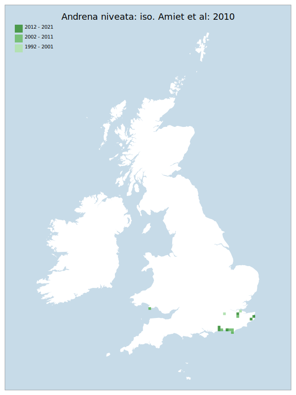

# Andrena niveata: iso. Amiet et al: 2010

## Provisional Red List status: EN
- B2 a,b, i
ii
iii

## Red List Justification
Intensification of agriculture is perceived as a moderate probability/high threat risk. This particularly covers conversion of current habitat to permanent pasture, vineyards, and cereal crops. The taxon has not been observed on oilseed rape, and is instead on Charlock beside the crop. Known locations are extremely localised, showing little ability to expand.
### Narrative
This is a rare species of solitary bee (though possibly overlooked) that is very sparsely distributed from East Kent to South Devon, north to Caernarvon. Intensification of agriculture is perceived as a moderate probability/high threat risk. This particularly covers conversion of current habitat to permanent pasture, vineyards, and cereal crops. The taxon has not been observed on Oilseed Rape and is instead on Charlock (Sinapsis arvensis) beside the agricultural crop. Known locations are extremely localised, showing little ability for populations to expand.

No statistical assessment was possible under Criterion A due insufficient data. Expert inference assessed this taxon as NT under future threat on the basis of continued intensification of the very localised known occupied areas.

The EoO (21,300 km²) exceeds the 20,000 km² VU threshold for criterion B1 and does not satisfy sufficient subcriteria to reach a threat status, and the AoO (104 km²) is below the 500 km² EN threshold for criterion B2 , has fewer or equal to 5 locations, and satisfies the requirement for continuing decline in extent of occurrence, area of occupancy, and area, extent & quality of habitat. For Criterion D2, the number of locations was fewer or equal to 5, and there is a plausible threat of rapid habitat loss that could drive the taxon to CR or RE in a very short time. No information was available on population size to inform assessments against Criteria C and D1; nor were any life-history models available to inform an assessment against Criterion E.
### Quantified Attributes
|Attribute|Result|
|---|---|
|Synanthropy|No|
|Vagrancy|No|
|Colonisation|No|
|Nomenclature|No|

## National Rarity
Nationally Rare (*NR*)

## National Presence
|Country|Presence
|---|:-:|
|England|Y|
|Scotland|N|
|Wales|Y|

## Distribution map

## Red List QA Metrics
### Decade
| Slice | # Records | AoO (sq km) | dEoO (sq km) |BU%A |
|---|---|---|---|---|
|1992 - 2001|5|16|18190|55%|
|2002 - 2011|27|52|22296|68%|
|2012 - 2021|15|44|19790|60%|
### 5-year
| Slice | # Records | AoO (sq km) | dEoO (sq km) |BU%A |
|---|---|---|---|---|
|2002 - 2006|4|8|13388|40%|
|2007 - 2011|23|48|15601|47%|
|2012 - 2016|6|16|8015|24%|
|2017 - 2021|9|28|19790|60%|
### Criterion A2 (Statistical)
|Attribute|Assessment|Value|Accepted|Justification
|---|---|---|---|---|
|Raw record count|LC|50%|No|Insufficient data|
|AoO|LC|75%|No|Insufficient data|
|dEoO|LC|147%|No|Insufficient data|
|Bayesian|DD|*NaN*%|Yes||
|Bayesian (Expert interpretation)|DD|*N/A*|Yes||
### Criterion A2 (Expert Inference)
|Attribute|Assessment|Value|Accepted|Justification
|---|---|---|---|---|
|Internal review|LC|Has not been observed on oilseed rape, is instead on Charlock beside the crop. Is extremely localised.|Yes||
### Criterion A3 (Expert Inference)
|Attribute|Assessment|Value|Accepted|Justification
|---|---|---|---|---|
|Internal review|NT|Intensification of agriculture is perceived as a moderate probability/high threat risk. This particularly covers conversion to permanent pasture, vineyards, and cereal crops. |Yes||
### Criterion B
|Criterion| Value|
|---|---|
|Locations|<=5|
|Subcriteria|i, ii, iii|
|Support|Intensification of agriculture is perceived as a moderate probability/high threat risk. This particularly covers conversion to permanent pasture, vineyards, and cereal crops. |
#### B1
|Attribute|Assessment|Value|Accepted|Justification
|---|---|---|---|---|
|MCP|LC|21300|No|Insufficient data|
#### B2
|Attribute|Assessment|Value|Accepted|Justification
|---|---|---|---|---|
|Tetrad|EN|104|Yes||
### Criterion D2
|Attribute|Assessment|Value|Accepted|Justification
|---|---|---|---|---|
|D2|VU|*N/A*|Yes||
### Wider Review
|  |  |
|---|---|
|**Action**|Moderated|
|**Reviewed Status**|VU|
|**Justification**|Core review team agrees that the Red List criteria overstates the threat to this taxon.|

## National Rarity QA Metrics
|Attribute|Value|
|---|---|
|Hectads|14|
|Calculated|NR|
|Final|NR|
|Moderation support||

