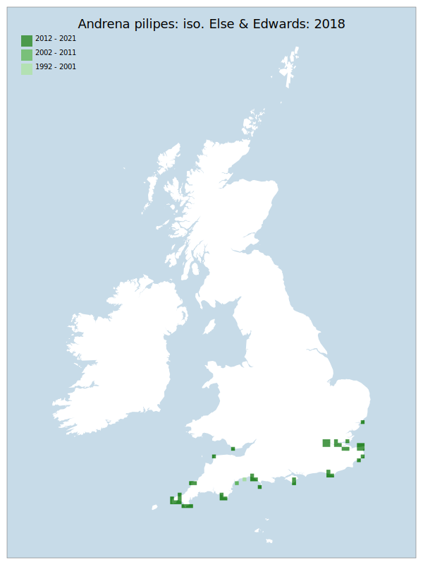

# Andrena pilipes: iso. Else & Edwards: 2018

## Provisional Red List status: LC
- B1 a,b, 
- B2 a,b, 

## Red List Justification
*N/A*
### Narrative

The most threatening accepted population decline was inferred at 0% using expert inference (A2). This does not exceed the 30% decline required for qualification as VU. The EoO (62,250 km2</sup.) exceeds the 20,000 km2</sup. VU threshold for criterion B1 and does not satisfy sufficient subcriteria to reach a threat status, and the AoO (276 km2</sup.) is below the 500 km2</sup. EN threshold for criterion B2 but does not satisfy sufficient subcriteria to reach a threat status. For Criterion D2, the number of locations was greater than 5 and there is no plausible threat that could drive the taxon to CR or RE in a very short time. No information was available on population size to inform assessments against Criteria C and D1; nor were any life-history models available to inform an assessment against Criterion E.
### Quantified Attributes
|Attribute|Result|
|---|---|
|Synanthropy|No|
|Vagrancy|No|
|Colonisation|No|
|Nomenclature|Peri-assessment change|

## National Rarity
Insufficient Data (*ID*)

## National Presence
|Country|Presence
|---|:-:|
|England|Y|
|Scotland|N|
|Wales|Y|

## Distribution map

## Red List QA Metrics
### Decade
| Slice | # Records | AoO (sq km) | dEoO (sq km) |BU%A |
|---|---|---|---|---|
|1992 - 2001|2|8|13388|15%|
|2002 - 2011|6|20|31446|37%|
|2012 - 2021|122|256|83643|98%|
### 5-year
| Slice | # Records | AoO (sq km) | dEoO (sq km) |BU%A |
|---|---|---|---|---|
|2002 - 2006|2|8|11363|13%|
|2007 - 2011|4|12|20082|23%|
|2012 - 2016|8|24|22091|26%|
|2017 - 2021|114|244|83415|98%|
### Criterion A2 (Statistical)
|Attribute|Assessment|Value|Accepted|Justification
|---|---|---|---|---|
|Raw record count|LC|1325%|No|Nomenclature change|
|AoO|LC|917%|No|Nomenclature change|
|dEoO|LC|278%|No|Nomenclature change|
|Bayesian|DD|*NaN*%|Yes||
|Bayesian (Expert interpretation)|DD|*N/A*|Yes||
### Criterion A2 (Expert Inference)
|Attribute|Assessment|Value|Accepted|Justification
|---|---|---|---|---|
|Internal review|DD|Taxon results from a recent nomenclatural change. There is insufficient data and knowledge to arrive at a supportable conclusion.|Yes||
### Criterion A3 (Expert Inference)
|Attribute|Assessment|Value|Accepted|Justification
|---|---|---|---|---|
|Internal review|DD||Yes||
### Criterion B
|Criterion| Value|
|---|---|
|Locations|>10|
|Subcriteria||
|Support||
#### B1
|Attribute|Assessment|Value|Accepted|Justification
|---|---|---|---|---|
|MCP|LC|62250|Yes||
#### B2
|Attribute|Assessment|Value|Accepted|Justification
|---|---|---|---|---|
|Tetrad|LC|276|Yes||
### Criterion D2
|Attribute|Assessment|Value|Accepted|Justification
|---|---|---|---|---|
|D2|DD|*N/A*|Yes||
### Wider Review
|  |  |
|---|---|
|**Action**|Re-assessed|
|**Reviewed Status**|LC|
|**Justification**|The core review panel considers there to be too much uncertainty surrounding potential records to be able to assign records to either side of this split. However, the evidence provided is sufficient to assign this taxon to B1 & B2 (a,b) based on the distribution of known records confirmed to be A. pilipes: iso. Else & Edwards: 2018|

## National Rarity QA Metrics
|Attribute|Value|
|---|---|
|Hectads|47|
|Calculated|NS|
|Final|ID|
|Moderation support|Taxon results from a recent nomenclatural change.|

