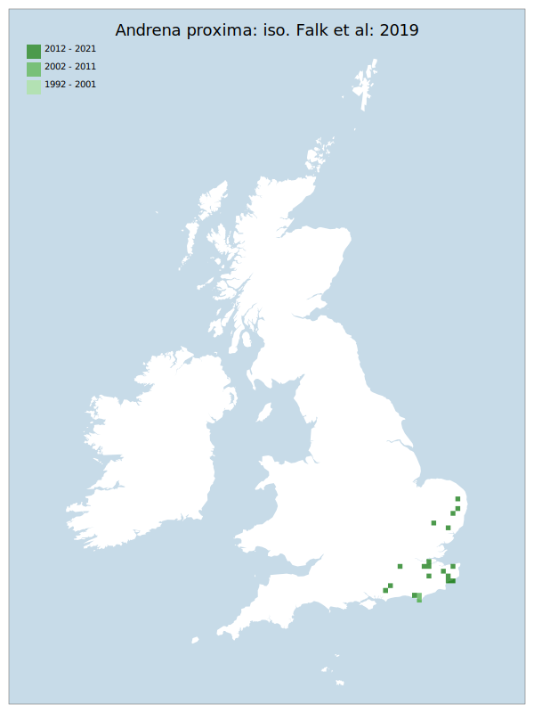

# Andrena proxima: iso. Falk et al: 2019

## Provisional Red List status: DD
- A2bc
- A3b
- D2

## Red List Justification
*N/A*

### Narrative

The most threatening accepted population decline was inferred at 0% using expert inference (A2). This does not exceed the 30% decline required for qualification as VU. The EoO was not accepted, the AoO was not accepted. For Criterion D2, the number of locations was greater than 5 and there is no plausible threat that could drive the taxon to CR or RE in a very short time. No information was available on population size to inform assessments against Criteria C and D1; nor were any life-history models available to inform an assessment against Criterion E.

### Quantified Attributes
|Attribute|Result|
|---|---|
|Synanthropy|No|
|Vagrancy|No|
|Colonisation|No|
|Nomenclature|Peri-assessment change|

## National Rarity
Insufficient Data (*ID*)

## National Presence
|Country|Presence
|---|:-:|
|England|Y|
|Scotland|N|
|Wales|N|

## Distribution map

## Red List QA Metrics
### Decade
| Slice | # Records | AoO (sq km) | dEoO (sq km) |BU%A |
|---|---|---|---|---|
|1992 - 2001|0|0|0|0%|
|2002 - 2011|7|24|13473|31%|
|2012 - 2021|20|76|39482|91%|

### 5-year
| Slice | # Records | AoO (sq km) | dEoO (sq km) |BU%A |
|---|---|---|---|---|
|2002 - 2006|5|16|7594|17%|
|2007 - 2011|2|8|11863|27%|
|2012 - 2016|2|8|8015|18%|
|2017 - 2021|18|68|39263|90%|

### Criterion A2 (Statistical)
|Attribute|Assessment|Value|Accepted|Justification
|---|---|---|---|---|
|Raw record count|LC|800%|No|Nomenclature change|
|AoO|LC|750%|No|Nomenclature change|
|dEoO|LC|390%|No|Nomenclature change|
|Bayesian|DD|*NaN*%|Yes||
|Bayesian (Expert interpretation)|DD|*N/A*|Yes||

### Criterion A2 (Expert Inference)
|Attribute|Assessment|Value|Accepted|Justification
|---|---|---|---|---|
|Internal review|DD|Taxon results from a recent nomenclatural change. There is insufficient data and knowledge to arrive at a supportable conclusion.|Yes||

### Criterion A3 (Expert Inference)
|Attribute|Assessment|Value|Accepted|Justification
|---|---|---|---|---|
|Internal review|DD||Yes||

### Criterion B
|Criterion| Value|
|---|---|
|Locations|>10|
|Subcriteria||
|Support||

#### B1
|Attribute|Assessment|Value|Accepted|Justification
|---|---|---|---|---|
|MCP|LC|19100|No|Nomenclature change|

#### B2
|Attribute|Assessment|Value|Accepted|Justification
|---|---|---|---|---|
|Tetrad|LC|100|No|Nomenclature change|

### Criterion D2
|Attribute|Assessment|Value|Accepted|Justification
|---|---|---|---|---|
|D2|DD|*N/A*|Yes||

### Wider Review
|  |  |
|---|---|
|**Action**|Re-assessed|
|**Reviewed Status**|LC|
|**Justification**|Expert inference and wider review agree that this taxon is more widespread than the data show, and is likely expanding.|

## National Rarity QA Metrics
|Attribute|Value|
|---|---|
|Hectads|18|
|Calculated|NS|
|Final|ID|
|Moderation support|Taxon results from a recent nomenclatural change.|
