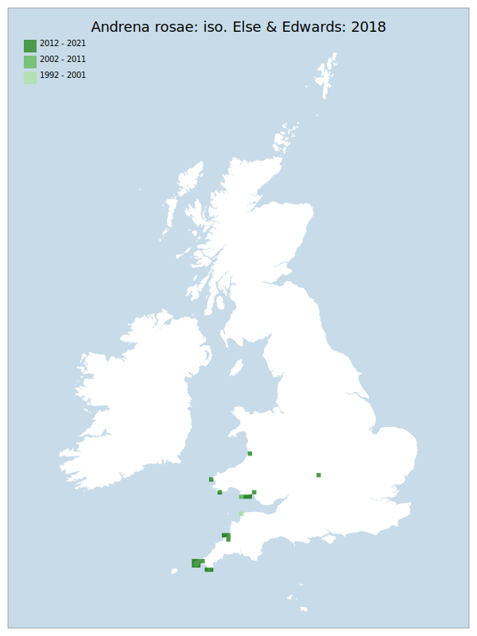

# Andrena rosae: iso. Else & Edwards: 2018

## Provisional Red List status: LC
- A2 b,c
- B1 a,b, 
- B2 a,b, 
- D2

## Red List Justification
*N/A*
### Narrative

The most threatening accepted population decline was inferred at 0% using expert inference (A2). This does not exceed the 30% decline required for qualification as VU. The EoO (35,900 km²) exceeds the 20,000 km² VU threshold for criterion B1 and does not satisfy sufficient subcriteria to reach a threat status, and the AoO (184 km²) is below the 500 km² EN threshold for criterion B2 but does not satisfy sufficient subcriteria to reach a threat status. For Criterion D2, the number of locations was greater than 5 and there is no plausible threat that could drive the taxon to CR or RE in a very short time. No information was available on population size to inform assessments against Criteria C and D1; nor were any life-history models available to inform an assessment against Criterion E.
### Quantified Attributes
|Attribute|Result|
|---|---|
|Synanthropy|No|
|Vagrancy|No|
|Colonisation|No|
|Nomenclature|Peri-assessment change|

## National Rarity
Nationally Scarce (*NS*)

## National Presence
|Country|Presence
|---|:-:|
|England|Y|
|Scotland|N|
|Wales|Y|

## Distribution map

## Red List QA Metrics
### Decade
| Slice | # Records | AoO (sq km) | dEoO (sq km) |BU%A |
|---|---|---|---|---|
|1992 - 2001|1|4|6694|14%|
|2002 - 2011|6|16|24500|54%|
|2012 - 2021|104|172|43248|96%|
### 5-year
| Slice | # Records | AoO (sq km) | dEoO (sq km) |BU%A |
|---|---|---|---|---|
|2002 - 2006|3|4|6694|14%|
|2007 - 2011|3|12|20065|44%|
|2012 - 2016|72|124|41560|92%|
|2017 - 2021|32|80|31561|70%|
### Criterion A2 (Statistical)
|Attribute|Assessment|Value|Accepted|Justification
|---|---|---|---|---|
|Raw record count|EN|-56%|No|Survey effort has distorted values entirely|
|AoO|VU|-35%|No|Survey effort has distorted values entirely|
|dEoO|LC|-24%|No|Survey effort has distorted values entirely|
|Bayesian|DD|*NaN*%|Yes||
|Bayesian (Expert interpretation)|LC|*N/A*|Yes||
### Criterion A2 (Expert Inference)
|Attribute|Assessment|Value|Accepted|Justification
|---|---|---|---|---|
|Internal review|LC|Most records coast, but data indicates potential under-recording inland|Yes||
### Criterion A3 (Expert Inference)
|Attribute|Assessment|Value|Accepted|Justification
|---|---|---|---|---|
|Internal review|DD||Yes||
### Criterion B
|Criterion| Value|
|---|---|
|Locations|>10|
|Subcriteria||
|Support||
#### B1
|Attribute|Assessment|Value|Accepted|Justification
|---|---|---|---|---|
|MCP|LC|35900|Yes||
#### B2
|Attribute|Assessment|Value|Accepted|Justification
|---|---|---|---|---|
|Tetrad|LC|184|Yes||
### Criterion D2
|Attribute|Assessment|Value|Accepted|Justification
|---|---|---|---|---|
|D2|LC|*N/A*|Yes||
### Wider Review
|  |  |
|---|---|
|**Action**|Maintained|
|**Reviewed Status**|LC|
|**Justification**|Increased sampling noted as being the cause of increased numbers is noted, but this is not considered to be sufficient reason for a threat status. There is the potential for taxonomic confusion, but this is an unresolved issue under the current Understandings. This Understanding is currently considered to be in good standing, and has thus been assessed.

Vulnerability of habitat components is noted, but without a widespread evidence of threat there is limited potential for the ability for vulnerability to impact a Red List assessment.|

## National Rarity QA Metrics
|Attribute|Value|
|---|---|
|Hectads|18|
|Calculated|NS|
|Final|NS|
|Moderation support||

