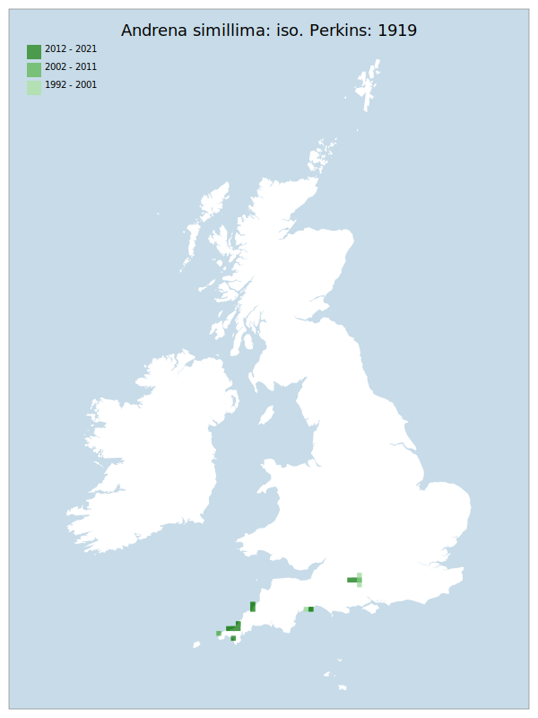

# Andrena simillima: iso. Perkins: 1919

## Provisional Red List status: LC
- A2 b,c
- B1 a,b, 
- B2 a,b, 
- D2

## Red List Justification
*N/A*
### Narrative
The provisional red list status of this species – which is very similar in habitus and biology / ecology to Andrena nigriceps (though much more restricted and rarer) was of Least Concern. Following external moderation, it was accepted that the populations of the species are restricted and scattered at a level that would almost elevate the species to vulnerable, though Near Threatened is thought to be the most appropriated threat level.

No statistical assessment was possible under Criterion A due insufficient data. Expert inference assessed this taxon as LC due to the absence of known declines over a 10 year period. The EoO (15,650 km2</sup.) is below the 20,000 km2</sup. VU threshold for criterion B1 and, whilst the population is considered to be fragmented, does not satisfy sufficient subcriteria to reach a threat status. The AoO (120 km2</sup.) is below the 500 km2</sup. EN threshold for criterion B2 and does not satisfy sufficient subcriteria to reach a threat status. For Criterion D2, the number of locations was greater than 5 and there is no plausible threat that could drive the taxon to CR or RE in a very short time. No information was available on population size to inform assessments against Criteria C and D1; nor were any life-history models available to inform an assessment against Criterion E.

When this taxon was presented to the wider peer review group, there was near-unanimous agreement that the Red List criteria did not adequately capture the threats to this taxon. As such, this taxon has been moderated by one step from LC to NT.
### Quantified Attributes
|Attribute|Result|
|---|---|
|Synanthropy|No|
|Vagrancy|No|
|Colonisation|No|
|Nomenclature|No|

## National Rarity
Nationally Scarce (*NS*)

## National Presence
|Country|Presence
|---|:-:|
|England|Y|
|Scotland|N|
|Wales|N|

## Distribution map

## Red List QA Metrics
### Decade
| Slice | # Records | AoO (sq km) | dEoO (sq km) |BU%A |
|---|---|---|---|---|
|1992 - 2001|20|52|30834|89%|
|2002 - 2011|19|40|29871|86%|
|2012 - 2021|33|48|29530|85%|
### 5-year
| Slice | # Records | AoO (sq km) | dEoO (sq km) |BU%A |
|---|---|---|---|---|
|2002 - 2006|7|20|18465|53%|
|2007 - 2011|12|20|24794|72%|
|2012 - 2016|9|8|13388|38%|
|2017 - 2021|24|44|22835|66%|
### Criterion A2 (Statistical)
|Attribute|Assessment|Value|Accepted|Justification
|---|---|---|---|---|
|Raw record count|LC|167%|No|Insufficient data|
|AoO|LC|450%|No|Insufficient data|
|dEoO|LC|71%|No|Insufficient data|
|Bayesian|DD|*NaN*%|Yes||
|Bayesian (Expert interpretation)|DD|*N/A*|Yes||
### Criterion A2 (Expert Inference)
|Attribute|Assessment|Value|Accepted|Justification
|---|---|---|---|---|
|Internal review|LC||Yes||
### Criterion A3 (Expert Inference)
|Attribute|Assessment|Value|Accepted|Justification
|---|---|---|---|---|
|Internal review|DD||Yes||
### Criterion B
|Criterion| Value|
|---|---|
|Locations|Fragmented|
|Subcriteria||
|Support||
#### B1
|Attribute|Assessment|Value|Accepted|Justification
|---|---|---|---|---|
|MCP|LC|15650|Yes||
#### B2
|Attribute|Assessment|Value|Accepted|Justification
|---|---|---|---|---|
|Tetrad|LC|120|Yes||
### Criterion D2
|Attribute|Assessment|Value|Accepted|Justification
|---|---|---|---|---|
|D2|LC|*N/A*|Yes||
### Wider Review
|  |  |
|---|---|
|**Action**|Moderated|
|**Reviewed Status**|NT|
|**Justification**|Whilst the taxon does not meet the full criteria for criteria B2, the taxon meets the AoO threshold for EN and is extremely fragmented. The wider reviewers have a majority consensus for NT, which supports moderating this taxon to a higher threat category.|

## National Rarity QA Metrics
|Attribute|Value|
|---|---|
|Hectads|16|
|Calculated|NS|
|Final|NS|
|Moderation support||

