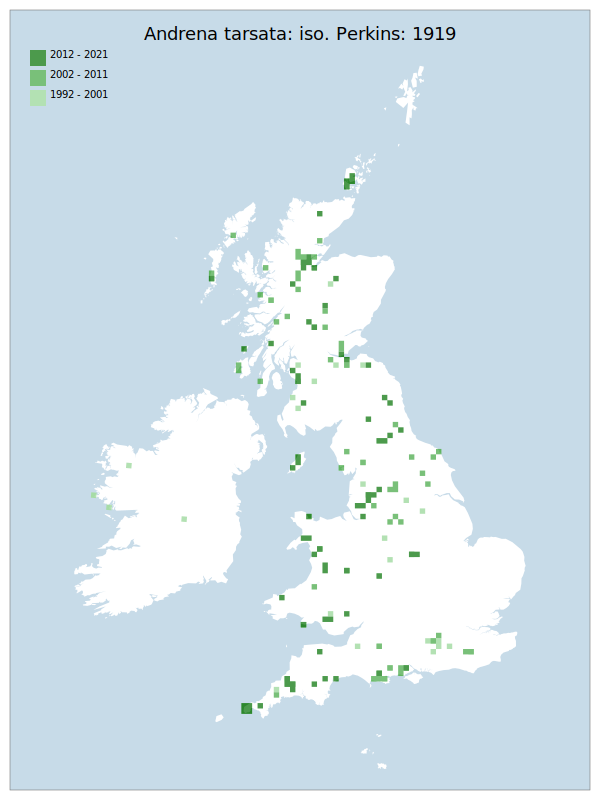

# Andrena tarsata: iso. Perkins: 1919

## Provisional Red List status: NT
- A2 b,c
- A3 b

## Red List Justification
Significant inconsistencies noted in data, suspected to be the result of a specific pattern rather than absolute truth.

Taxon is noted to be disappearing from southern locations. Importantly, this taxon appears to have coped well in the period 2007-2016 where other Andrena did not. Population increase did not continue 2017-2021. The taxon has been the subject of targeted survey effort which has uncovered a wider distribution in the northern regions.

Potential loser to climate change due to warming climate. Exact reason unknown.
### Narrative
A northwest biased small, solitary and oligolectic bee, usually found on grassland and heaths that support plentiful amounts of its obligate pollen plants in the Potentilla genus. It is uncommon and localised south of the Severn to the Wash line (except for Cornwall) and has much declined in some lowland areas (e.g. northwest England). This species was subject to a JNCC Species Action Plan.

The most threatening accepted population change estimate is -9.0% (discrete Extent of Occurrence), which does not exceed the 30% decline required for qualification as VU under Criterion A. However, expert inference noted a distinct decline in records from the south of England, which is typically the most well-sampled area for the aculeates. Such a decline is thought to be real, indicating the potential existence of a northward contraction due to changing climate. This finding was supported by the wider consultation of experts, with those in the south noting a decrease and those north of the midlands not yet noticing a decrease. The northern 'increase' is suspected to be the result of targeted survey effort in these areas, coupled with the overall increase in recording from Scotland (though record numbers are still very low overall from this region) Given the distinct regionality of the change, as well as the lack of widespread decline, this taxon has been placed in NT to encapsulate the inferred risk of continued decline as temperatures increase.

The EoO (351,300 km2) exceeds the 20,000 km2 VU threshold for criterion B1 and does not satisfy sufficient subcriteria to reach a threat status, and the AoO (804 km2) is below the 2,000 km2 VU threshold for criterion B2 but does not satisfy sufficient subcriteria to reach a threat status. For Criterion D2, the number of locations was greater than 5 and there is no plausible threat that could drive the taxon to CR or RE in a very short time. No information was available on population size to inform assessments against Criteria C and D1; nor were any life-history models available to inform an assessment against Criterion E.
### Quantified Attributes
|Attribute|Result|
|---|---|
|Synanthropy|No|
|Vagrancy|No|
|Colonisation|No|
|Nomenclature|No|

## National Rarity
Nationally Frequent (*NF*)

## National Presence
|Country|Presence
|---|:-:|
|England|Y|
|Scotland|Y|
|Wales|Y|

## Distribution map

## Red List QA Metrics
### Decade
| Slice | # Records | AoO (sq km) | dEoO (sq km) |BU%A |
|---|---|---|---|---|
|1992 - 2001|61|164|145977|51%|
|2002 - 2011|180|352|201402|70%|
|2012 - 2021|240|392|199816|70%|
### 5-year
| Slice | # Records | AoO (sq km) | dEoO (sq km) |BU%A |
|---|---|---|---|---|
|2002 - 2006|63|136|131500|46%|
|2007 - 2011|117|256|174825|61%|
|2012 - 2016|151|268|152596|53%|
|2017 - 2021|89|164|139156|48%|
### Criterion A2 (Statistical)
|Attribute|Assessment|Value|Accepted|Justification
|---|---|---|---|---|
|Raw record count|VU|-41%|No|Data volume does not fit established pattern of long-term increase|
|AoO|VU|-39%|No|Data volume does not fit established pattern of long-term increase|
|dEoO|LC|-9%|Yes||
|Bayesian|LC|11%|Yes||
|Bayesian (Expert interpretation)|LC|*N/A*|Yes||
### Criterion A2 (Expert Inference)
|Attribute|Assessment|Value|Accepted|Justification
|---|---|---|---|---|
|Internal review|NT|Noted to be disappearing from southern locations. Notably, did well in the period 2007-2016 where other Andrena did not. Population increase did not continue 2017-2021. Has been the subject of targeted survey effort which has uncovered a wider distribution in the northern regions.|Yes||
### Criterion A3 (Expert Inference)
|Attribute|Assessment|Value|Accepted|Justification
|---|---|---|---|---|
|Internal review|NT|Potential loser to climate change due to warming climate. Exact reason unknown.|Yes||
### Criterion B
|Criterion| Value|
|---|---|
|Locations|>10|
|Subcriteria||
|Support||
#### B1
|Attribute|Assessment|Value|Accepted|Justification
|---|---|---|---|---|
|MCP|LC|351300|Yes||
#### B2
|Attribute|Assessment|Value|Accepted|Justification
|---|---|---|---|---|
|Tetrad|LC|804|Yes||
### Criterion D2
|Attribute|Assessment|Value|Accepted|Justification
|---|---|---|---|---|
|D2|LC|*N/A*|Yes||
### Wider Review
|  |  |
|---|---|
|**Action**|Maintained|
|**Reviewed Status**|NT|
|**Justification**||

## National Rarity QA Metrics
|Attribute|Value|
|---|---|
|Hectads|148|
|Calculated|NF|
|Final|NF|
|Moderation support||

