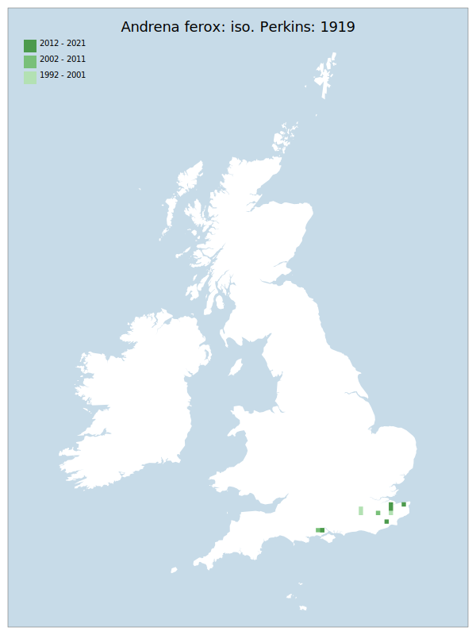

# Andrena ferox: iso. Perkins: 1919

## Provisional Red List status: LC
- A2 b,c
- B1 a,b, 
- B2 a,b, 
- D2

## Red List Justification
*N/A*
### Quantified Attributes
|Attribute|Result|
|---|---|
|Synanthropy|No|
|Vagrancy|No|
|Colonisation|No|
|Nomenclature|No|

## National Rarity
Nationally Rare (*NR*)

## National Presence
|Country|Presence
|---|:-:|
|England|Y|
|Scotland|N|
|Wales|N|

## Distribution map

## Red List QA Metrics
### Decade
| Slice | # Records | AoO (sq km) | dEoO (sq km) |BU%A |
|---|---|---|---|---|
|1992 - 2001|14|20|19994|75%|
|2002 - 2011|64|32|14288|54%|
|2012 - 2021|28|36|19603|74%|
### 5-year
| Slice | # Records | AoO (sq km) | dEoO (sq km) |BU%A |
|---|---|---|---|---|
|2002 - 2006|20|24|14288|54%|
|2007 - 2011|44|20|6694|25%|
|2012 - 2016|16|20|18285|69%|
|2017 - 2021|12|20|17143|64%|
### Criterion A2 (Statistical)
|Attribute|Assessment|Value|Accepted|Justification
|---|---|---|---|---|
|Raw record count|LC|-25%|No|Insufficient data|
|AoO|LC|0%|No|Insufficient data|
|dEoO|LC|-6%|No|Insufficient data|
|Bayesian|LC|0%|No|Insufficient data|
|Bayesian (Expert interpretation)|LC|*N/A*|No|Insufficient data|
### Criterion A2 (Expert Inference)
|Attribute|Assessment|Value|Accepted|Justification
|---|---|---|---|---|
|Internal review|LC|Significant detection problems due to behaviour.|Yes||
### Criterion A3 (Expert Inference)
|Attribute|Assessment|Value|Accepted|Justification
|---|---|---|---|---|
|Internal review|DD||No||
### Criterion B
|Criterion| Value|
|---|---|
|Locations|>10|
|Subcriteria||
|Support||
#### B1
|Attribute|Assessment|Value|Accepted|Justification
|---|---|---|---|---|
|MCP|LC|7750|Yes||
#### B2
|Attribute|Assessment|Value|Accepted|Justification
|---|---|---|---|---|
|Tetrad|LC|64|Yes||
### Criterion D2
|Attribute|Assessment|Value|Accepted|Justification
|---|---|---|---|---|
|D2|LC|*N/A*|Yes||
### Wider Review
|  |  |
|---|---|
|**Action**|Maintained|
|**Reviewed Status**|LC|
|**Justification**|Potential threats noted, but none cross the border to the point where they warrant NT under Red List criteria.|

## National Rarity QA Metrics
|Attribute|Value|
|---|---|
|Hectads|10|
|Calculated|NR|
|Final|NR|
|Moderation support||

