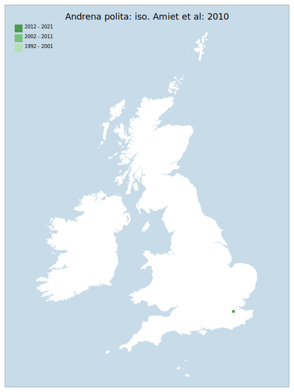

# Andrena polita: iso. Amiet et al: 2010

## Provisional Red List status: NA

## Red List Justification
Recent re-colonist. There is not enough data to come to any supportable conclusion in threat status.
### Quantified Attributes
|Attribute|Result|
|---|---|
|Synanthropy|No|
|Vagrancy|No|
|Colonisation|Peri-Assessment Colonist|
|Nomenclature|No|

## National Rarity
Insufficient Data (*ID*)

## National Presence
|Country|Presence
|---|:-:|
|England|Y|
|Scotland|N|
|Wales|N|

## Distribution map

## Red List QA Metrics
### Decade
| Slice | # Records | AoO (sq km) | dEoO (sq km) |BU%A |
|---|---|---|---|---|
|1992 - 2001|0|0|0|0%|
|2002 - 2011|0|0|0|0%|
|2012 - 2021|3|4|6694|100%|
### 5-year
| Slice | # Records | AoO (sq km) | dEoO (sq km) |BU%A |
|---|---|---|---|---|
|2002 - 2006|0|0|0|0%|
|2007 - 2011|0|0|0|0%|
|2012 - 2016|0|0|0|0%|
|2017 - 2021|3|4|6694|100%|
### Criterion A2 (Statistical)
|Attribute|Assessment|Value|Accepted|Justification
|---|---|---|---|---|
|Raw record count|LC|?%|No|Recent colonist|
|AoO|LC|?%|No|Recent colonist|
|dEoO|LC|?%|No|Recent colonist|
|Bayesian|DD|*NaN*%|Yes||
|Bayesian (Expert interpretation)|DD|*N/A*|Yes||
### Criterion A2 (Expert Inference)
|Attribute|Assessment|Value|Accepted|Justification
|---|---|---|---|---|
|Internal review|DD|Recent re-colonist. There is not enough data to come to any supportable conclusion.|Yes||
### Criterion A3 (Expert Inference)
|Attribute|Assessment|Value|Accepted|Justification
|---|---|---|---|---|
|Internal review|DD||Yes||
### Criterion B
|Criterion| Value|
|---|---|
|Locations||
|Subcriteria||
|Support||
#### B1
|Attribute|Assessment|Value|Accepted|Justification
|---|---|---|---|---|
|MCP|LC|100|No|Recent colonist|
#### B2
|Attribute|Assessment|Value|Accepted|Justification
|---|---|---|---|---|
|Tetrad|LC|4|No|Recent colonist|
### Criterion D2
|Attribute|Assessment|Value|Accepted|Justification
|---|---|---|---|---|
|D2|DD|*N/A*|Yes||
### Wider Review
|  |  |
|---|---|
|**Action**|Maintained|
|**Reviewed Status**|NA|
|**Justification**|Due to the regularity of survey effort in this area, it is considered to be very unlikely that this taxon has existed undetected for 90 years. The bee is very big and very obvious.|

## National Rarity QA Metrics
|Attribute|Value|
|---|---|
|Hectads|1|
|Calculated|NR|
|Final|ID|
|Moderation support||

