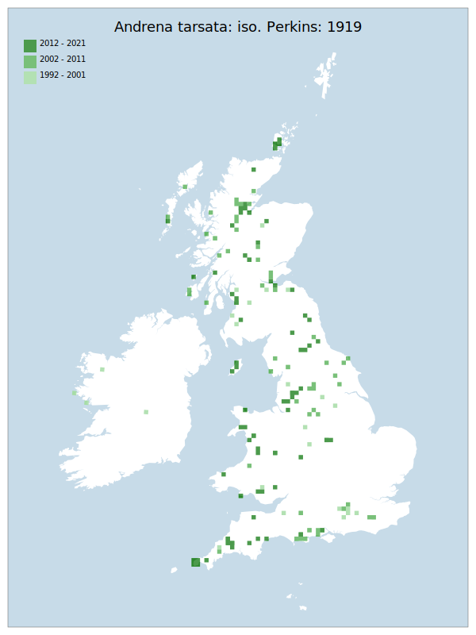

# Andrena tarsata: iso. Perkins: 1919

## Provisional Red List status: NT
- A2 b,c
- A3 b

## Red List Justification
Significant inconsistencies noted in data, suspected to be the result of a specific pattern rather than absolute truth.

Taxon is noted to be disappearing from southern locations. Importantly, this taxon appears to have coped well in the period 2007-2016 where other Andrena did not. Population increase did not continue 2017-2021. The taxon has been the subject of targeted survey effort which has uncovered a wider distribution in the northern regions.

Potential loser to climate change due to warming climate. Exact reason unknown.
### Quantified Attributes
|Attribute|Result|
|---|---|
|Synanthropy|No|
|Vagrancy|No|
|Colonisation|No|
|Nomenclature|No|

## National Rarity
Nationally Frequent (*NF*)

## National Presence
|Country|Presence
|---|:-:|
|England|Y|
|Scotland|Y|
|Wales|Y|

## Distribution map

## Red List QA Metrics
### Decade
| Slice | # Records | AoO (sq km) | dEoO (sq km) |BU%A |
|---|---|---|---|---|
|1992 - 2001|61|164|145977|51%|
|2002 - 2011|180|352|201402|70%|
|2012 - 2021|240|392|199816|70%|
### 5-year
| Slice | # Records | AoO (sq km) | dEoO (sq km) |BU%A |
|---|---|---|---|---|
|2002 - 2006|63|136|131500|46%|
|2007 - 2011|117|256|174825|61%|
|2012 - 2016|151|268|152596|53%|
|2017 - 2021|89|164|139156|48%|
### Criterion A2 (Statistical)
|Attribute|Assessment|Value|Accepted|Justification
|---|---|---|---|---|
|Raw record count|VU|-41%|No|Data volume does not fit established pattern of long-term increase|
|AoO|VU|-39%|No|Data volume does not fit established pattern of long-term increase|
|dEoO|LC|-9%|Yes||
|Bayesian|LC|11%|Yes||
|Bayesian (Expert interpretation)|LC|*N/A*|Yes||
### Criterion A2 (Expert Inference)
|Attribute|Assessment|Value|Accepted|Justification
|---|---|---|---|---|
|Internal review|NT|Noted to be disappearing from southern locations. Notably, did well in the period 2007-2016 where other Andrena did not. Population increase did not continue 2017-2021. Has been the subject of targeted survey effort which has uncovered a wider distribution in the northern regions.|Yes||
### Criterion A3 (Expert Inference)
|Attribute|Assessment|Value|Accepted|Justification
|---|---|---|---|---|
|Internal review|NT|Potential loser to climate change due to warming climate. Exact reason unknown.|Yes||
### Criterion B
|Criterion| Value|
|---|---|
|Locations|>10|
|Subcriteria||
|Support||
#### B1
|Attribute|Assessment|Value|Accepted|Justification
|---|---|---|---|---|
|MCP|LC|351300|Yes||
#### B2
|Attribute|Assessment|Value|Accepted|Justification
|---|---|---|---|---|
|Tetrad|LC|804|Yes||
### Criterion D2
|Attribute|Assessment|Value|Accepted|Justification
|---|---|---|---|---|
|D2|LC|*N/A*|Yes||
### Wider Review
|  |  |
|---|---|
|**Action**|Maintained|
|**Reviewed Status**|NT|
|**Justification**||

## National Rarity QA Metrics
|Attribute|Value|
|---|---|
|Hectads|148|
|Calculated|NF|
|Final|NF|
|Moderation support||

