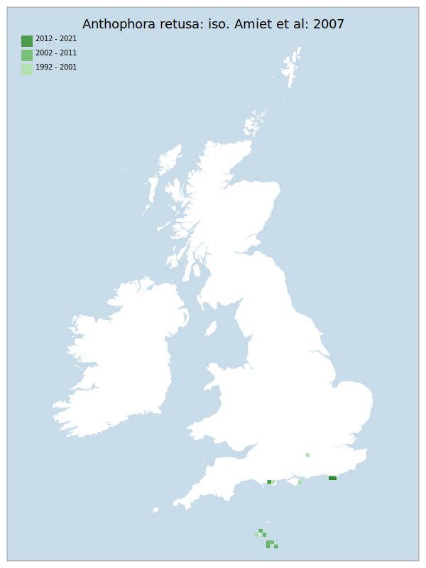

---
    parent: bee
    ---

    # Anthophora retusa: iso. Amiet et al: 2007

## Provisional Red List status: EN
- B2 a,b, iii

## Red List Justification
A large area of known nesting habitat was destroyed in one summer storm, leading to substantial population reduction. Taxon is considered to be recovering, but is at risk of a repeat of the same event before recovery completes.
### Narrative
Historically this species (superficially similar to the much more common A. plumipes) was well recorded in southern England - from Dorset to Kent, north to Oxfordshire, and East Norfolk. Over more recent decades this bee has undergone a rapid and largely unexplained decline in Britain. In the last two decades it has been reliably recorded from just six sites in Dorset, Isle of Wight, North Hampshire, East Sussex and North Essex. A large area of known nesting habitat in East Sussex was destroyed in one summer storm, leading to substantial population reduction. The taxon is considered to be recovering but is at risk of repeat events.

To statistical assessment was accepted as valid under Criterion A, where expert inference assessed this taxon as LC. The EoO (8,350 km²) is below the 20,000 km² VU threshold for criterion B1, the AoO (56 km²) is below the 500 km² EN threshold for criterion B2, the number of locations are fewer or equal to 5 (EN), and there has been, and is expected to be again in the future, significant decline in the area, extent, and quality of habitat for this taxon. For Criterion D2, the number of locations was greater than 5 and there is no plausible threat that could drive the taxon to CR or RE in a very short time. No information was available on population size to inform assessments against Criteria C and D1; nor were any life-history models available to inform an assessment against Criterion E.
### Quantified Attributes
|Attribute|Result|
|---|---|
|Synanthropy|No|
|Vagrancy|No|
|Colonisation|No|
|Nomenclature|No|

## National Rarity
Nationally Rare (*NR*)

## National Presence
|Country|Presence
|---|:-:|
|England|Y|
|Scotland|N|
|Wales|N|

## Distribution map

## Red List QA Metrics
### Decade
| Slice | # Records | AoO (sq km) | dEoO (sq km) |BU%A |
|---|---|---|---|---|
|1992 - 2001|15|32|26003|98%|
|2002 - 2011|33|32|14288|54%|
|2012 - 2021|40|16|14288|54%|
### 5-year
| Slice | # Records | AoO (sq km) | dEoO (sq km) |BU%A |
|---|---|---|---|---|
|2002 - 2006|9|16|14288|54%|
|2007 - 2011|24|24|14288|54%|
|2012 - 2016|11|16|14288|54%|
|2017 - 2021|29|4|6694|25%|
### Criterion A2 (Statistical)
|Attribute|Assessment|Value|Accepted|Justification
|---|---|---|---|---|
|Raw record count|LC|164%|No|Insufficient data|
|AoO|EN|-75%|No|Insufficient data|
|dEoO|EN|-53%|No|Insufficient data|
|Bayesian|DD|*NaN*%|Yes||
|Bayesian (Expert interpretation)|DD|*N/A*|Yes||
### Criterion A2 (Expert Inference)
|Attribute|Assessment|Value|Accepted|Justification
|---|---|---|---|---|
|Internal review|LC||Yes||
### Criterion A3 (Expert Inference)
|Attribute|Assessment|Value|Accepted|Justification
|---|---|---|---|---|
|Internal review|DD||Yes||
### Criterion B
|Criterion| Value|
|---|---|
|Locations|<=5|
|Subcriteria|iii|
|Support|Large area of nesting habitat was destroyed in one summer storm, leading to substantial population reduction. Taxon is considered to be recovering, but is at risk of a repeat of the same event.|
#### B1
|Attribute|Assessment|Value|Accepted|Justification
|---|---|---|---|---|
|MCP|VU|8350|Yes||
#### B2
|Attribute|Assessment|Value|Accepted|Justification
|---|---|---|---|---|
|Tetrad|EN|56|Yes||
### Criterion D2
|Attribute|Assessment|Value|Accepted|Justification
|---|---|---|---|---|
|D2|LC|*N/A*|Yes||
### Wider Review
|  |  |
|---|---|
|**Action**|Maintained|
|**Reviewed Status**|EN|
|**Justification**||

## National Rarity QA Metrics
|Attribute|Value|
|---|---|
|Hectads|6|
|Calculated|NR|
|Final|NR|
|Moderation support||

