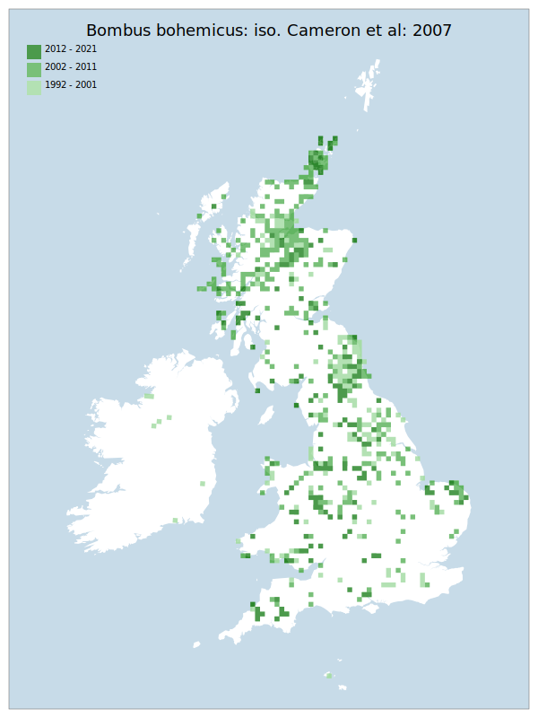

# Bombus bohemicus: iso. Cameron et al: 2007

## Provisional Red List status: VU
- A2 b

## Red List Justification
Retreating northward, but potential confusion in identification with B. vestalis: iso. Cameron et al: 2007 which is expanding into the north. This confusion is suspected to have inflated the record numbers from the 10 year period, hiding a longer-term decline.

Disappearing from lowlands of Lancashire, Cumbria, and from Southern England. Unknown host specificity within Bombus lucorum agg: iso. Murray et al: 2008, which itself may be subject to declines.
### Narrative
This parasitic bumblebee is associated with species of the Bombus lucorum agg., though host specificity is unknown. It is retreating northward – and is disappearing from lowland areas of Lancashire and Cumbria (and the south more widely and rapidly). Potential confusion in identification exists with B. vestalis: iso. Cameron et al: 2007 which is expanding into the north - this confusion is suspected to have inflated the record numbers from the 10-year period, hiding a longer-term decline.

No statistical assessment was possible under Criterion A due insufficient data. Expert inference assessed this taxon as VU due to the mismatch between this taxon's trends and the overall trend of the *Bombus lucorum agg*: iso. Murray et al: 2008 aggregate which serves as the host. It is unknown if there is host specificity within this complex, as well as the trends of the components of this aggregate (*Bombus lucorum*: iso. Murray et al: 2008, *Bombus cryptarum*: iso. Murray et al: 2008, *Bombus magnus*: iso. Murray et al: 2008) The EoO (382, 050 km^2) is above the 20,000 km^2 VU threshold for criterion B1 and the AoO (4320 km^2) is above the 500 km^2 VU threshold for criterion B2. For Criterion D2, the number of locations was greater than 5, and there is no plausible threat of rapid habitat loss that could drive the taxon to CR or RE in a very short time. No information was available on population size to inform assessments against Criteria C and D1; nor were any life-history models available to inform an assessment against Criterion E.
### Quantified Attributes
|Attribute|Result|
|---|---|
|Synanthropy|No|
|Vagrancy|No|
|Colonisation|No|
|Nomenclature|No|

## National Rarity
Nationally Frequent (*NF*)

## National Presence
|Country|Presence
|---|:-:|
|England|Y|
|Scotland|Y|
|Wales|Y|

## Distribution map

## Red List QA Metrics
### Decade
| Slice | # Records | AoO (sq km) | dEoO (sq km) |BU%A |
|---|---|---|---|---|
|1992 - 2001|706|1648|273381|72%|
|2002 - 2011|1025|2148|349047|92%|
|2012 - 2021|320|940|281541|75%|
### 5-year
| Slice | # Records | AoO (sq km) | dEoO (sq km) |BU%A |
|---|---|---|---|---|
|2002 - 2006|790|1692|320706|85%|
|2007 - 2011|235|588|243422|64%|
|2012 - 2016|164|528|226542|60%|
|2017 - 2021|156|464|224793|59%|
### Criterion A2 (Statistical)
|Attribute|Assessment|Value|Accepted|Justification
|---|---|---|---|---|
|Raw record count|LC|-5%|No|Suspected significant confusion between this and Bombus vestalis: iso. Cameron et al: 2007|
|AoO|LC|-12%|No|Suspected significant confusion between this and Bombus vestalis: iso. Cameron et al: 2007|
|dEoO|LC|-1%|No|Suspected significant confusion between this and Bombus vestalis: iso. Cameron et al: 2007|
|Bayesian|DD|*NaN*%|No|Suspected significant confusion between this and Bombus vestalis: iso. Cameron et al: 2007|
|Bayesian (Expert interpretation)|LC|*N/A*|No|Suspected significant confusion between this and Bombus vestalis: iso. Cameron et al: 2007|
### Criterion A2 (Expert Inference)
|Attribute|Assessment|Value|Accepted|Justification
|---|---|---|---|---|
|Internal review|VU|Retreating north, but potential confusion in identification with B. vestalis: iso. Cameron et al: 2007 which is expanding into the north. This is suspected to have inflated the record numbers from the 10 year period, hiding a longer-term decline.

Disappearing from lowlands of Lancashire, Cumbria, and from Southern England. Unknown host specificity within Bombus lucorum agg: iso. Murray et al: 2008, which itself may be subject to declines.|Yes||
### Criterion A3 (Expert Inference)
|Attribute|Assessment|Value|Accepted|Justification
|---|---|---|---|---|
|Internal review|DD||Yes||
### Criterion B
|Criterion| Value|
|---|---|
|Locations|>10|
|Subcriteria||
|Support||
#### B1
|Attribute|Assessment|Value|Accepted|Justification
|---|---|---|---|---|
|MCP|LC|382050|No|Suspected significant confusion between this and Bombus vestalis: iso. Cameron et al: 2007|
#### B2
|Attribute|Assessment|Value|Accepted|Justification
|---|---|---|---|---|
|Tetrad|LC|4320|No|Suspected significant confusion between this and Bombus vestalis: iso. Cameron et al: 2007|
### Criterion D2
|Attribute|Assessment|Value|Accepted|Justification
|---|---|---|---|---|
|D2|LC|*N/A*|Yes||
### Wider Review
|  |  |
|---|---|
|**Action**|Maintained|
|**Reviewed Status**|VU|
|**Justification**|Overall weighting of opinions suggests a strong decline, supporting the level of VU.|

## National Rarity QA Metrics
|Attribute|Value|
|---|---|
|Hectads|624|
|Calculated|NF|
|Final|NF|
|Moderation support||

