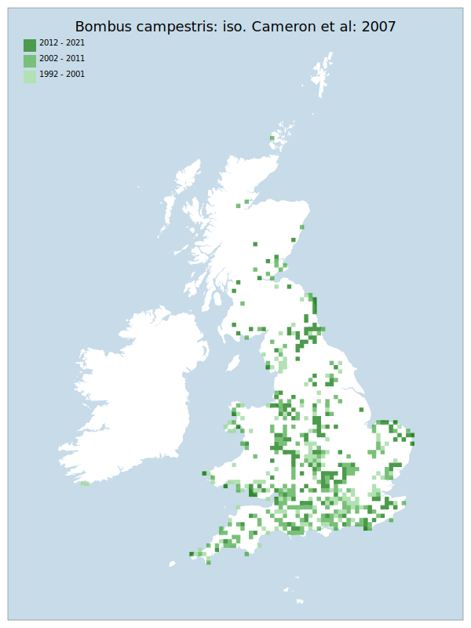

# Bombus campestris: iso. Cameron et al: 2007

## Provisional Red List status: NT
- A2 b,c

## Red List Justification
Despite a utilisation of Bombus pascuorum: iso. Cameron et al: 2007 as a host, which is increasing, this taxon is not following suit. The mismatch of the distribution between potential hosts and this species requires further investigation.
### Narrative
There have been significant decreases in the range of the once common parasitic bumblebee in GB. Substantial declines have been noticed in both southeast and northwest England – especially Cumbria and Lancashire (in the county there have been only two records in the last 15 years, where it was always biased towards the coast).

The most threatening accepted population change estimate is -9.0% (tetrad area), which does not exceed the 30% decline required for qualification as VU under Criterion A. Expert inference assessed this taxon as NT under future threats due to observed declines whilst a known host remains extremely common. This may reflect a result of climate change where *Bombus pascuorum*: iso. Cameron et al: 2007 is emerging earlier in the year, allowing *B. pascuorum* to reach a nest size that cannot be easily predated upon by the time that *Bombus campestris*: iso. Cameron et al: 2007 emerges. The EoO (322,800 km²) exceeds the 20,000 km² VU threshold for criterion B1 and does not satisfy sufficient subcriteria to reach a threat status, and the AoO (3,292 km²) exceeds the 2,000 km² VU threshold for criterion B2 and does not satisfy sufficient subcriteria to reach a threat status. For Criterion D2, the number of locations was greater than 5 and there is no plausible threat that could drive the taxon to CR or RE in a very short time. No information was available on population size to inform assessments against Criteria C and D1; nor were any life-history models available to inform an assessment against Criterion E.
### Quantified Attributes
|Attribute|Result|
|---|---|
|Synanthropy|No|
|Vagrancy|No|
|Colonisation|No|
|Nomenclature|No|

## National Rarity
Nationally Frequent (*NF*)

## National Presence
|Country|Presence
|---|:-:|
|England|Y|
|Scotland|Y|
|Wales|Y|

## Distribution map

## Red List QA Metrics
### Decade
| Slice | # Records | AoO (sq km) | dEoO (sq km) |BU%A |
|---|---|---|---|---|
|1992 - 2001|473|1208|237847|76%|
|2002 - 2011|462|1436|281498|90%|
|2012 - 2021|277|864|254696|82%|
### 5-year
| Slice | # Records | AoO (sq km) | dEoO (sq km) |BU%A |
|---|---|---|---|---|
|2002 - 2006|250|808|239391|77%|
|2007 - 2011|212|680|220478|71%|
|2012 - 2016|144|464|210484|68%|
|2017 - 2021|133|420|203748|65%|
### Criterion A2 (Statistical)
|Attribute|Assessment|Value|Accepted|Justification
|---|---|---|---|---|
|Raw record count|LC|-8%|Yes||
|AoO|LC|-9%|Yes||
|dEoO|LC|-3%|Yes||
|Bayesian|LC|34%|Yes||
|Bayesian (Expert interpretation)|LC|*N/A*|Yes||
### Criterion A2 (Expert Inference)
|Attribute|Assessment|Value|Accepted|Justification
|---|---|---|---|---|
|Internal review|NT|Despite a utilisation of Bombus pascuorum: iso. Cameron et al: 2007 as a host, which is increasing, this taxon is not following suit. The mismatch of the distribution between potential hosts and this species requires further investigation.|Yes||
### Criterion A3 (Expert Inference)
|Attribute|Assessment|Value|Accepted|Justification
|---|---|---|---|---|
|Internal review|DD||Yes||
### Criterion B
|Criterion| Value|
|---|---|
|Locations|>10|
|Subcriteria||
|Support||
#### B1
|Attribute|Assessment|Value|Accepted|Justification
|---|---|---|---|---|
|MCP|LC|322800|Yes||
#### B2
|Attribute|Assessment|Value|Accepted|Justification
|---|---|---|---|---|
|Tetrad|LC|3292|Yes||
### Criterion D2
|Attribute|Assessment|Value|Accepted|Justification
|---|---|---|---|---|
|D2|LC|*N/A*|Yes||
### Wider Review
|  |  |
|---|---|
|**Action**|Maintained|
|**Reviewed Status**|NT|
|**Justification**|Associated with the Thoracabombus group, most of which are declining - except B. pascuorum which is increasing. Given the decline in B. campestris, this may reflect asynchrony within host phenology which is yet to be understood. |

## National Rarity QA Metrics
|Attribute|Value|
|---|---|
|Hectads|557|
|Calculated|NF|
|Final|NF|
|Moderation support||

