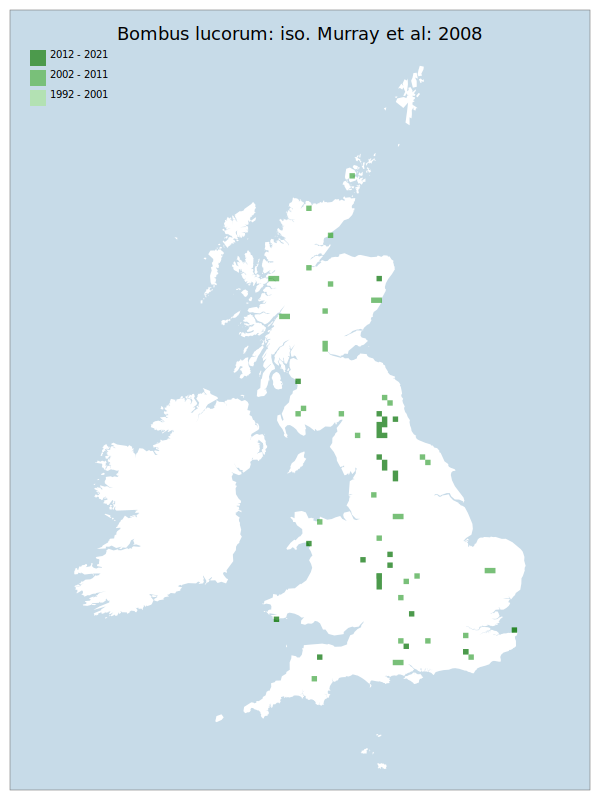

---
    parent: bee
    ---

    # Bombus lucorum: iso. Murray et al: 2008

## Provisional Red List status: DD
- A2 b
- A3 b
- D2

## Red List Justification
*N/A*
### Narrative
One of the "Bombus lucorum aggregate", this species has been subject to an early assessment change. As it can only be identified using genetic or chemical analysis the true distribution is poorly known.

Insufficient data were available to reach a supportable conclusion on the threat status for this taxon.
### Quantified Attributes
|Attribute|Result|
|---|---|
|Synanthropy|No|
|Vagrancy|No|
|Colonisation|No|
|Nomenclature|Early-assessment change|

## National Rarity
Insufficient Data (*ID*)

## National Presence
|Country|Presence
|---|:-:|
|England|Y|
|Scotland|Y|
|Wales|Y|

## Distribution map

## Red List QA Metrics
### Decade
| Slice | # Records | AoO (sq km) | dEoO (sq km) |BU%A |
|---|---|---|---|---|
|1992 - 2001|0|0|0|0%|
|2002 - 2011|47|172|169625|82%|
|2012 - 2021|51|152|90489|44%|
### 5-year
| Slice | # Records | AoO (sq km) | dEoO (sq km) |BU%A |
|---|---|---|---|---|
|2002 - 2006|2|8|13388|6%|
|2007 - 2011|45|164|166554|81%|
|2012 - 2016|14|44|33471|16%|
|2017 - 2021|37|108|60676|29%|
### Criterion A2 (Statistical)
|Attribute|Assessment|Value|Accepted|Justification
|---|---|---|---|---|
|Raw record count|LC|164%|No|Low data|
|AoO|LC|145%|No|Low data|
|dEoO|LC|81%|No|Low data|
|Bayesian|DD|*NaN*%|Yes||
|Bayesian (Expert interpretation)|DD|*N/A*|Yes||
### Criterion A2 (Expert Inference)
|Attribute|Assessment|Value|Accepted|Justification
|---|---|---|---|---|
|Internal review|DD|Subject of a fairly recent split, which so far can only be reliably determined across the range by genetic or chemical analysis.|Yes||
### Criterion A3 (Expert Inference)
|Attribute|Assessment|Value|Accepted|Justification
|---|---|---|---|---|
|Internal review|DD||Yes||
### Criterion B
|Criterion| Value|
|---|---|
|Locations|>10|
|Subcriteria||
|Support||
#### B1
|Attribute|Assessment|Value|Accepted|Justification
|---|---|---|---|---|
|MCP|LC|276150|No|Low data|
#### B2
|Attribute|Assessment|Value|Accepted|Justification
|---|---|---|---|---|
|Tetrad|LC|324|No|Low data|
### Criterion D2
|Attribute|Assessment|Value|Accepted|Justification
|---|---|---|---|---|
|D2|DD|*N/A*|Yes||
### Wider Review
|  |  |
|---|---|
|**Action**|Maintained|
|**Reviewed Status**|DD|
|**Justification**|Preliminary research suggests that this species is still very difficult to separate from the B. lucorum/cryptarum/magnus complex. We still lack enough data to be able to arrive at a substantiated status.|

## National Rarity QA Metrics
|Attribute|Value|
|---|---|
|Hectads|67|
|Calculated|NS|
|Final|ID|
|Moderation support|Subject of a fairly recent split, which so far can only be reliably determined across the range by genetic or chemical analysis.|

