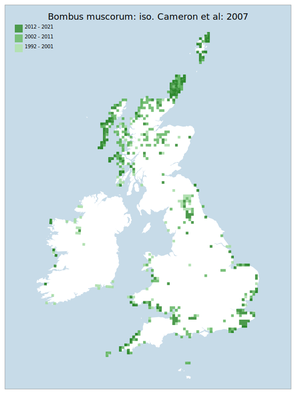

# Bombus muscorum: iso. Cameron et al: 2007

## Provisional Red List status: LC
- A2 b,c
- B1 a,b, 
- B2 a,b, 
- D2

## Red List Justification
*N/A*
### Narrative
This – the largest of the Thoracobombus bumblebee species (which nest on the surface of the ground in) – has undergone a serious and extensive decline since the 1970’s. It is now very rare or absent from central and northwest England, whilst populations in South England and Wales are almost entirely coastal. Despite statistically coming out as LC, the wider review panel unanimously agreed it should be given NT status given the range and extent of decline. This species was previously a BAP species and has continued to show the decline common to many of the bumblebee species covered by this legislation.

The most threatening accepted population change estimate is -16.0% (discrete Extent of Occurrence), which does not exceed the 30% decline required for qualification as VU under Criterion A. The EoO (543,200 km²) exceeds the 20,000 km² VU threshold for criterion B1 and does not satisfy sufficient subcriteria to reach a threat status, and the AoO (4,860 km²) exceeds the 2,000 km² VU threshold for criterion B2 and does not satisfy sufficient subcriteria to reach a threat status. For Criterion D2, the number of locations was greater than 5 and there is no plausible threat that could drive the taxon to CR or RE in a very short time. No information was available on population size to inform assessments against Criteria C and D1; nor were any life-history models available to inform an assessment against Criterion E.

This taxon was moderated from LC to NT during peer review, with a majority of reviewers agreeing with NT over LC.
### Quantified Attributes
|Attribute|Result|
|---|---|
|Synanthropy|No|
|Vagrancy|No|
|Colonisation|No|
|Nomenclature|No|

## National Rarity
Nationally Frequent (*NF*)

## National Presence
|Country|Presence
|---|:-:|
|England|Y|
|Scotland|Y|
|Wales|Y|

## Distribution map

## Red List QA Metrics
### Decade
| Slice | # Records | AoO (sq km) | dEoO (sq km) |BU%A |
|---|---|---|---|---|
|1992 - 2001|682|1660|328909|83%|
|2002 - 2011|1326|2804|332480|84%|
|2012 - 2021|1116|1680|288745|73%|
### 5-year
| Slice | # Records | AoO (sq km) | dEoO (sq km) |BU%A |
|---|---|---|---|---|
|2002 - 2006|884|1968|291979|73%|
|2007 - 2011|442|1080|259925|65%|
|2012 - 2016|702|1120|248172|62%|
|2017 - 2021|414|764|209235|53%|
### Criterion A2 (Statistical)
|Attribute|Assessment|Value|Accepted|Justification
|---|---|---|---|---|
|Raw record count|VU|-41%|No|Data from first half significantly skewed by a period of high recorder activity|
|AoO|VU|-32%|No|Data from first half significantly skewed by a period of high recorder activity|
|dEoO|LC|-16%|Yes||
|Bayesian|LC|20%|Yes||
|Bayesian (Expert interpretation)|LC|*N/A*|Yes||
### Criterion A2 (Expert Inference)
|Attribute|Assessment|Value|Accepted|Justification
|---|---|---|---|---|
|Internal review|LC||Yes||
### Criterion A3 (Expert Inference)
|Attribute|Assessment|Value|Accepted|Justification
|---|---|---|---|---|
|Internal review|DD||Yes||
### Criterion B
|Criterion| Value|
|---|---|
|Locations|>10|
|Subcriteria||
|Support||
#### B1
|Attribute|Assessment|Value|Accepted|Justification
|---|---|---|---|---|
|MCP|LC|543200|Yes||
#### B2
|Attribute|Assessment|Value|Accepted|Justification
|---|---|---|---|---|
|Tetrad|LC|4860|Yes||
### Criterion D2
|Attribute|Assessment|Value|Accepted|Justification
|---|---|---|---|---|
|D2|LC|*N/A*|Yes||
### Wider Review
|  |  |
|---|---|
|**Action**|Moderated|
|**Reviewed Status**|NT|
|**Justification**|Moderated on basis of feedback from reviewers|

## National Rarity QA Metrics
|Attribute|Value|
|---|---|
|Hectads|484|
|Calculated|NF|
|Final|NF|
|Moderation support||

